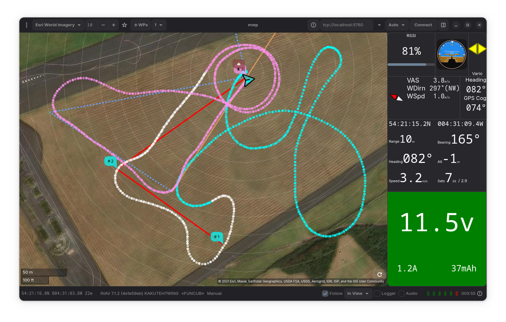

mwptools revisited
==================

"A mission planner for the rest of us"



## Overview

This is the implementation of mwp using Gtk4 / libshumate..

See the [migration guide](https://github.com/stronnag/mwptools/blob/master/docs/images/mwp4.png) for dependencies (and migration from the legacy version).

mwptools provides a mission planner, [terrain analysis](https://github.com/stronnag/mwptools/wiki/Mission-Elevation-Plot-and-Terrain-Analysis), line of sight analysis, ground control station, real time flight logger and log replay / blackbox replay functions for the [INAV](https://github.com/iNavFlight/inav) FC firmware.

mwp supports the following telemetry protocols:

* MSP (MultiWii Serial Protocol)
* LTM (Lightweight Telemetry)
* MAVLink (INAV subset)
* Smartport (direct /  via inverter / or from Multi-protocol Module)
* Crossfire (CRSF)
* Flysky AA (via Multi-protocol Module)
* [BulletGCCS MQTT](https://github.com/stronnag/mwptools/wiki/mqtt---bulletgcss-telemetry)

mwp also supports the real-time display of adjacent aircraft using:

* [INAV-radar](https://github.com/OlivierC-FR/ESP32-INAV-Radar/) (INAV UAS)
* MAVlink Traffic Report (e.g. full-size aviation, typically ADS-B via a device such as uAvionix PingRX)
* ADS-B using Dump1090 /  SBS-1 Basestation streaming TCP protocol.
* Any other mwp supported telemetry protocol

mwp also provides logging and the replay of:

* mwp log files
* Blackbox logs
* OpenTX CSV (sdcard) logs
* BulletGCSS logs
* Ardupilot (`.bin`) log

Log replay requires tools from the [flightlog2x](https://github.com/stronnag/bbl2kml) project.

There is also an [INAV](https://github.com/iNavFlight/inav) [Safehome editor](https://github.com/stronnag/mwptools/wiki/mwp-safehomes-editor).

In addition, mwp proivdes legacy suport for multiwii navigation functions.

## User Guide

There is am [online user guide](https://stronnag.github.io/mwptools/) for the older Gtk+-3.0 version.

## Tools

 * mwp : "A mission planner for the rest of us". Simple mission planning and monitoring. Mission Planning is provided for INAV and MW-NAV (MW 2.4+). Monitoring, logging and recording for INAV and MultiWii
 * Many standalone tools to manage flight logs, maintain CLI `diff`s, analyse logs etc.

## Platforms and OS

The tools are designed to be portable and as far as possible platform and architecture agnostic. The suite is developed on Arch Linux and is additionally tested on Alpine (Edge), Debian (Trixie / Sid), Fedora (current)  and FreeBSD (current release) (at least).

mwp should  build and run on any platform that provides modern Gtk and POSIX APIs.

mwptools is tested on x86_64, ia32, aarch64 and riscv64 architectures (Linux / FreeBSD).

## Installation

See the [migration guide](docs/mwp-Gtk4-migration-guide.md) for dependencies (and migration from the legacy version).

```
meson setup _build --prefix=~/.local --strip
ninja -C _build install
```
## Compatibility

As well as supporting INAV, mwp aims to be compatible with EOSBandi's WinGUI for MultiWii. It used the same XML mission file format (with INAV and mwp extensions) and aims to provide similar functionally where possible.

## Licence

GPL v3 or later
