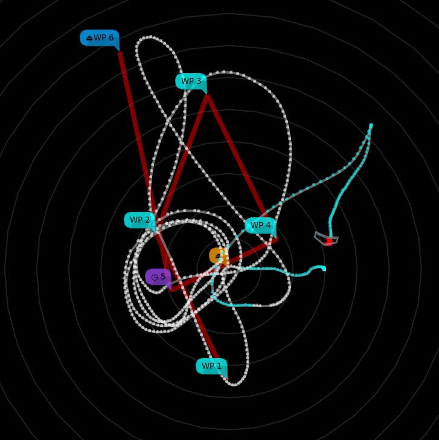

# Anonymous Maps

**mwp** provides a pseudo-map proxy that just gives you a black map (or user specified tile). This may be useful for a number of use-cases:

* privacy
* general obstinacy
* clarity of display

## Building

This proxy is not build by default, it is necessary to build, install and configure the proxy manually.

    cd mwptools/qproxy
    make bproxy
    # copy bproxy somewhere on the PATH
    cp bproxy ~/.local/bin/
    # or
    sudo cp broxy /usr/local/bin
    # or
    sudo cp broxy /usr/bin

## Configuration

That was the easy bit! Now it is necessary to tell {{ mwp }} where to find the proxy. This involves a setting and a configuration file.

First of all, ensure that the `map-sources` setting is enabled:

    $ gsettings get org.stronnag.mwp map-sources
    'sources.json'
    # here this set to a file sources.json (in the configuraion directory ~/.config/mwp/ / $LOCALAPPDATA/mwp)

if this is not set, then set it:

    $ gsettings set org.stronnag.mwp map-sources 'sources.json'

Now we need to edit the configuration file `sources.json`, there is a sample file in `mwptools/samples/sources.json `. you file needs a stanza like:

    {
     "id": "Black",
     "name": "Black Tiles",
     "license": "(c) jh ",
     "license_uri": "http://daria.co.uk/",
     "min_zoom": 0,
     "max_zoom": 20,
     "tile_size": 256,
     "projection": "MERCATOR",
     "spawn" : "bproxy",
    }
So a minimal `sources.json` looks like:

    {
       "sources" : [
          {
             "id": "Black",
             "name": "Black Tiles",
             "license": "(c) jh ",
             "license_uri": "http://daria.co.uk/",
             "min_zoom": 0,
             "max_zoom": 20,
             "tile_size": 256,
             "projection": "MERCATOR",
             "spawn" : "bproxy",
           }
       ]
    }

On starting **mwp** you should see a new map option "Black Tiles".

{: width="50%" }

## Custom Tile

It's also possible to have a custom tile (which does not have to be black). The tile **must** be:

* 256x256 pixels
* PNG

The full path is provided in the environment variable `MWP_BLACK_TILE`, e.g.

    # put this in e.g. ~/.bashrc to make it permanent
    export MWP_BLACK_TILE=~/.config/mwp/mytile.png

The environment variable may instead be added to [`cmdopts`](mwp-Configuration.md#cmdopts).

For example:

{: width="50%" }
