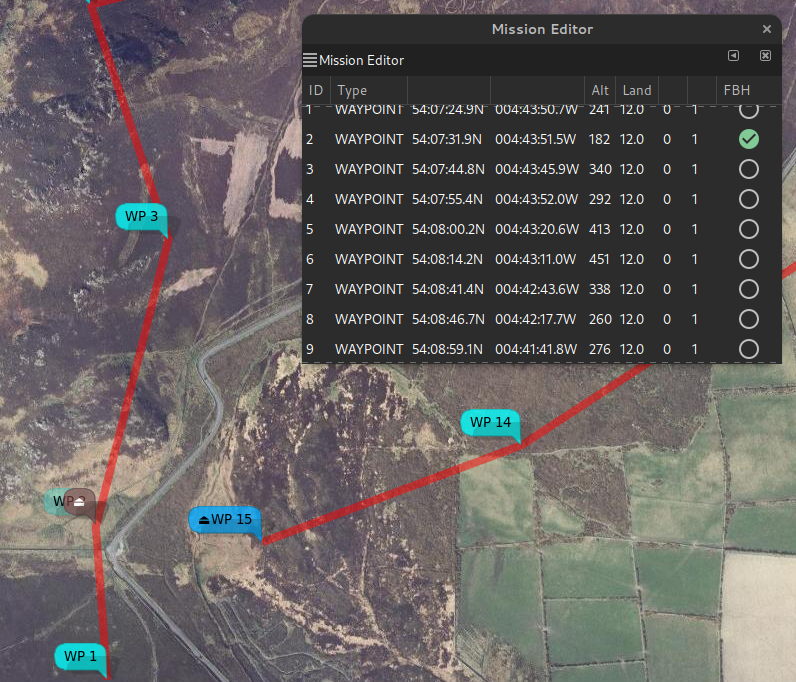
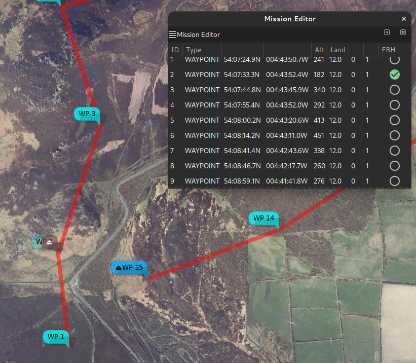
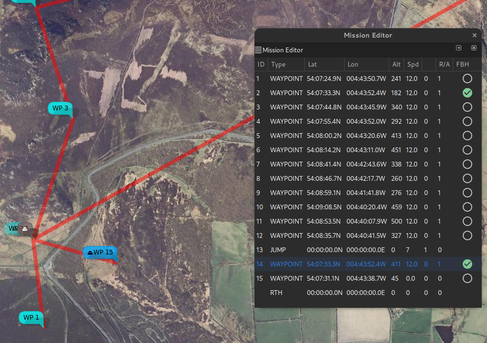

# Fly By Home Waypoints

## Introduction

For INAV 4.0, there is a ["FlyBy Home" (FBH) waypoint modifier.](https://www.youtube.com/embed/wjUzXyf2XEM)

<iframe width="560" height="315" src="https://www.youtube.com/embed/wjUzXyf2XEM" title="YouTube video player" frameborder="0" allow="accelerometer; autoplay; clipboard-write; encrypted-media; gyroscope; picture-in-picture" allowfullscreen></iframe>

This will set waypoints of types WAYPOINT, POSHOLD_TIME and LAND to execute at the arming home location (any safehome is ignored).

The flight controller applies FBH behaviour to waypoints having one (or both) of the following characteristics:

* The latitude and longitude are 0
* The mission item `flag` field is set to 0x48 (72 decimal, 'H')

In this case, the waypoint position is determined at run time (when the WP is actually used) and is set to the arming location. Note that the arming location must be set with a valid GPS fix.

As the waypoint location is determined during execution, it is not stored; so downloading a completed mission will return the original locations, not the locations used during the mission.

{{ mwp }} will perform the following checks when importing WAYPOINT, POSHOLD_TIME and LAND points:

* If the latitude and longitude are 0, then the flag is set to 0x48
* If the flag is set to 0x48 and latitude and longitude are 0, the latitude and longitude are set to the mission file home (which may also be 0)

This will ensure, as far as possible, that when such a mission is exported, it is safe on earlier {{ inav }} firmware. Note that this excludes using exactly 0,0 as an actual waypoint location (but 0.00001,0.00001 would be OK); in practical terms this is only likely to affect 007 villains.

## Implications for a graphical mission planner

{{ inav }} (and {{ mwp }}) do not require a planned homed location, so providing graphical support for waypoints whose location is indeterminate prior to mission execution is an interesting challenge. {{ mwp }} incorporates a number of new features to support FBH.

* The concept of a planned home location is embedded in the planning function. The planned home location is indicated by a brown icon.
* The planned home location is stored as metadata in the XML mission files.
* The `flag` attribute has been added the XML mission file schema.

The practical results being:

* A common mission file format continues to be used by mwp and the INAV configurator planner; maintaining mission file interoperability between the two applications.
* The planned home is recorded and may be used for subsequent re-planning of a mission.
* FBH waypoints have a position (the planned home) and the `flag` set. This means they will behave predictably when uploaded to older firmware.

## Usage in mwp

A waypoint may set set to FBH (or have FBH removed) from either the right mouse popup or the mission editor.

In the first image, no FBH waypoints have been set. We can see the planned home (the brown icon, which was read from the extant mission file), and the popup menu and mission editor. Note: the popup entry has since been renamed 'Fly By Home' for consistency.
<figure markdown>
{: width="50%" }
<figcaption>1. Initial state, no FBH</figcaption>
</figure>

In the second image, WP2 has been made a FBH WP; we can see that it is now attached the home icon (and slightly faded). The home icon can be dragged, the attached FBH waypoint is no longer independently draggable.
<figure markdown>
{: width="60%" }
<figcaption>2. WP2 set as FBH</figcaption>
</figure>

In the third image, the planned home has been moved slightly north, WP2 has moved with it.
<figure markdown>
{: width="60%" }
<figcaption>3. Home moved, WP2 moved as FBH</figcaption>
</figure>

In the forth image, a second waypoint (WP14) has been set as FBH; it is also now locked to the planned home location.
<figure markdown>
{: width="60%" }
<figcaption>4. Add WP14 as FBH</figcaption>
</figure>

In the fifth image, the FBH attribute as been cleared on WP2; it has been independently dragged to a new location.
<figure markdown>
{: width="60%" }
<figcaption>5. Remove FBH from WP2</figcaption>
</figure>

## mwp Ground Control Station and Replay modes

If a mission is loaded when mwp is used as ground control station or for log replay, and the mission contains FBH waypoints, then the mission will be redrawn with the actual home location when the home location is established.
