# Mission Elevations

## Overview

Prior to {{ inav }} 3.0, mission altitudes are relative to the HOME (arming) location, which is not part of a mission definition. As a result, the pilot has to be ensure by some other means that the mission will clear any raised elevations on the mission path. For INAV 3.0, missions may be either [relative to home or absolute](Support-for-inav-3.0-WP-features.md) (above a [datum, see below](#datum)).

**mwp** includes a `mwp-plot-elevations` tool that performs mission and terrain analysis.
Prior to 2021-05-03, this was provided by a ruby script in `mwptools/samples`; since 2021-05-03 there is a Go program (in `mwptools/mwp-plot-elevations`) which is an enhanced version, and supports [INAV 3.0 absolute altitude](Support-for-inav-3.0-WP-features.md) missions. If you're running an older version of **mwp**, or you haven't installed the Go compiler, you can use the older, less functional ruby version, but the Go version is recommended as:

* It supports INAV 3.0 absolute altitude waypoints
* It can update LAND waypoints to offset the difference between the home ground elevation and the LAND WP ground elevation.
* It's much faster
* Its usage is compatible with the deprecated ruby version.
* Bug fixes and improvements

Both the ruby application and the Go application are platform independent and can be used without {{ mwp }} for mission terrain analysis.

!!! note "Obsolescence Note"
    Prior to 2021-05, the ruby version was installed as `mwp-plot-elevations.rb`; now it's installed as plain `mwp-plot-elevations` in order that the superior Go version is a drop in replacement.

`mwp-plot-elevations` can rewrite the mission file with new elevations to provide a specified ground clearance.

## Video Tutorial & UI integration

From of 2018-12-06, `mwp-plot-elevations` is integrated into the `mwp` application.

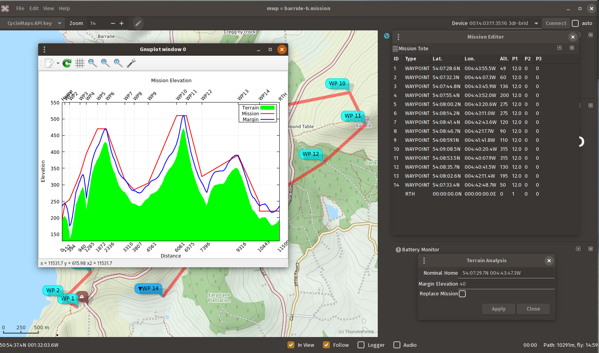{: width="70%" }

There is a [video tutorial](https://www.youtube.com/watch?v=oE3t5Asqhio).

!!! note "Obsolescence Note"
    The video uses the older ruby application, but that doesn't really affect *basic* functionality.

<iframe width="560" height="315" src="https://www.youtube.com/embed/oE3t5Asqhio" title="YouTube video player" frameborder="0" allow="accelerometer; autoplay; clipboard-write; encrypted-media; gyroscope; picture-in-picture" allowfullscreen></iframe>

## Sample output

Given the mission shown below:

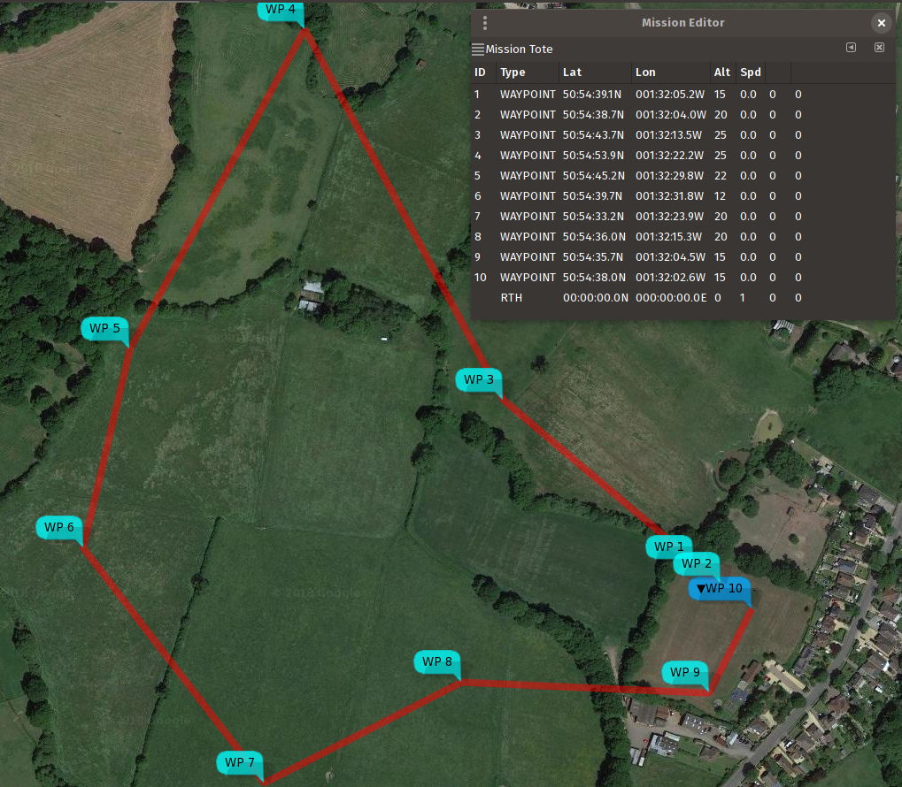{: width="50%" }

and knowing that the land rises to the north and west, we can check that we do indeed have adequate clearance with the planned route and elevations:

    	# for decimal '.' locales
    	$ mwp-plot-elevations -- home 50.9104826,-1.5350745 --plotfile profile.svg  west_field.mission
    	# for decimal ',' locales
    	$ mwp-plot-elevations --home "50,9104826 -1,5350745" --plotfile profile.svg  west_field.mission

where:

* `west_field.mission` is the MW-XML mission file (via [mwp](https://github.com/stronnag/mwptools), INAV configurator, [ezgui, mission planner for INAV] or [impload](https://github.com/stronnag/impload))
* the `--home lat,lon` option defines the home position (which may also be set by the environment variable `MWP_HOME`), the command line having preference. Note that for modern {{ mwp }} generated mission files, this information is provided in the mission file.
* The graphical output is `profile.svg`, via the `--plotfile` option.

The result from this command is an SVG file, which can be displayed with common image tools (`eog`, ImageMagick `display` et al). It can also be converted to a raster image using e.g. `rsvg-convert`); a sample is shown below:

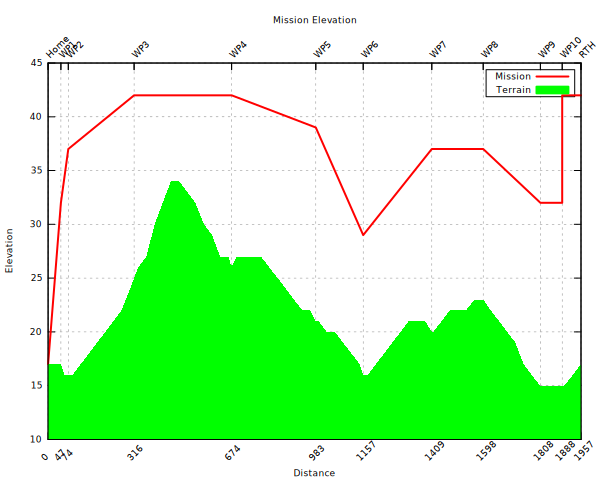{: width="50%" }

The red line represents the planned mission altitudes (which are defined relative to the estimated home location), and the green area represents the terrain. As we can see, we clear the hill (and other terrain), but cannot guarantee that we have LOS to lowest point of the mission, or that we're clear of the trees.

We can also specify a "clearance" option, in the image below this was set to 16m. Where the blue line is above the red line, one should review that the mission elevations are adequate.

{: width="50%" }

## Creating a new mission file

It is also possible (see command line options below) to write out a new mission that takes into account the clearance (`margin` parameter). If we then plot this new mission file, we can see that we are at least `margin` (in this example 16m) distance clear of the terrain.

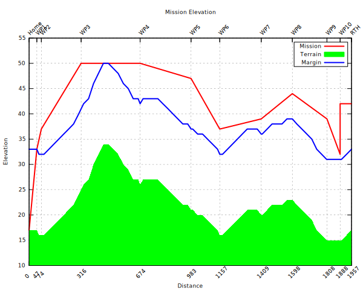{: width="50%" }

Note that the original mission elevations are still taken into account. We can also ignore these, so we end up the absolute clearance distance above the terrain.

    $ mwp-plot-elevations nm_west_field.mission --output /tmp/p1.mission --no-mission-alts

{: width="50%" }

## Dependencies

The **`mwp-plot-elevations`** has **NO** dependency on {{ mwp }} or Linux / FreeBSD, it can just as easily be run on MacOS or MS Windows. It does however has some dependencies:

### Go version

* Go compiler (1.13 or later)

### Ruby version

* ruby (2.0 or later)
* ruby 'gems' (libraries)
    * nokogiri
* gnuplot

`gnuplot` is easily provided (by your distro or from a binary download), and the `nokogiri` dependency is also easily satisfied by either the distro or Ruby's `gem` command:

    	$ apt install ruby-nokogiri
    	### or ###
    	> gem install nokogiri
    	## mwp Windows / Cygwin
    	$ cyg-apt install ruby-nokogiri

Using the package manager is recommended for non-proprietary operating systems.

On all operating systems, the terrain graph is also plotted interactively, regardless of whether the `-p` (save SVG plot) option has been specified. The following shows the UI on Windows (it's pretty much the same on other OS).

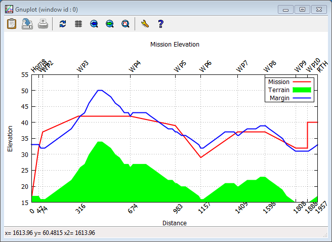{: width="50%" }

## Caveats

* 3rd party terrain data is not guaranteed, either as to its absolute accuracy, nor to its coverage.
* Terrain data does not take into account other obstacles (trees, buildings, power lines etc).
* The tool does not faithfully model the vehicle motion. As multi-rotor and fixed-wing have different climb behaviours, this would be quite complex.
* RTH altitude has to specified if you wish to model it, and assumes 'AT LEAST' behaviour.

## Datum

Digital elevation services can use the WGS84 Ellipsoid or "sea level"; survey maps typically use AMSL (Above Mean Sea Level); GPS can report either or both of WGS Ellipsoid and above MSL (mean sea level). The "sea level" used by Bing Elevations is computed from a magnetic anomaly / gravity database and may not be the same as the AMSL "sea level" used by the survey.  **Caveat User**.

* mwp currently uses Bing "Sea level" to obtain elevations. The user should apply a suitable margin.
* {{ inav }} firmware uses the GPS' AMSL value, so {{ inav }} and {{ mwp }} are consistent on this.
* The INAV configurator uses Bing's Ellipsoid values (by default, it can be changed).

Due to the granularity of the AMSL grid used by GPS and the gravity based Bing Sea Level, there may be a significant difference between ASML, "sea level", WGS84 Ellipsoid and Survey heights, for example, for a test point of  54.149461 -4.669315 (summit of South Barrule, Isle of Man):

* Google Earth : 470m
* Ordnance Survey (OS) Map (official survey): 483m
* Bing Ellipsoid (Configurator): 526m
* Bing "Sea Level" (mwp): 470m

## So who's right?

Many years ago, I took a GPS up South Barrule.

{: width="40%" }

It reads 485m, this pretty much agrees with the OS (Survey) height (AMSL). So the real issue is with the DEM available online (either Bing or Google). The 'sea-level" height DEM reports **for this location** is c. 13m below Ordnance Survey AMSL value whilst the WGS84 ellipsoid value is 43m above the OS AMSL value.

## Command line help and options

    $ mwp-plot-elevations --help
      -dump
    	Dump  internal data, exit
      -force-alt int
    	Force Altitude Mode (-1=from mission, 0=Relative, 1=Absolute (default -1)
      -home string
    	home as DD.dddd,DDD.dddd
      -keep
    	Keep intermediate plt files
      -margin int
    	Clearance margin (m)
      -no-graph
    	No interactive plot
      -no-mission-alts
    	Ignore extant mission altitudes
      -output string
    	Revised mission file
      -rth-alt int
    	RTH altitude (m)
      -svg string
    	SVG graph file
      -upland
    	Update landing elevation offset

Note that Go considers `-foo` and `--foo` to the equivalent. The ruby script requires the `--` notation.

## Configuration File

As well as specifying options such as home location, clearance margin and RTH altitude on the command line (or as an environment variable), some or all of these options may be set in a configuration file.

`mwp-plot-elevations` looks for options in one of the following (in order) `./.elev-plot.rc` (i.e. current directory), `$HOME/.config/mwp/elev-plot`,  and `$HOME/.elev-plot.rc`. The configuration file is a simple text file containing `key=value` pairs. Blank lines and lines beginning with `#` are ignored; the following example illustrates the recognised keys. Note that  `$HOME/.config/mwp/elev-plot` is the preferred location, as this is also used by `mwp` to populate its graphical dialogue to launch the analysis tool.

    # settings for mwp-plot-elevations
    margin = 16
    home = 50.910476,-1.535038
    # for ',' locales
    # home = 50,910476 -1,535038
    rth-alt=25
    # 'sanity' is the home -> WP1 distance check; default if not set here is 100m
    sanity = 200

## Usage Examples

    # Interactive plot, using the above configuration file:
    $ mwp-plot-elevations nm_west_field.mission

    # Interactive plot. save SVG file
    $ mwp-plot-elevations --plotfile /tmp/mission.svg nm_west_field.mission

    # Interactive plot. save SVG file, rewrite mission file
    $ mwp-plot-elevations --plotfile /tmp/mission.svg --output new_west_field.mission nm_west_field.mission

    # Interactive plot. save SVG file, rewrite mission file, override clearance margin (20m)
    $ mwp-plot-elevationsb --plotfile /tmp/mission.svg --outout new_west_field.mission --margin 20 nm_west_field.mission

    # Interactive plot. save SVG file, rewrite mission file,
    # override clearance margin (20m), reduce RTH altitude (22m)
    $ mwp-plot-elevations --plotfile /tmp/mission.svg --output new_west_field.mission --margin 20 --rth-alt 22 nm_west_field.mission

Another contrived example ... create a mission in Google Earth (tied to ground), save as KMZ, convert to MWXML mission file with [impload](https://github.com/stronnag/impload) (0 altitude). Use `mwp-plot-elevations.rb` to calculate a safe mission.

### KMZ planned in Google Earth

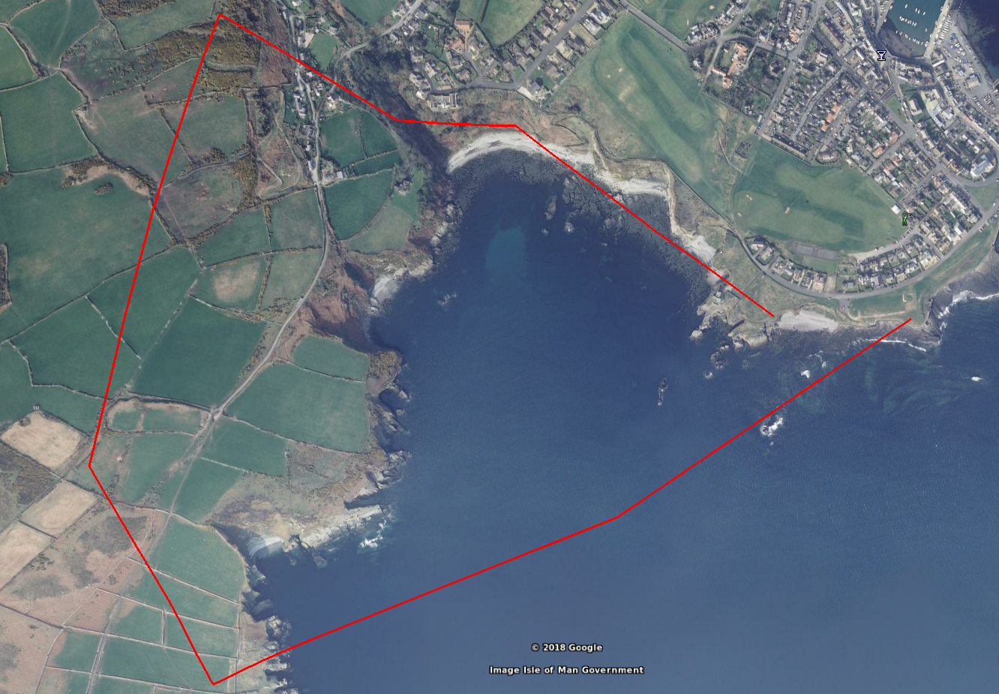{: width="60%" }

### Conversion tools

    # convert the saved KMZ file to a MWXML mission file
    $ impload convert  /tmp/IOM.kmz /tmp/perwick.mission

    # Verify the elevations and clearance with plot-elevations.rb
    $ mwp-plot-elevations.rb -h  54.068826,-4.735472   -m 40 /tmp/perwick.mission

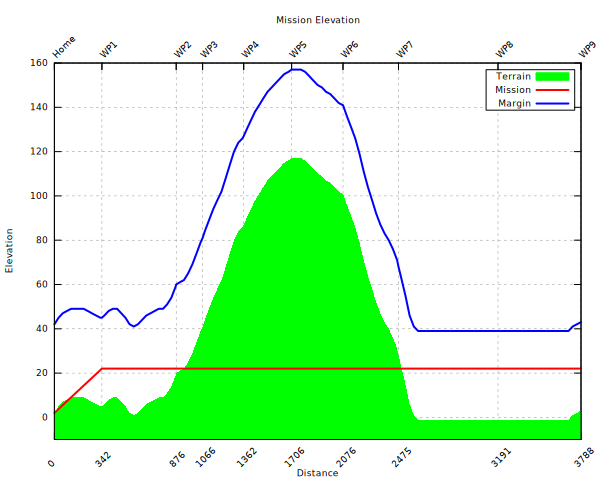{: width="50%" }

Looks OK (well, apart from the flying through the hill, due to impload's default altitude of 20m).

If we specify that a new mission file be generated (`--output`), the updated mission is also plotted, and we can see that this clears the hill.

    mwp-plot-elevations --home  54.068826,-4.735472 --margin 40 --output /tmp/perwick-ok.mission /tmp/perwick.mission

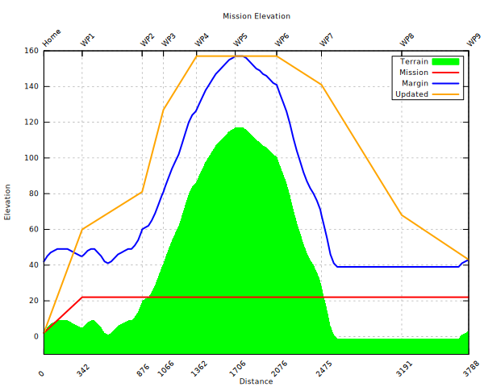{: width="50%" }

It's not yet perfect, we could be more aggressive in reaching just the clearance altitude, but we clear the hill!.

## Climb and Dive Angle Report

<figure markdown>
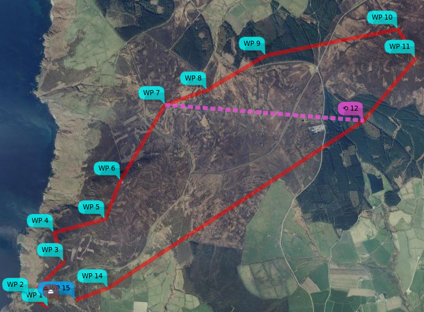{: width="60%" }

<figcaption>Mission used for climb /dive example</figcaption>
</figure>

As of 2021-06, it's also possible to get climb and dive angles for the calculated mission. Before I added the WP12 => WP7 jump in the mission shown below, it was almost OK; below the desired clearance in a couple of places and just failing to clear the hill at WP15. After adding the JUMP, it hits the terrain pretty conclusively between WP12 and WP7. The modified mission is interesting, as it has to adjust the WPs within the JUMP for the worst case (so the WP7, the second pass is definitive).

The final result:

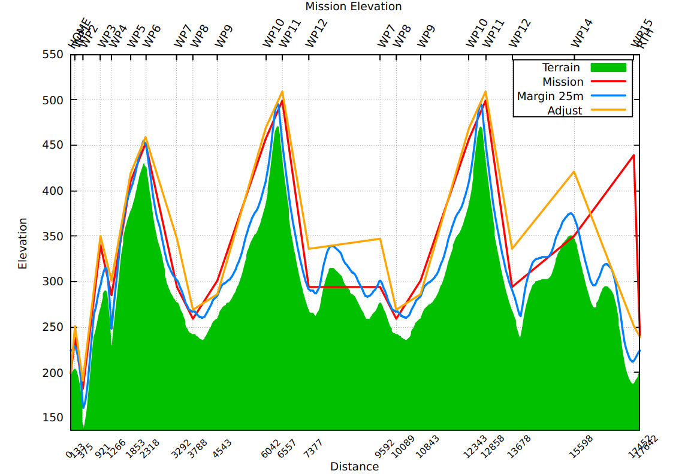{: width="50%" }

We also get a climb / dive report, currently to STDOUT and `$TMP/mwpmission-angles.txt` (tab separated for easy analysis).

    $ mwp-plot-elevations --margin 25 -no-mission-alts --output /tmp/n.mission \
     --home 54.125205,-4.730322 -rth-alt 40 mwp/missions/IoM/barrule-jump.mission
    HOME -  WP1	 21.3°	(climb)
     WP1 -  WP2	-13.9°	(dive)
     WP2 -  WP3	 16.2°	(climb)
     WP3 -  WP4	 -8.1°	(dive)
     WP4 -  WP5	 11.4°	(climb)
     WP5 -  WP6	  4.9°	(climb)
     WP6 -  WP7	 -6.6°	(dive)
     WP7 -  WP8	 -8.9°	(dive)
     WP8 -  WP9	  1.3°	(climb)
     WP9 - WP10	  7.0°	(climb)
    WP10 - WP11	  4.4°	(climb)
    WP11 - WP12	-11.9°	(dive)
    WP12 -  WP7	  0.3°	(climb)
     WP7 -  WP8	 -8.9°	(dive)
     WP8 -  WP9	  1.3°	(climb)
     WP9 - WP10	  7.0°	(climb)
    WP10 - WP11	  4.4°	(climb)
    WP11 - WP12	-11.9°	(dive)
    WP12 - WP14	  2.5°	(climb)
    WP14 - WP15	 -5.2°	(dive)
    WP15 -  RTH	 -3.6°	(dive)

If you run **mwp-plot-elevations** via **mwp**, the information is presented in a separate window.

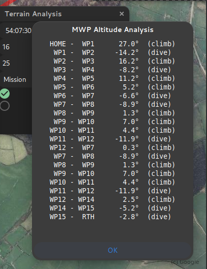{: width="30%" }

**mwp** can also highlight any legs that exceed user-defined (not 0) climb and dive angle limits. However, it's up to you to work out the best solution.

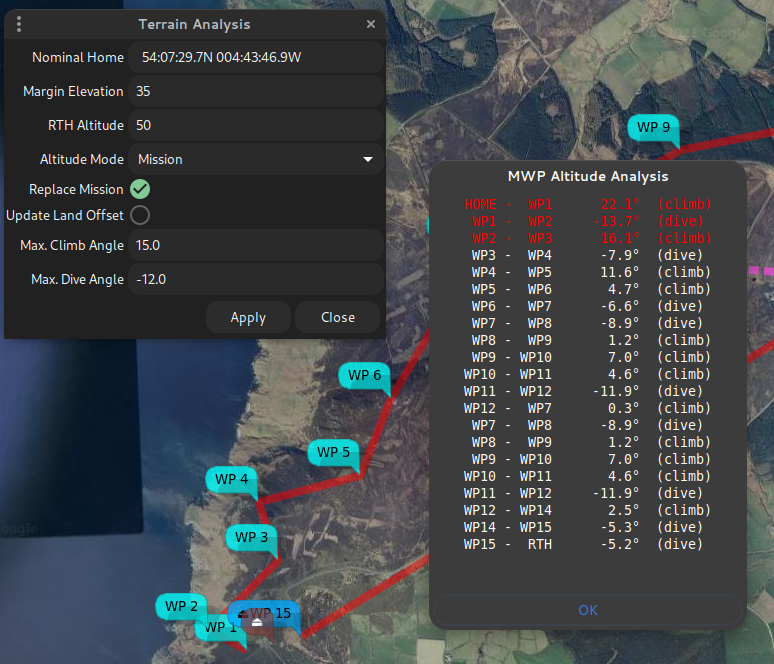{: width="50%" }

The steep hill and valley at the start are just too much here; best to reroute.

## Finally ....

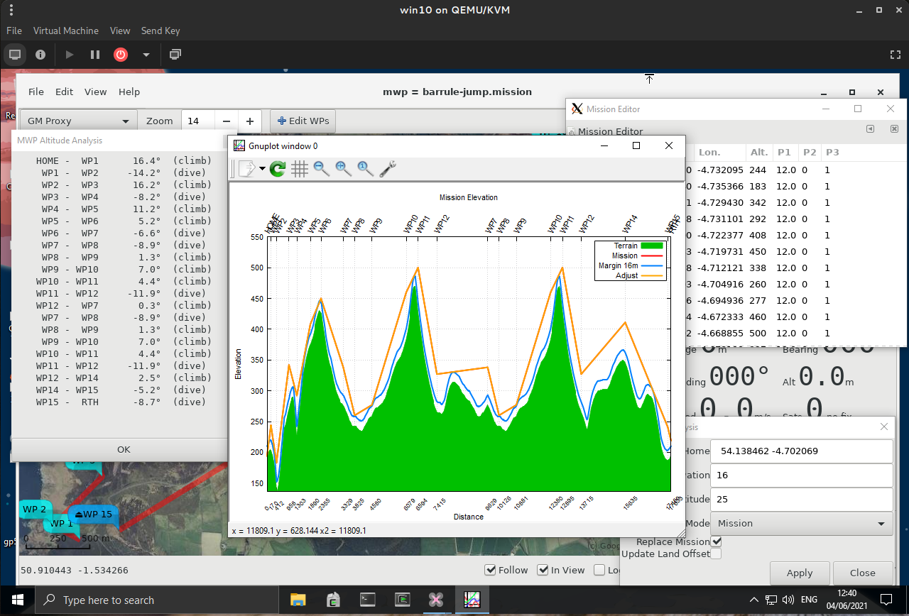{: width="80%" }

For Window 10 / Cygwin, you probably need to have the Windows `gnuplot`, vice the Cygwin version.
