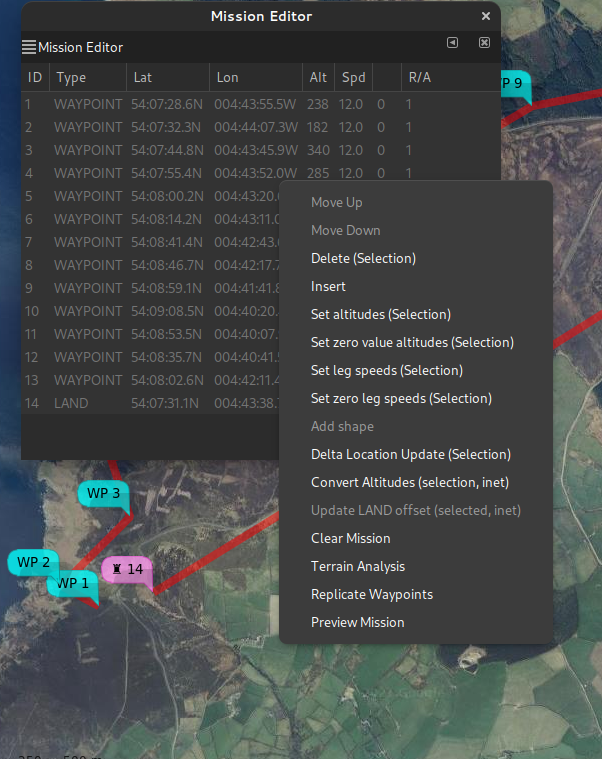
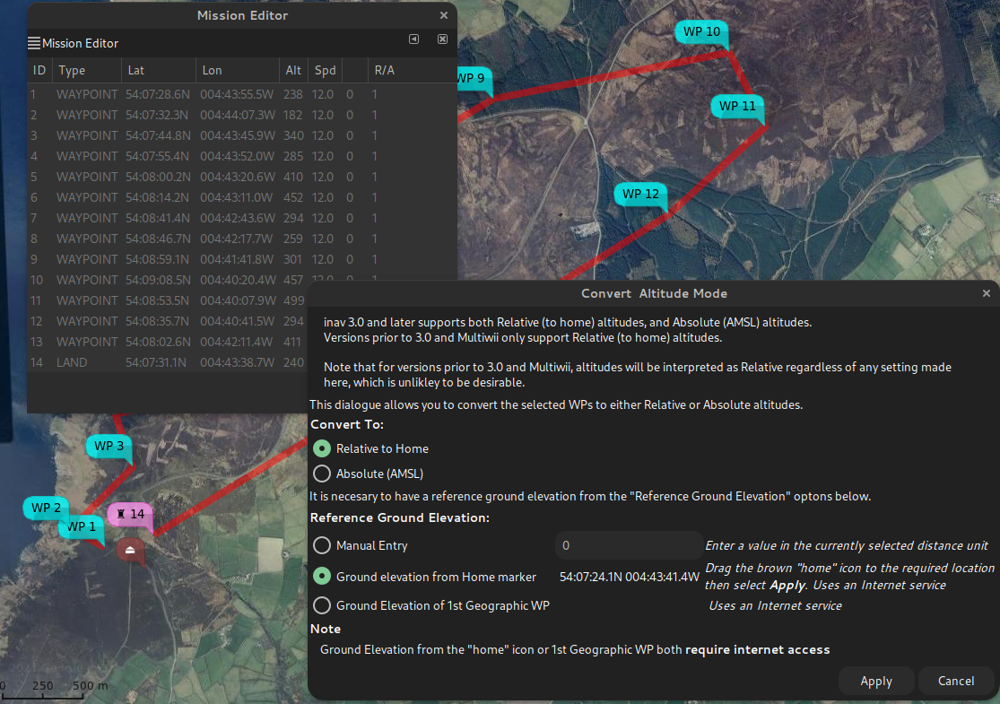
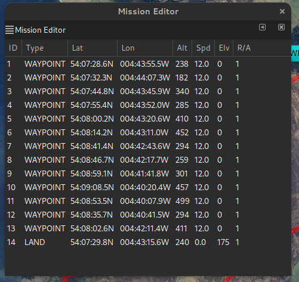
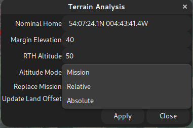

# mwp and INAV 3.0 Mission Updates

## Overview

INAV 3.0 adds a couple of changes to INAV mission planning:

* Absolute WP altitudes
* Land WP ground elevation setting

### Absolute WP altitudes

For Multiwii and INAV prior to 3.0, waypoint altitudes were always relative to the arming location. If you always fly in a flat area, or always arm at the same point, this wasn't really an issue; you could always use [mwp's terrain analysis](Mission-Elevation-Plot-and-Terrain-Analysis.md) to check that you'd clear any obstructions.

However, if you armed some (vertical) distance from the arming point assumed when the plan was created, the absolute, (AMSL) elevation of the WP would differ by the ground difference between the assumed arming point at planning time and the actual arming point at take off. In the worst case (arming at an 'zero' absolute elevation well below the 'assumed at planning time' location), this could result in automated flight into terrain, which is generally undesirable.

Absolute mission altitudes addresses this issue, as the AMSL elevation of the WP is fixed and does not depend on arming location.

### Land WP ground elevation setting

A similar issue existed prior to INAV 3.0 for the LAND WP; the initial implementation assumed that the LAND WP site ground elevation was at approximately the same ground elevation as the arming location. INAV computes landing behaviour based on relative altitude from home; if the actual LAND site was lower than home, then the descent would be slow; if it was higher, then slowdown might not occur and there would be a hard landing (for MR). For FW the final approach and motor-off would be sub-optimal.

The required land elevation uses the `P2` WP parameter, **in metres.**

* If LAND is a relative altitude WP, then this is the altitude difference between the assumed home and the LAND location.
* If LAND is an absolute altitude WP, then this is the absolute (AMSL) altitude of the LAND location.

## mwp support for 3.0 features

**mwp** supports the new feature in the Mission Editor and Terrain Analysis.

### Mission Editor

The mission editor gains two new context message options:

* Convert Altitudes (selection, inet)
* Update LAND offset (selected, inet)

The text in parentheses indicating that a selection of point and an internet (`inet`) connection is potentially needed.

* Internet connectivity is needed in order to perform conversion between absolute and relative modes, unless manual entry of the home elevation is chosen.
* Internet connectivity is needed for automatic LAND elevation adjustment, as mwp needs to known the LAND site ground elevation.
* However, the values can all the edited manually if necessary:

In the image below:

* The R/A column indicates the altitude mode (**R**elative to home, **A**bsolute). These are shown as the raw `P3`value, where `0` = Relative (default) and `1` means absolute (AMSL). A mission can contain a mixture of relative and absolute values.
* "Convert Altitudes ..." is enabled, because geospatial WPs are selected.
* "Update LAND offset ..."  is not enabled; it requires a single LAND WP to be selected.

{: width="40%" }

When "Convert Altitudes ..." is invoked, the user is presented with the following:

{: width="60%" }

* The user can select to convert the selected WPs to either Relative or Absolute. Only geospatial WPs are converted, and if the WP is already of the selected mode, it will be ignored.
* The user can select the reference home altitude by:
    * Entering a manual value, does not require an internet connection.
    * Dragging the brown "home" icon to the required position
    * Using the position of the 1st geographic WP, which does not have to be in the conversion selection.

  If "Apply" is clicked, the conversion proceeds, downloading elevation data from the internet as required. Cancel closes the dialogue and clears the selection from the Mission Editor.

When "Update LAND offset ..."  is invoked, the user is presented with a similar dialogue, without the Altitude Mode selection, as that's implicit from the selected waypoint.

In the image below, WP14 has been moved down the valley:

{: width="60%" }

When this is applied, the WP14 value (parameter 2, "Elv" in the cell headers), should decrease, which it does, from 183m to 175m (AMSL).

{: width="30%" }

### Terrain Analysis

[mwp's terrain analysis](Mission-Elevation-Plot-and-Terrain-Analysis.md) function has been upgraded to handle INAV 3.0 features (Relative / Absolute Elevations, Land Ground Elevation). If you're using the older (ruby) terrain analysis tool, you won't see the new features. The [mwp terrain analysis article](Mission-Elevation-Plot-and-Terrain-Analysis.md) also describes the new analysis tool.

In the image below, the dialogue has been enhanced to allow selection of the altitude mode and adjustment of LAND elevation. The orange graph line shows the generated mission with a 40m clearance of all obstacles.

{: width="80%" }

The user can select the following altitude modes:

{: width="30%" }

* Mission - use the altitude mode from the mission
* Relative to home
* Absolute (AMSL).

## Attribute editing

Of course, it's not necessary to use the new dialogues to set or change the new INAV 3.0 features.

* The `parameter3` value sets the altitude mode 0 = relative to home (legacy default), 1 = Absolute.
* The `altitude` value is interpreted according to `parameter3`
* For a LAND WP `parameter2` defines the LAND WP ground elevation; if `parameter3` is 0, then it's relative to home, if `parameter3` is 1, then it's absolute (AMSL).

## Further reading

The [INAV wiki](https://github.com/iNavFlight/inav/wiki/MSP-Navigation-Messages) describes WP mission parameters in some detail.

Discussion of the meaning of ["sea level"](Mission-Elevation-Plot-and-Terrain-Analysis.md#datums). It's confusing.
