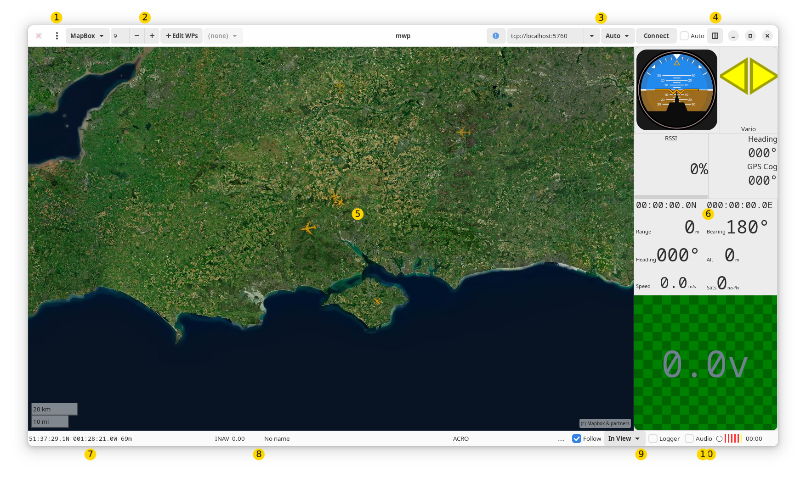
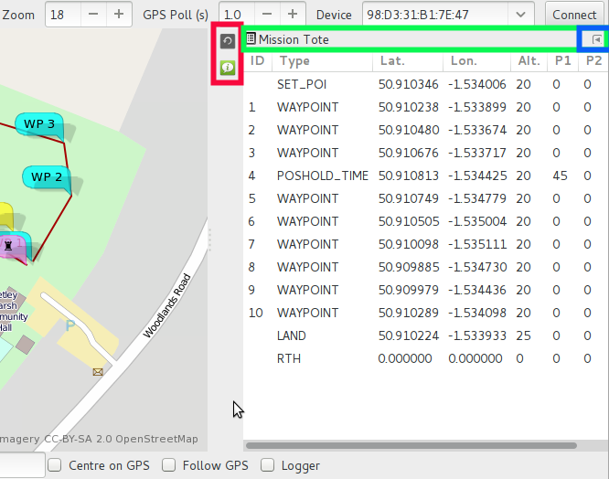
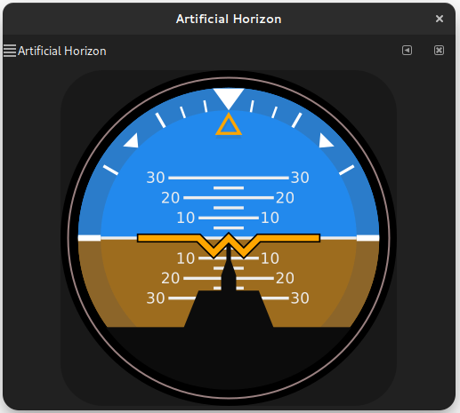
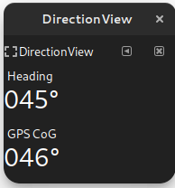
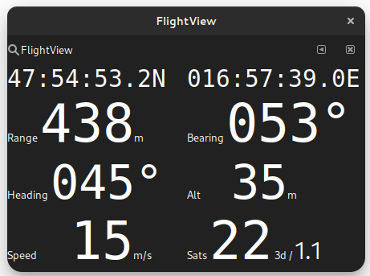
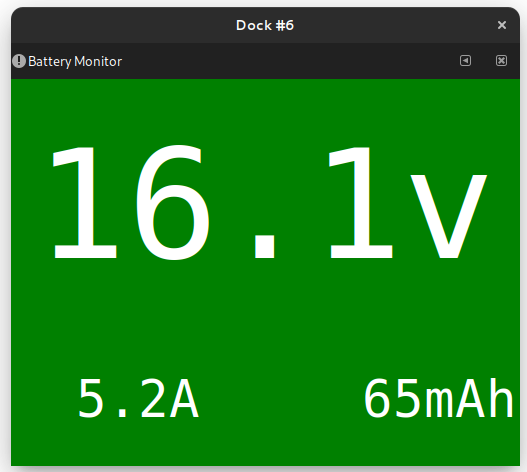
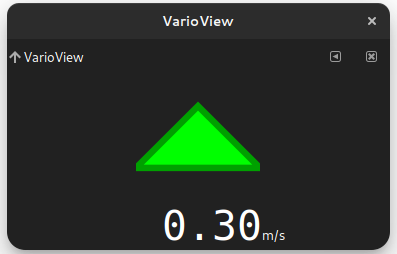
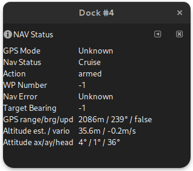
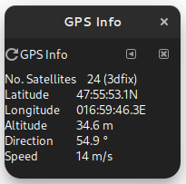

# Dock Concepts and Usage

## Dock Overview

The **dock**, items 5 and 6 in the main window guide provides an area for optional widgets.

{: width="100%" }

This [slightly outdated video](https://vimeo.com/267437907) that describes dock usage probably better than words might do.

<iframe src="https://player.vimeo.com/video/267437907?h=015ed1fdc6" width="640" height="431" frameborder="0" allow="autoplay; fullscreen; picture-in-picture" allowfullscreen></iframe>

!!! info "Current Status"
    * The dock is now installed populated.
	* WP editor switch is enabled by default
    * There is now a graphical "favourite places" editor
    * The build system is no longer `make`

## Dock Usage

{{ mwp }} uses the GNOME Docking Library (`gdl`) to provide a dock capability. Items in the dock may be hidden, iconified or torn off into a separate window (that may then be returned to the dock). This section explains how use gdl in mwp. There is also an [ancient short (silent) video](https://vimeo.com/147958984) illustrating dock actions.

* Load a mission into the mission tote
* Load the Nav Status into the dock bar
* Click the Nav Status icon to view nav status in the dock
* Move the Nav status view into a window
* Drag the Nav Status window back into the dock, selecting one of dock locations offered
* Minimise the Nav Status back to the dock bar (the little arrow)
* Reopen the Nav Status into the dock
* Hide the Nav Status
* Restore the Nav Status as a dock icon
* Reopen Nav Status in the dock.

!!! warning "Caveat updates"
    If a {{ mwp }} update expands the  dock adding new dock items, any previously saved dock layouts are invalidated, and you will have to manually recreate them. Fortunately, this is a rare occurrence.

The main dock controls are shown below:

{: width="50%" }

!!! note "This is an old image from c. 2015."

* Highlight in **red** : the dock icons. Clicking on these will restore the window (either to the dock, or as a separate window)
* Highlight in **green** : the dock item bar. Where multiple items are in the dock, the tab icon may be dragged to reposition the docked window. In also has a pop-up menu, that allows the item
to be completely hidden (but recoverable from the View menu), and
* Highlight in  **blue** :  a iconify widget that will add the item to dock icon bar (the red highlight).

If the item bar icon (left-most in the green area) is dragged from the dock, the item will appear as a separate window. The detached window may be added back to the dock by dragging the window's “item bar” back into the dock, or added back to the dock icon bar using the iconify button (the left facing arrow to the right of the window's “item bar”. If the detached window is closed, then it becomes hidden, and may be reattached to the dock (as an iconified dock item) from the View menu.

!!! info "Wayland Display API"
    When docklets are dragged around to reposition then, an "target" landing area is shown on the dock area. Unfortunately, the some older versions of the "modern" **Wayland** display manager breaks this in a way that only the upstream maintainers can fix. The workaround is to temporarily force X11 mode:

	```
	# In a terminal
	$ GDK_BACKEND=x11 mwp
	# Drag dock items around
	$ mwp # items moved, Wayland again
	```

## Dock Items (Dockets)

The following items are provided.

### Artificial Horizon

{: width="30%" }

### Direction View

{: width="15%" }

### Flight View

{: width="33%" }

### Mission Editor

{: width="35%" }

### Radio Status

{: width="15%" }

### Battery Monitor

{: width="30%" }

### Vario View

{: width="25%" }
{: width="25%" }
{: width="25%" }

### Telemetry View

{: width="15%" }

### MW Nav Status

{: width="30%" }

### MW GPS Status

{: width="17%" }
