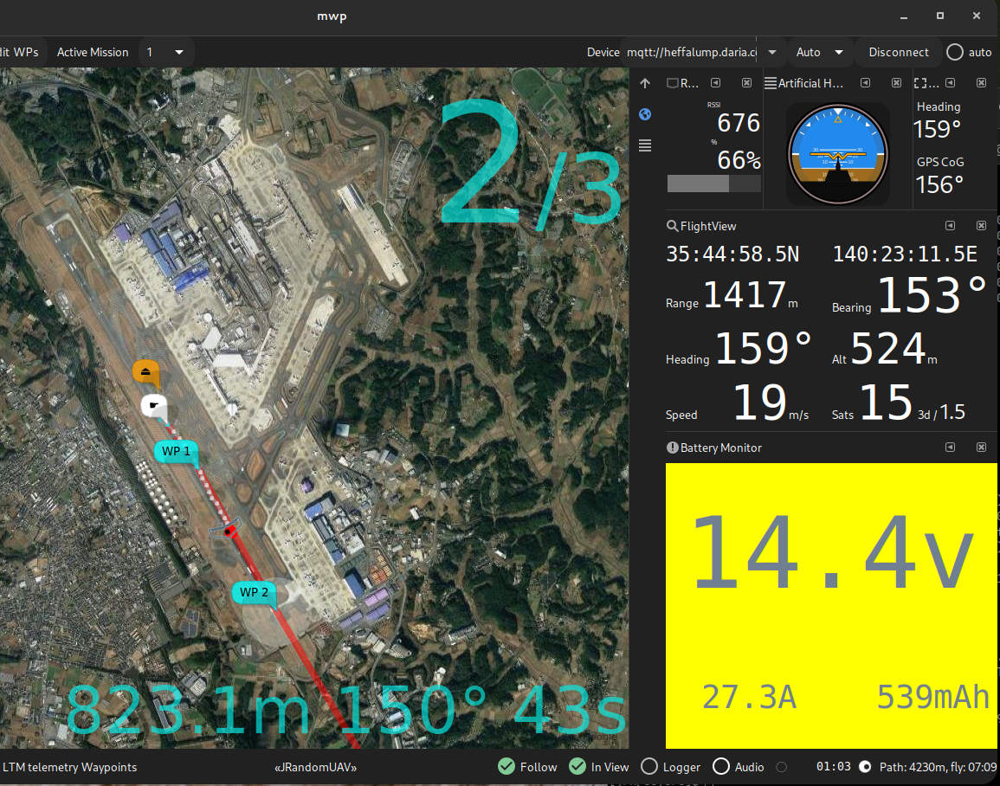
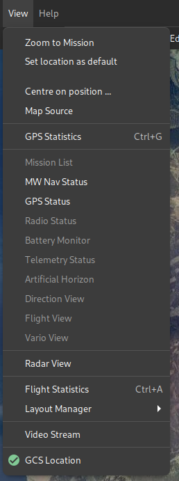

# Ground Control Station Features

## GCS Usage

### OSD information

When flying waypoints, if the mission is also loaded into {{ mwp }}, {{ mwp }} can display some limited OSD information.

{: width="75%" }

Various settings (colour, items displayed etc.) are defined by [settings](mwp-Configuration.md#dconf-gsettings).

### GCS Location Icon

A icon representing the "somewhat static" GCS location can be activated from the **View/GCS Location**" menu option:

{: width "20%" }.

By default, it will display a tasteful gold star which one may drag around. It has little purpose other than showing some user specificed location (but see [below](#radar)).

If you don't like the icon, you can override it by creating your own icon in `~/.config/mwp/pixmaps/` (as one can for _any_ mwp specific icon), with the same file name as the default in `$prefix/share/mwp/pixmaps/`; i.e. override `$prefix/share/mwp/pixmaps/gcs.svg` with `~/.config/mwp/pixmaps/gcs.svg` (which could be a PNG, vice SVG; we're a real OS and file "extensions" are an advisory illusion).

* If `gpsd` is detected (on `localhost`), then the position will be driven by `gpsd`, as long as it has  a 3D fix.

* The one  usage is when [inav-radar](mwp-Radar-View.md) is active; if the GCS icon is enabled (either by manual location or driven by `gpsd`), then rather than being a passive 'GCS' node, {{ mwp }} will masquerade as an 'INAV' node and advertise the GCS (icon) location to other nodes. This implies that you have sufficent LoRa slots to support this node usage.

