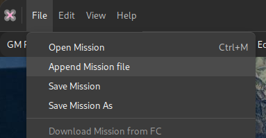
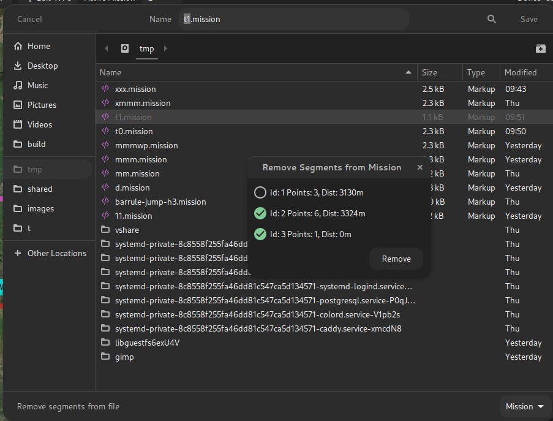
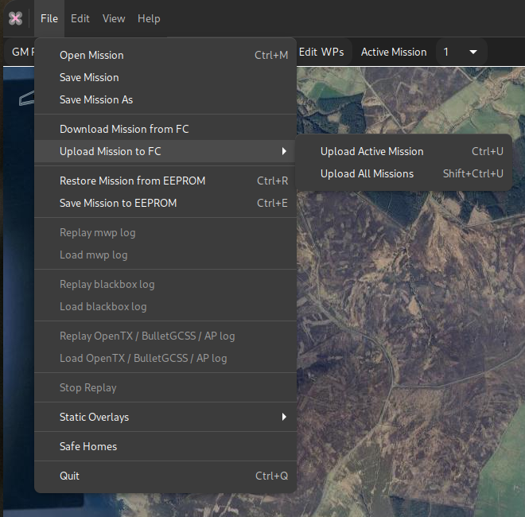
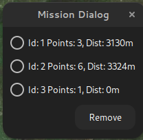

# INAV 4.0 Multi-Mission Support

## Overview

In {{ inav }} 4.0, the FC supports "multi-missions", that is allowing the user to upload and store multiple missions.

The mission to be executed may be set when the mission set is uploaded, or selected by OSD command (or stick command).

## mwp support

The means by which this function is provided by the FC is a little inconvenient (for the planner) but expedient; it's hard to see how else it could have been implemented.

In general and in summary, the functionality allows multiple missions to exist in a single "mission file" and either one or all of those mission can be uploaded to the FC.

When a "multi-mission" set is downloaded from the FC, {{ mwp }} will set the active mission to that set as active in the FC.

When a "multi-mission" set is uploaded to the FC, mwp will set the active FC mission to its active mission.

## mwp changes

### Top Bar

The top bar how includes an "Active Mission" item. This always has mission 1 (the legacy mission) and offers "New", allowing multiple missions to be maintained in one mwp session.

{: width="30%" }

### Open Mission file

The file open dialog has a preview pane that displays the missions in a multi-mission file. The user can select the mission to be the active mission.

{: width="75%" }

### Append Mission File

It is now possible to append an existing mission file (which may hold multiple missions) into a multi-mission set. This uses same dialog as [Open Mission File](#open-mission-file).

{: width="30%" }

### Save As Mission file

The file "Save as" dialog has an option to exclude specific segments from a multi-mission (via the **Remove Segments from file** button in the following image).
Note that "Save" will always save all mission segments.

{: width="75%" }

In this case, only segment 1 of the multi-mission would be saved.

## Upload / Download Menu Options

The menu options reflect the new capability to upload all or the active mission. The "Save to EEPROM" option may also change to this pattern in future.

{: width="40%" }

### Multi-Mission Manager

The **Edit** menu has a **Multi Mission Manager** option. This allows the user to delete one or more missions from a multi-mission scenario.

{: width="20%" }


## FC Limits

inav 4.0 limits the total number of waypoints to 120 and the number of mission segments within a multi-mission scenario to 9.

**mwp** will allow the user to exceed these limits while creating / editing multi-mission scenarios, but enforces the limits for upload. So it would be possible to open / append files containing a total of (for example) 11 mission segments and 150 WPs. It would be necessary to reduce the mission set to the FC limits before it could be uploaded.

## Legacy

mwp still supports prior FC firmware, including MW. It is a bug if this is not the case. However, the user needs to be aware of the capabilities of the FC firmware.

## Caveats

* This is all quite novel and has required some significant changes in {{ mwp }}; however it appears quite stable.
* By default, {{ mwp }} writes mission files in "reset / per segment metadata" style.
* Multi-mission files may be written in the (IMO) ugly / confusing "sequential" style required by the configurator if the environment variable CFG_UGLY_XML is set (to any value). See the [schema definition](https://github.com/iNavFlight/inav/tree/master/docs/development/wp_mission_schema) for details. mwp can read either style.

## Example XML multi-mission file

```
<?xml version="1.0" encoding="utf-8"?>
<mission>
  <!--mw planner 0.01-->
  <version value="42"></version>
  <mwp save-date="2021-11-11T07:22:43+0000" zoom="14" cx="-3.2627249" cy="54.5710168" home-x="-3.2989342" home-y="54.5707123" generator="mwp (mwptools)"><details><distance units="m" value="3130"></distance><nav-speed units="m/s" value="10"></nav-speed><fly-time units="s" value="319"></fly-time><loiter-time units="s" value="0"></loiter-time></details></mwp>
  <missionitem no="1" action="WAYPOINT" lat="54.5722109" lon="-3.2869291" alt="660" parameter1="0" parameter2="0" parameter3="0" flag="0"></missionitem>
  <missionitem no="2" action="WAYPOINT" lat="54.5708178" lon="-3.2642698" alt="755" parameter1="0" parameter2="0" parameter3="0" flag="0"></missionitem>
  <missionitem no="3" action="WAYPOINT" lat="54.5698227" lon="-3.2385206" alt="513" parameter1="0" parameter2="0" parameter3="0" flag="165"></missionitem>
  <mwp save-date="2021-11-11T07:22:43+0000" zoom="15" cx="-3.2778311" cy="54.5568837" home-x="-3.2983737" home-y="54.5622331" generator="mwp (mwptools)"><details><distance units="m" value="9029"></distance><nav-speed units="m/s" value="10"></nav-speed><fly-time units="s" value="929"></fly-time><loiter-time units="s" value="0"></loiter-time></details></mwp>
  <missionitem no="1" action="WAYPOINT" lat="54.5599696" lon="-3.2958555" alt="236" parameter1="0" parameter2="0" parameter3="0" flag="0"></missionitem>
  <missionitem no="2" action="WAYPOINT" lat="54.5537978" lon="-3.2958555" alt="136" parameter1="0" parameter2="0" parameter3="0" flag="0"></missionitem>
  <missionitem no="3" action="WAYPOINT" lat="54.5547933" lon="-3.2864141" alt="238" parameter1="0" parameter2="0" parameter3="0" flag="0"></missionitem>
  <missionitem no="4" action="WAYPOINT" lat="54.5597705" lon="-3.2695913" alt="570" parameter1="0" parameter2="0" parameter3="0" flag="0"></missionitem>
  <missionitem no="5" action="WAYPOINT" lat="54.5552910" lon="-3.2598066" alt="502" parameter1="0" parameter2="0" parameter3="0" flag="0"></missionitem>
  <missionitem no="6" action="JUMP" lat="0.0000000" lon="0.0000000" alt="0" parameter1="1" parameter2="1" parameter3="0" flag="165"></missionitem>
  <mwp save-date="2021-11-11T07:22:43+0000" zoom="20" cx="-3.2501935" cy="54.5714148" generator="mwp (mwptools)"><details><distance units="m" value="0"></distance></details></mwp>
  <missionitem no="1" action="WAYPOINT" lat="54.5714148" lon="-3.2501935" alt="50" parameter1="0" parameter2="0" parameter3="0" flag="165"></missionitem>
</mission>
```

[Download sample mission](https://github.com/stronnag/mwptools/wiki/assets/sample-multi.mission)
