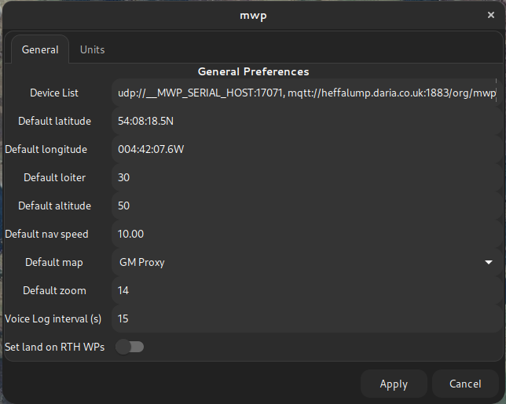
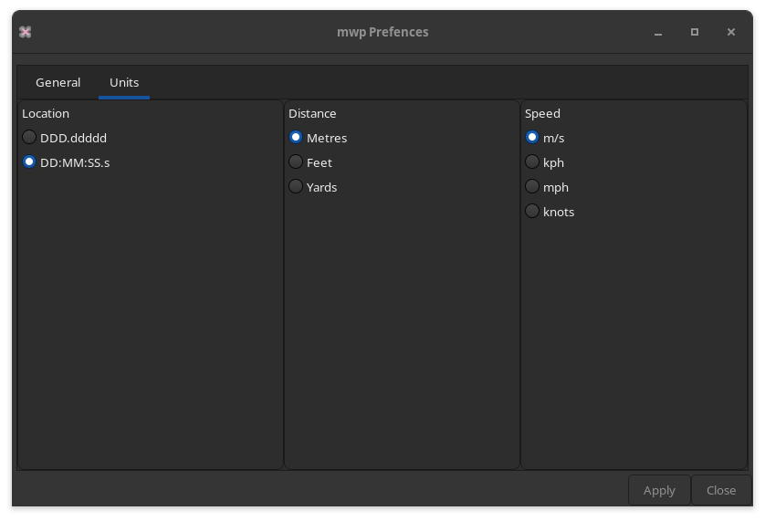
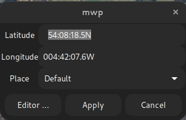
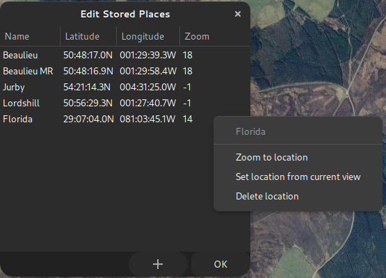

# Miscellaneous UI Elements

## Preferences

The "Edit > Preferences" menu provides a UI for some `gsetting` / `dconf` [settings](mwp-Configuration.md). The settings here are applied immediately if 'Apply' is clicked.

### General Preferences

{: width="50%" }

### Units Preferences

{: width="50%" }

Unit preferences should be instantly reflected in the UI when 'Apply' is clicked.

### Favourite Places

{{ mwp }} maintains a list of favourite places, from "View > Centre on Location" menu item.

{: width="30%" }

The "Place" combo menu holds all places defined in `~/.config/mwp/places` (see the [configuration reference](mwp-Configuration.md)).

For convenience, clicking the 'Editor ...' button will load the "Places Editor".

{: width="30%" }

* New items are added with the **+** button.
* Locations can be edited in place
* The context (right mouse button) menu:
    * Zoom to location : Zooms to the place
	* Set location from current view : Sets the location to the centre of the current map view
	* Delete location : Deletes the location without question.
* **OK** Saves the locations to `~/.config/mwp/places`
* Closing using the window manager **X** icon closes without saving.
