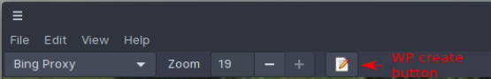
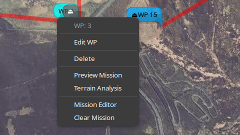
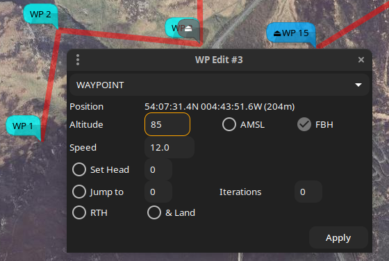
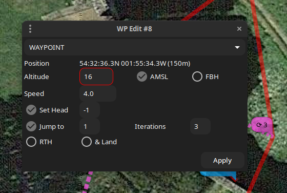
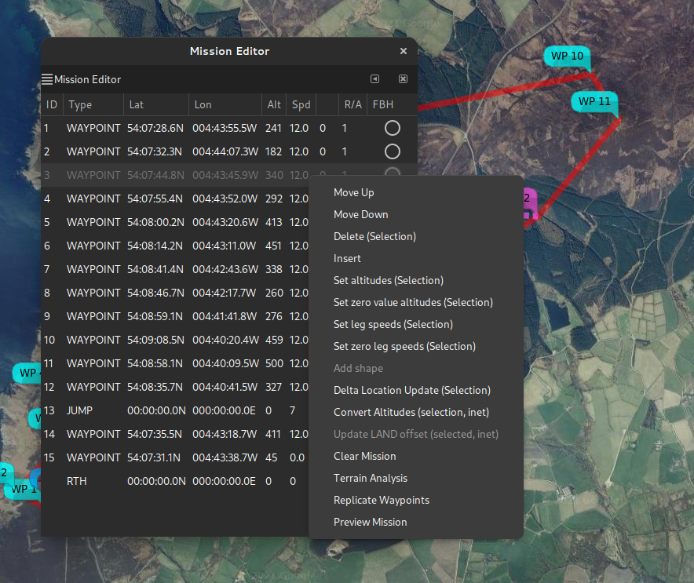
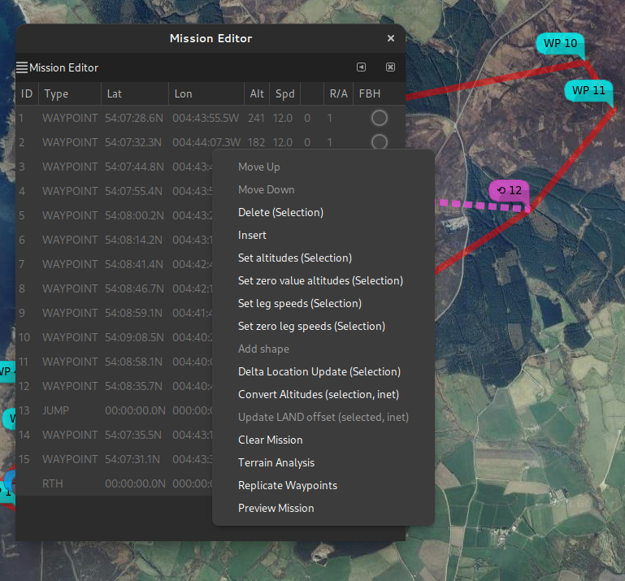
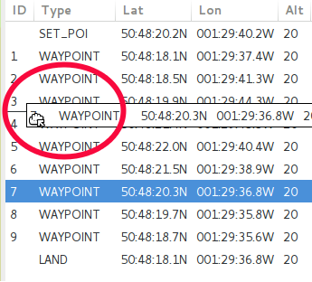
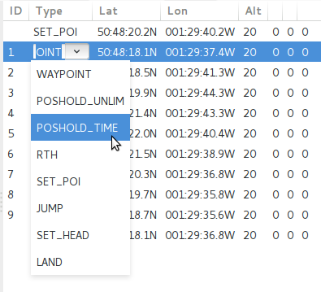

# Mission Editor

## Overview

Another [slightly outdated video](https://vimeo.com/268036585), generic mission editing.

<iframe src="https://player.vimeo.com/video/268036585?h=e81256c10e" width="640" height="431" frameborder="0" allow="autoplay; fullscreen; picture-in-picture" allowfullscreen></iframe>

!!! info "Current situation"
    * {{ inav }} now supports 120 waypoints
    * {{ inav }} now supports `SET_POI` and other multiwii waypoint types.
    * Delete from the map popup context menu behaves as it does in the tabular editor; it removes the RTH state.

Please also refer to the following chapters that provide specific information for advanced {{ inav }} capability topics:

* [INAV multi-missions](inav-4.0-multi-missions.md)
* [INAV fly-by-home](Fly-By-Home-waypoints-(inav-4-new-feature).md)

## Map Features

Missions are edited on the map by enabling mission edit mode:

{: width="40%" }

This will:

* Display a notional home location (brown icon)
* Allow new WPs to be created by clicking on the map
* Provide a context popup menu by right click on a WP icon

The context menu is displayed by right click on a WP icon, for example:

{: width="30%" }

Almost all functions are available here, however some advanced functions, moving (multiple) WP,  etc. requires the tabular mission editor.

### Edit Waypoint

The **Edit Waypoint** option opens an edit form for the current waypoint. The items displayed depend on the type of waypoint.

{: width="30%" }

In this image, note:

* The Way Point type `WAYPOINT`.
* The WP location (and absolute elevation AMSL)
* The WP Altitude, either absolute (here the ASML box is checked) or relative. Whether this is a [Fly By Home (FBH) waypoint](Fly-By-Home-waypoints-(inav-4-new-feature).md)
* The speed (m/s)
* Additional attributes which may be enabled or disabled:
    * Set Heading (-1 to clear a previous set head)
	* JUMP parameters (-1 Iterations == infinite)
	* Return to Home (and land).

Multiple attributes may be set.

If the AMSL button is toggled, **and a valid planned home location** is set, then the altitude will be adjusted. For the above example, if the AMSL box is cleared, the dialogue shows:

{: width="30%" }

Note that the Altitude box has an orange border to show that the altitude has been automatically updated.

If there is no planned home location, and the AMSL box is toggled, then the Altitude box assumes a red border to indicate to the user that manual intervention is required.

{: width="30%" }

In the above image, a relative altitude of 16m has been toggled to absolute; there is no home position, so the altitude entry has a red border, as this is now below the absolute altitude of the terrain.

Note also that this example has multiple option set (SET HEAD and JUMP).

## Mission Editor

The mission editor may be invoked from the [dock](dock.md) or from a WP context menu.

It provides the following functions:

* Create, delete, modify, reorder waypoints.
* Inline editing of parameters
* Context sensitive column titles for parameter editing
* Bulk updates (altitudes, speeds, position offsets)
* Automated path (polygon around a shape) generation.
* [Terrain Analysis](Mission-Elevation-Plot-and-Terrain-Analysis.md), automated altitude correction.

There is a right mouse context menu, the availability of items depending on whether zero, one or multiple items are selected.

<figure markdown>
{: width="75%" }

<figcaption>Single selection context menu</figcaption>
</figure>

<figure markdown>
{: width="75%" }
<figcaption>Multiple selection context menu</figcaption>
</figure>

### Common Operations

Many of the operations described below are shown in the videos, which probably provide a clearer explanation that any textual description could.

#### Editing

Way points can be edited Mission Editor. When a row is selected, the column headers will change to indicate the data fields appropriate to the point type (in particular the “parameters” P1,P2,P3 whose interpretation is dependent on the point type.

* Position. The position of a way point may be changed by dragging the way point icon on the map or editing in the list.
* Order. The order of way points may be changed by either:
    * Using the “Move Up” and “Move Down” entries from the mission pop-up menu; or
    * Dragging the list item to the desired position. In order to drag, the entry must be 'grabbed' on the ID column. In that screen-shot (below), way point 7 is being dropped between way points 3 and 4.
    * At the end of the drop, the list and markers on the map will be re-ordered.

        {: width="35%" }

* Type. The way point type may be selected from a drop down menu embedded in the "Type" column of the list:

    {: width="35%" }

  Once the type has been changed, default parameters for that way point type or action will be set. The type may also be set by a right mouse button click on the map symbol.

* Altitude. New points are created with the default altitude (from the "Preferences"). Some basic validation is performed
* Parameters P1, P2 and P3. The parameters P1,P2 and P3 are integer values that have a meaning specific to the way-point type or action. For example, for action type of JUMP, P1 is the point to which to jump, and P2 is the number of repeats. This usage is documented in the [INAV wiki](https://github.com/iNavFlight/inav/wiki/MSP-Navigation-Messages).
* Delete. The delete action will delete the selected (highlighted) way point(s). If no way point is selected, this option has no affect.

#### Add Shape

If a SET POI point is added to the mission, (there may also be other extant way-points), this option will display a dialogue to enter the number of points in a shape, the radial distance (from the SET POI to each point), an offset angle and the direction of rotation. i.e this defines a polygon around the POI.

* The offset is relative to North. If you wanted the lines to be horizontal / vertical, specify an offset of 45° for a square.
* Shape points are appended to any extant mission points, and the shape tool may be invoked multiple times, for example to create 'concentric' circles.
* The `SET_POI` point may be deleted, unless you really want `SET_POI` functionality.

#### Location Updates

Bulk location updates may be applied to selected waypoints.

{: width="30%" }

If an item if left black (or 0), then no adjustment is applied to that axis. Offsets are in metres, regardless of the user's preference distance unit.

#### Speed and Altitude updates

Bulk speed and altitude updates may be applied to selected waypoints.

#### Convert Altitudes

From {{ inav }} 3.0, {{ inav }} supports both relative and AMSL altitudes. This, and the {{ mwp }} features for managing this, are described [in a separate chapter](Support-for-inav-3.0-WP-features.md)

#### Replicate Waypoints

This item facilitates the cloning of waypoints. Since {{ inav }} now supports the JUMP waypoint type, this option is less useful that is was previously.

#### Preview Mission

["Flys"](#mission-preview) an aircraft icon around the mission; this may be useful for predicting the behaviour of multiple embedded JUMPs.

#### Clear Mission

The Clear Mission option clears the mission. There is no confirmation, so be sure you really want to do this.

## Advanced WP types / Video Tutorials

### JUMP, POSHOLD TIMED, LAND

[Video example](https://www.youtube.com/watch?v=w6M-v4qM5Yg) setting up JUMP, POSHOLD TIMED and LAND waypoints.

<iframe width="560" height="315" src="https://www.youtube.com/embed/w6M-v4qM5Yg" title="YouTube video player" frameborder="0" allow="accelerometer; autoplay; clipboard-write; encrypted-media; gyroscope; picture-in-picture" allowfullscreen></iframe>

### SET_POI, SET_HEAD as mission elements

[Video example](https://www.youtube.com/watch?v=RO5N9tbzNg8) SET_POI and SET_HEAD (real mission usage).

<iframe width="560" height="315" src="https://www.youtube.com/embed/RO5N9tbzNg8" title="YouTube video player" frameborder="0" allow="accelerometer; autoplay; clipboard-write; encrypted-media; gyroscope; picture-in-picture" allowfullscreen></iframe>

### Mission Preview

[Video example](https://www.youtube.com/watch?v=MTA42WUOjUY) of preview for a complex (multiple jumps, timed POSHOLD) mission (preview from the first video).

<iframe width="560" height="315" src="https://www.youtube.com/embed/MTA42WUOjUY" title="YouTube video player" frameborder="0" allow="accelerometer; autoplay; clipboard-write; encrypted-media; gyroscope; picture-in-picture" allowfullscreen></iframe>
