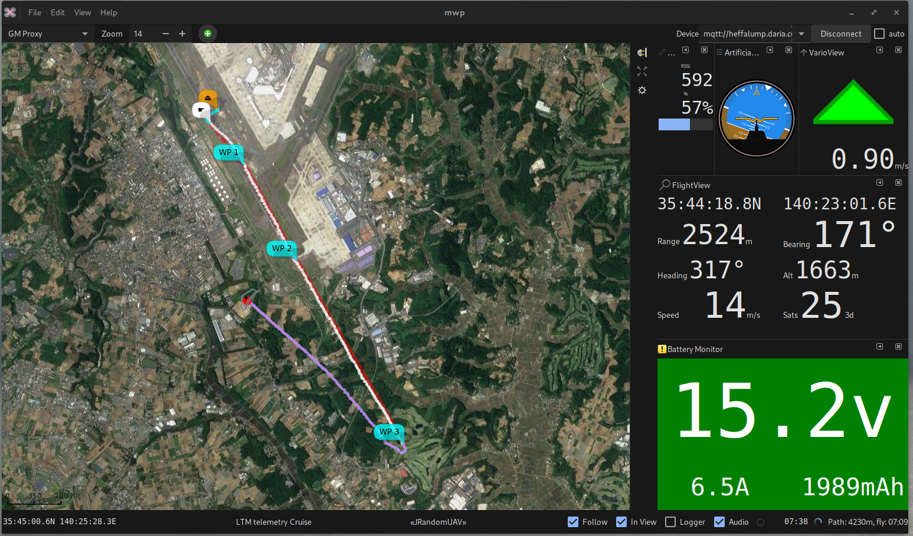

# BulletGCSS Telemetry

## mwp requirements

{{ mwp }} works with the web-based Ground Control Station [BulletGCSS](https://bulletgcss.fpvsampa.com/) MQTT protocol, tested with both a `fl2mqtt` simulation and a recorded live session.

The MQTT component is build if either `paho-mqtt` or `mosquitto` libraries are detected; `paho-mtqq` is preferred.
```
## Debian / Ubuntu ##
### Debian testing / Ubuntu 20.10 + for paho ###
sudo apt install libpaho-mqtt-dev
# or #
sudo apt install libmosquitto-dev

## Arch ##

yay -S paho-mqtt-c-git  ## or you favourite AUR helper
# or #
sudo pacman -S mosquitto

## Fedora ##

dnf install paho-c-devel
# or #
dnf install mosquitto-devel

## FreeBSD ##

## paho-mqtt
# Clone github repo and build from source. Configure with cmake -DPAHO_WITH_SSL=true ..
git clone https://github.com/eclipse/paho.mqtt.c.git
cd paho.mqtt.c
mkdir build
cd build
cmake -DPAHO_WITH_SSL=true ..
make && sudo make install

# or #
sudo pkg install mosquitto
```
If you have both `paho-mqtt` and `mosquitto` installed, then `paho-mqtt` is preferred.

## Usage

Once {{ mwp }} is built with a MQTT library, you can use an MQTT URL as a device name, for example for the demo that runs every other hour (00:00, 02:00 .. 22:00) UTC on `broker.emqx.io` with topic `org/mwptools/mqtt/otxplayer`, the mqtt URI for mwp would be:
```
mqtt://broker.emqx.io/org/mwptools/mqtt/otxplayer
```
Or in general:
```
mqtt://[user[:pass]@]broker[:port]/topic[?cafile=file]
```
Note:
* port is the mqtt port (typically and by default 1883), not the websocket port.
* if you want to use TLS, then the port will be different, often 8883, and you might need to provide the broker's CA file.
* As {{ mwp }} uses a pseudo-URL for the broker,topic etc, the topic should comply with rules for a URL rather than the more relaxed MQTT topic specification. This is a feature.

The scheme part (`mqtt://`) in the example is interpreted as:

* `ws://` - Websocket (vice TCP socket), ensure the websocket port is also specified, requires 'paho-mqtt' as the provider.
* `wss://` - Encrypted websocket, ensure the TLS websocket port is also specified. TLS validation is performed using the operating system. Not supported by `mosquitto`; requires `paho-mqtt` 1.39 or later.
* `mqtts://`,`ssl://` - Secure (TLS) TCP connection. Ensure the TLS port is specified. TLS validation is performed using the operating system, unless `cafile` is provided.
* `mqtt://` - TCP connection. If `?cafile=file` is specified, then that is used for TLS validation (and the TLS port should be specified).

MQTT looks like an incredibly elegant solution to long range telemetry.

More information on the [BulletGCSS website](https://bulletgcss.fpvsampa.com/) and [BulletGCSS wiki](https://github.com/danarrib/BulletGCSS/wiki)

See also [fl2mqtt](https://github.com/stronnag/bbl2kml), a tool to replay Blackbox and OpenTx logs as MQTT and [BulletGCSS mosquitto hosting guide](https://github.com/danarrib/BulletGCSS/wiki/Self-Hosting-a-MQTT-server--(broker)) for hosting your own MQTT broker.

{: width="80%" }
