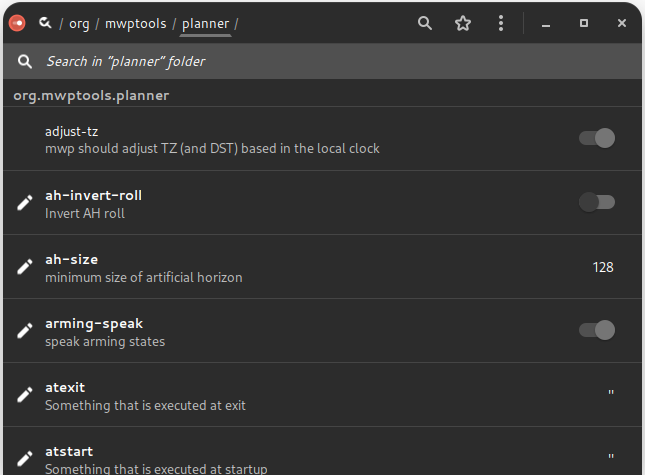

# mwp Configuration

## Overview

{{ mwp }} stores configuration in a number of places, to some degree at the developer's whim, but also in accordance with the data item's volatility.

* Command line options
* Configuration Files
* dconf / gsettings

Each type is further discussed below.

## Command line options

Command line options provide a 'per instantiation' means to control {{ mwp }} behaviour; the current set of command line options may be viewed by running {{ mwp }} from the command line with the single option `--help`:

```
$ mwp --help
```

Where it is required to give permanence to command line options, they can be added to the configuration file `$HOME/.config/cmdopts`, which is described in more detail in the following section.

### Debug flags

The `--debug-flags` option takes a numeric value defines areas where additional debug information may be output.

| Value | Usage |
| ----- | ----- |
| 1     | Waypoints |
| 2     | Startup |
| 4     | MSP |
| 8     | ADHOC |
| 16    | RADAR |
| 32    | LOG REPLAY |
| 64    | SERIAL |
| 128   | VIDEO |
| 256   | GCS Location |

Values may be added together (so 511 means all).

## Configuration Files

{{ mwp }} configuration files are stored in a standard directory `$HOME/.config/mwp`. This directory is created on first invocation if it does not exist. The following files may be found there:

## `cmdopts`

The file `cmdopts` contains command line options that the user wishes to apply permanently (and conveniently when run from a launcher icon rather than the command line).

The file contains CLI options exactly as would be issued from the terminal. Options may be on separate lines, and blank lines and line prefixed with a hash '#' are ignored. For example:

In addition to options (`--`), the file may also contain environment variables e.g. `FOO=BAR`.

```
# Default options for mwp
--rings 50,20
#--voice-command "spd-say -t female2 -e"
#--debug-flags=2
--dont-maximise
#-S 8192

# set the anonymous tile file.
MWP_BLACK_TILE=/home/jrh/.config/mwp/mars.png
```

So here the only current, valid options are  `--rings 50,20 -dont-maximise`, and the environment variable MWP_BLACK_TILE is set (for [anonymous maps](Black-Ops.md#custom-tile)).

## `.layout`

`.layout` contains the current arrangement of Dock items. You are advised not to manually edit this file (or other named, alternate layout files).

## `sources.json`

`sources.json` facilitates adding non-standard map sources to {{ mwp }}. See the  [anonymous maps](Black-Ops.md#custom-tile) section and comments in the source files in the `qproxy` directory.

## `vcol.css`

`vol.css` contains alternate CSS themeing for the battery voltage dock item that may work better on dark desktop themes. An example file is provided as `mwp/vcol.css` which can be copied into `.config/mwp/`.

## `places`

The `places` (`~/.config/mwp/places`) file is a delimited (CSV) file that defines a list of "shortcut" home locations used by the "View / Centre on Position ..." menu item. It consists of a Name, Latitude, Longitude and optionally zoom level, separated by a `TAB`,`|`,`:` or `;`. Note that positions may be localised in the file and thus `.` is no longer recognised as a field separator.

Example `places`

```
# mwp places name,lat,lon [,zoom]
Beaulieu|50.8047104|-1.4942621|17
Jurby:54.353974:-4.523600:-1
```

The user may maintain these files manually if used, or use the [graphic places editor](misc-ui-elements.md#favourite-places).

## Dconf / gsettings

Linux has a facility for storing configuration items in a registry like facility. This is used extensively by {{ mwp }}. The items can viewed and modified using a number of tools:

* {{ mwp }} preference dialogue (for a small subset of the items)
* The `dconf-editor` graphical editor
* The command line `gsettings` tool

For `gsettings` and `dconf-editor`, the name-space is `org.mwptools.planner`, so to list of items:

```
$ gsettings list-recursively  org.mwptools.planner
```

and to list then set a single item:

```
$ gsettings get org.mwptools.planner log-save-path
..
$ gsettings set org.mwptools.planner log-save-path ~/flight-logs/
```

#### dconf-editor

This *may* not be installed by default, but should be available via the OS package manager / software centre.

<figure markdown>
{: width="50%" }
<figcaption>Initial dconf-editor showing all mwp settings</figcaption>
</figure>

<figure markdown>
{: width="50%" }
<figcaption>dconf-editor, editing a setting</figcaption>
</figure>

### List of mwp settings

| Name | Summary | Description | Default |
| ---- | ------- | ----------- | ------ |
| adjust-tz | mwp should adjust TZ (and DST) based in the local clock | mwp should adjust TZ (and DST) based in the local clock | true |
| ah-invert-roll | Invert AH roll | Set to true to invert roll in the AH (so it becomes an attitude indicator) | false |
| ah-size | minimum size of artificial horizon | (private setting) | 32 |
| arming-speak | speak arming states | whether to reporting arming state by audio | false |
| atexit | Something that is executed at exit | e.g. `gsettings set org.gnome.settings-daemon.plugins.power idle-dim true`. See also `manage-power` (and consider setting to true). | "" |
| atstart | Something that is executed at startup | e.g. `gsettings set org.gnome.settings-daemon.plugins.power idle-dim false`. See also `manage-power` (and consider setting to true). | "" |
| audio-bearing-is-reciprocal | Announce bearing as reciprocal | Whether the audio bearing is the reciprocal (i.e. bearing from home to machine, rather than from machine to home) | false |
| audio-on-arm | start audio on arm | start audio on arm (and stop on disarm) | true |
| auto-follow | set auto-follow on start | set auto-follow on start | true |
| auto-restore-mission | Whether to automatically import a mission in FC memory to MWP | If the FC holds a valid mission in memory, and there is no mission loaded into MWP, this setting controls whether MWP automatically downloads the mission. | false |
| auto-wp-edit | Whether you direct WP editing is available | If true, the user can edit / create waypoints directly by clicking on the map, if false, it is necessary to toggle the WP Edit button to enable editing. | false |
| baudrate | Baud rate | Serial baud rate | 115200 |
| blackbox-decode | Name of the blackbox_decode application | Name of the blackbox_decode application (in case there are separate for iNav and betaflight) | "blackbox_decode" |
| centre-on | centre map on GPS as needed | centre map on GPS as needed | true |
| checkswitches | check switches | check switches (a JH sanity check) | false |
| compat-version | mw-nav compat version | Default mw-nav compat version in XML files. mwp doesn't care, older (MW) applications might. | "42.0" |
| dbox-is-horizontal | Geometry of the DirectionView box | If true, uses a horizontal organisation, rather than vertical | false |
| default-altitude | Default altitude | Default Altitude (m) | 20 |
| default-latitude | Default Latitude | Default Latitude when no GPS | 50.909528 |
| default-layout | Default layout name | Default layout name. If not set, .layout is used. | "" |
| default-loiter | Default Loiter time | Default Loiter time | 30 |
| default-longitude | Default Longitude | Default Longitude when no GPS | -1.532936 |
| default-map | Default Map | Default map *key* | "" |
| default-nav-speed | Default Nav speed | Default Nav speed (m/s). For calculating durations only. | 2.5 |
| default-zoom | Default Map zoom | Default map zoom | 15 |
| delta-minspeed | Minimum speed for elapsed distance updates | Minimum speed for elapsed distance updates (m/s). Default is zero, which means the elapsed distance is always updated; larger values will take out hover / jitter movements. | 0.0 |
| device-names | Device names | A list of device names to be added to those that can be auto-discovered | [] |
| display-distance | Distance units | 0=metres, 1=feet, 2=yards | 0 |
| display-dms | Position display | Show positions as dd:mm:ss rather than decimal degrees | false |
| display-speed | Speed units | 0=metres/sec, 1=kilometres/hour, 2=miles/hour, 3=knots | 0 |
| dump-unknown | dump unknown | dump unknown message payload | false |
| espeak-voice | Default espeak voice | Default espeak voice (see espeak documentation) | "en" |
| fctype | Force fc type | Forces fc type (mw,mwnav,bf,cf) | "auto" |
| fixedfont | Use a fixed font for Flight View | Use a fixed font for Flight View | true |
| flash-warn | Flash storage warning | If a dataflash is configured for black box, and this key is non-zero, a warning in generated if the data flash is greater than "flash-warn" percent full. | 0 |
| flite-voice-file | Default flite voice file | Default flite voice file (full path, *.flitevox), see flite documentation) | "" |
| font-fv | flight view font scaling | Scales the flight view widget. Smaller screens may need a lower value | 12 |
| forward | Types of message to forward | Types of message to forward (none, LTM, minLTM, minMAV, all) | "minLTM" |
| geouser | User account on geonames.org | A user account to query geonames.org for blackbox log timezone info. A default account of 'mwptools' is provided; however users are requested to create their own account. | "mwptools" |
| gpsd-host | gpsd provider | Provider for GCS location via gpsd. Default is "localhost", can be set to other host name or IP address. Setting blank ("") disables. | "localhost" |
| gpsintvl | gps sanity time (m/s) | gps sanity time (m/s), check for current fix | 2000 |
| heartbeat | Something that runs every minute (i.e. screensaver disable) | e.g. `xscreensaver-command -deactivate`. See also `manage-power` (and consider setting to true). | "" |
| ignore-nm | Don't ever query Network Manager for network status | Set to true to always ignore NM status (may slow down startup) | false |
| kml-path | Directory for KML overlays | Directory for KML overlays | "" |
| led | GPS LED colour | GPS LED colour as well know string or #RRGGBB | "#60ff00" |
| load-safehome | Load default set of safehomes | Set to file[,Y]. File defines a set of safehome lines (CLI format), optionally followed by a comma and Y. If the definition includes ",Y", then the safehome locations will be displayed. | "" |
| log-on-arm | start logging on arm | start logging on arm (and stop on disarm) | false |
| log-path | Directory for replay log files | Directory for log files (for replay) | "" |
| log-save-path | Directory for storing log files | Directory for log files (for save), default = current directory | "" |
| mag-sanity | Enable mag sanity checking | mwp offers a primitive mag sanity checker that compares compass heading with GPS course over the ground using LTM (only). There are various hard-coded constraints (speed > 3m/s, certain flight modes) and two configurable parameters that should be set here in order to enable this check. The parameters are angular difference (⁰) and duration (s). The author finds a settings of 45,3 (i.e. 45⁰ over 3 seconds) works OK, detecting real instances (a momentarily breaking cable) and not reporting false positives. | "" |
| manage-power | manage power and screen | whether to manage idle and screen saver | false |
| map-sources | Additional Map sources | JSON file defining additional map sources | "" |
| mavph | RC settings for Mav PH | RC settings for Mav PH (chanid:minval:maxval) | "" |
| mavrth | RC settings for Mav RTH | RC settings for Mav RTH (chanid:minval:maxval) | "" |
| max-climb-angle | Maximum climb angle highlight for terrain analysis | If non-zero, any climb angles exceeding the specified value will be highlighted in Terrain Analysis Climb / Dive report. Note that the absolute value is taken as a positive (climb) angle | 0.0 |
| max-dive-angle | Maximum dive angle highlight for terrain analysis | If non-zero, any dive angles exceeding the specified value will be highlighted in Terrain Analysis Climb / Dive report. Note that the absolute value is taken as a negative (dive) angle | 0.0 |
| max-home-delta | home position delta (m) | Maximum variation of home position without verbal alert | 2.5 |
| max-radar-slots | Maximum number of aircraft reported by iNav-radar | Maximum number of aircraft reported by iNav-radar | 4 |
| max-wps | Maximum number of WP supported | Maximum number of WP supported | 120 |
| media-player | Media player for alerts | Blank means internal gstreamer, "false" or "none" means no beeps. | "" |
| misc-icon-size | Miscellaneous icon size | Size for miscellaneous icons (radar, GCS location) in pixels. -1 means the image's natural size (no scaling). | 32 |
| mission-file-type | Preferred mission file type | m for XML (.mission), j for json (change at your peril) | "m" |
| mission-meta-tag | use meta vice mwp in mission file | If true, the legacy mwp tag is named meta | false |
| mission-path | Directory for mission files | Directory for mission files | "" |
| osd-mode | Data items overlaid on the map | 0 = none, 1 = current WP/Max WP, 2 = next WP distance and course. This is a mask, so 3 means both OSD items. | 3 |
| poll-timeout | Poll messages timeout (ms) | Timeout in milliseconds for telemetry poll messages. Note that timer loop has a resolution of 100ms. | 900 |
| pos-is-centre | Determines position label content | Whether the position label is the centre or pointer location | true |
| pwdw-p | internal parameter | (private setting) | 72 |
| radar-alert-altitude | Altitude below which ADS-B alerts may be generated | Target altitude (metres) below which ADS-B proximity alerts may be generated. Requires that 'radar-alert-range' is also set (none zero). Setting to 0 disables. Note that ADS-B altitudes are AMSL (or geoid). | 0 |
| radar-alert-range | Range below which ADS-B alerts may be generated | Target range (metres) below which ADS-B proximity alerts may be generated. Requires that 'radar-alert-altitude' is also set (none zero). Setting to 0 disables. | 0 |
| radar-list-max-altitude | Maximum altitude for targets to show in the radar list view | Maximum altitude (metres) to include targets in the radar list view. Targets higher than this value will show only in the map view. This is mainly for ADS-B receivers where there is no need for high altitude targets to be shown. Setting to 0 disables. Note that ADS-B altitudes are AMSL (or geoid). | 0 |
| require-telemetry | Whether to warn the operator if telemetry is disabled in iNav | if set, and telemetry is disabled, a non-timeout dialogue is displayed | false |
| rings-colour | range rings colour | range rings colour as well know string or #RRGGBBAA | "#ffffff20" |
| rth-autoland | Automatically assert land on RTH waypoints | Automatically assert land on RTH waypoints | false |
| say-bearing | Whether audio report includes bearing | Whether audio report includes bearing | true |
| set-head-is-b0rken | set head bearing as reciprocal | Whether the set head bearing is the reciprocal (i.e. ancient bug in mw nav) | false |
| smartport-fuel-unit | User selected fuel type | Units label for smartport fuel (none, %, mAh, mWh) | "none" |
| speak-amps | When to speak amps/hr used | none, live-n, all-n n=1,2,4 : n = how often spoken (modulus basically) | "none" |
| speak-interval | Interval between voice prompts | Interval between voice prompts, 0 disables | 15 |
| speech-api | API for speech synthesis | espeak, speechd, flite. Only change this if you know you have the required development files at build time | "espeak" |
| speechd-voice | Default speechd voice | Default speechd voice (see speechd documentation) | "male1" |
| stats-timeout | timeout for flight statistics display (s) | Timeout before the flight statistics popup automatically closes. A value of 0 means no timeout. | 30 |
| tote-float-p | Do Mission tote float | (private setting) | true |
| uc-mission-tags | Upper case mission XML tags | If true, MISSION, VERSION and MISSIONITEM tags are upper case (for interoperability with legacy Android applications) | false |
| uilang | Language Handling | "en" do everything as English (UI numeric decimal points, voice), "ev" do voice as English (so say 'point' for decimals even when shown as 'comma') | "" |
| use-legacy-centre-on | If true, uses legacy centre-on | If true, uses legacy centre-on mode rather than the new "In View" mode. | false |
| vlevels | Voltage levels | Semi-colon(;) separated list of *cell* voltages values for transition between voltage label colours | "" |
| wp-dist-size | Font size (points) for OSD WP distance display | Font size (points) for OSD WP distance display | 56.0 |
| wp-spotlight | Style for the 'next waypoint' highlight | Defines RGBA colour for 'next way point' highlight | "#ffffff60" |
| wp-text-style | Style of text used for next WP display | Defines the way the WP numbers are displayed. Font, size and RGBA description (or well known name, with alpha) | "Sans 144/#ff000080" |
| zone-detect | Application to return timezone from location | If supplied, the application will be used to return the timezone (in preference to geonames.org). The application should take latitude and longitude as parameters. See samples/tzget.sh | "" |

## Settings precedence and user updates

{{ mwp }} installs a number of files in `$prefix/share/mwp/`. The user can override these by creating an eponymous file in the user configuration directory, `~/.config/mwp/pixmaps/`. Such user configurations are never over-written on upgrade.

For example, to replace a {{ mwp }} specific icon; i.e. replace the GCS Location icon (`$prefix/share/mwp/pixmaps/gcs.svg`) with a user defined file `~/.config/mwp/pixmaps/gcs.svg`.

While the file name must be consistent, the format does not have to be; the replacement could be be a PNG, rather than SVG; we're a real OS and file "extensions" are an advisory illusion.

### Example

e.g. replace the inav-radar icon.

```
mkdir -p `~/config/mwp/pixmaps
# copy the preview image
cp ~/.local/share/mwp/pixmaps/preview.png  ~/config/mwp/pixmaps/
# (optionally) resize it to 32x32 pixels
mogrify -resize 80% ~/config/mwp/pixmaps/preview.png
# and rename it, mwp doesn't care about the 'extension', this is not MSDOS:)
mv  ~/config/mwp/pixmaps/preview.png  ~/config/mwp/pixmaps/inav-radar.svg
# and verify ... perfect
file ~/.config/mwp/pixmaps/inav-radar.svg
/home/jrh/.config/mwp/pixmaps/inav-radar.svg: PNG image data, 32 x 32, 8-bit/color RGBA, non-interlaced
```

Note also that the resize step is no longer required, as {{ mwp }} scales the icon according to the `misc-icon-size` setting.
