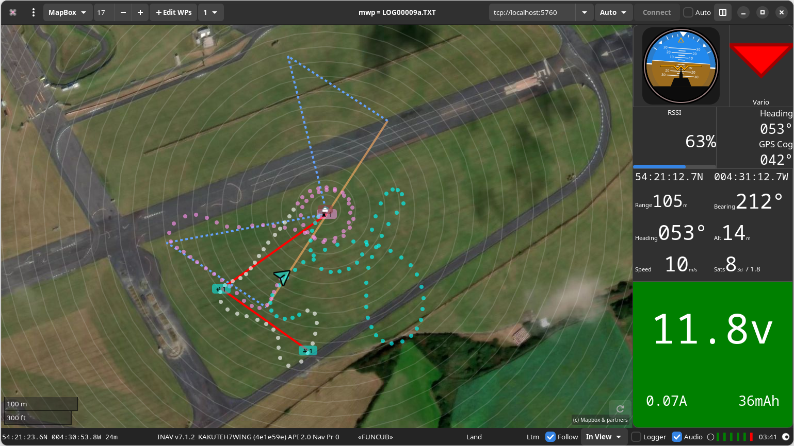
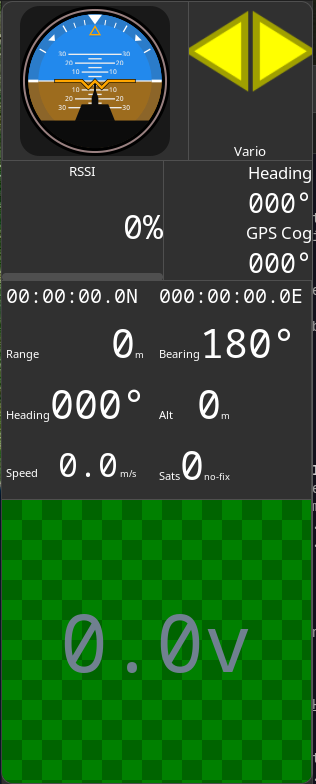

# mwp Migration Guide

This document describes the migration from legacy (Gtk+-3.0) mwp to contemporary (Gtk4) mwp.



## System Requirements

### Supported OS

* Modern Open Source POSIX operating system, for example:
    * Alpine Linux 3.20+
    * Arch Linux
    * Debian "Trixie" / "Sid" (and derivatives)
    * Fedora 40+
    * FreeBSD 14+
	* Ubuntu 24.04 and later (and derivatives).

### Unsupported but usable OS

* MacOS (Ventura or later), requires `homebrew`. [Platform specifics](mwp-macos.md)
* Windows (10 or later), requires `MSys2`. [Platform specifics](mwp-windows-msys.md)

Note that most of the documentation assumes open source OS (Linux, FreeBSD) semantics. See the "Platform Specifics" documents for differences.

### Specific components

The following are minimum versions.

* Gtk4 (4.14)
* libsoup3 (3.2)
* libshumate (1.3)
* meson (1.40)
* blueprint-compiler (0.12.0)
* libvte4
* libadwaita-1 1.5
* libsecret-1

For replaying blackbox log, [bbl2kml](https://github.com/stronnag/bbl2kml) 1.0.24 or later is rquired.

## GSettings /DConf schema

The gsettings / dconf schema is now `/org/stronnag/mwp/`. The keys are (mainly) the same as for legacy mwp/gtk3 and may be migrated:

```
dconf dump /org/mwptools/planner/ | dconf load /org/stronnag/mwp/
```

Full list of settings is at the end of this document.

## libshumate

[libshumate](https://gitlab.gnome.org/GNOME/libshumate) is the replacement for the obsolete libchamplain. `libshumate` uses a different cache directory organisation compared to `libchamplain`. If required, you can bulk move (`rsync` etc.) your old `libchamplain` files to the new locations.

The old files are under `~/.cache/champlain/`, the new cache `~/.cache/shumate/`; the following table illustrates the naming for Bing and OpenStreetmap caches. Other caches follow a similar pattern.

| `libchamplain` | `libshumate` |
| -------------- | ------------ |
| `osm-mapnik`     | `https___tile_openstreetmap_org__z___x___y__png` |
| `BingProxy`  | `http___localhost_31897_Bing__z___x___y__png` |

## Map Sources

In preparation for the announced removal of the Bing Maps service, `mwp` adds two new imagery sources:

* **ESRI Clarity** : No registration required, some minor data quality affects.
* **MapBox** : Requires registration, the user acquiring a [Mapbox API key](https://mapbox.com/). This key may be either stored in the Desktop keyring (managed by `libsecret`) or as a plain text string in the `gsettings` database.

### Keyring

Add to the MapBox key to the user keyring using `secret-tool` with the following attributes:

```
secret-tool store --label="Mapbox API" name mapbox-api-key domain org.stronnag.mwp
Password: *************************************************
```

### Gsettings

Alternatively, the key can be added to the `gsettings` database:
```
 gsettings set org.stronnag.mwp mapbox-apikey 'pk.xxxxxxx'
 # where 'pk.xxxxxxx' is your MapBox API Key
```

Note that sadly `libshumate` creates a cache directory name from which the MapBox access token may be recovered, so there is little security / privacy gain by using the secret key-ring, alas. See [Gitlab issue](https://gitlab.gnome.org/GNOME/libshumate/-/issues/84).

### Bing Services

While it lasts, the Bing services (no registration required) provide:

* Bing Aerial : Imagery with no annotations
* Bing Hybrid : Imagery with road / place annotations

## Side Panel

As `libgdl` is retired, a simple, bespoke panel comprising embedded resizeable panes has been implemented. The configuration may be user defined by a simple text file `~/.config/mwp/panel.conf`.

* The panel consists for four vertical panels
* The top panel can hold three horizontal panes
* The other panels can hold two panes.

Each entry is defined by a comma separated line defining the panel widget, the row (0-3) and the column (0-2) and an optional minimum size (only required for the artificial horizon). The default panel is defined (in the absence of a configuration file) as:

```
# default widgets
ahi,0,1,100
rssi, 1, 0
dirn, 1, 1
flight, 2, 0
volts, 3, 0
```

Which appears as:


The available panel widgets are named as:

| Name | Usage |
| ---- | ---- |
| `ahi` | Artificial horizon |
| `dirn` | Direction comparison |
| `flight` | "Flight View" Position / Velocity / Satellites etc, |
| `volts` | Battery information |
| `vario` | Vario indicator |
| `wind` | Wind Estimator (BBL replay only) |

No other legacy widgets have been migrated.

So using the following `~/.config/mwp/panel.conf`

```
# default + vario + wind widgets
ahi, 0, 1, 100
vario,0,2
rssi, 0, 0
wind, 1, 0
dirn, 1, 1
flight, 2, 0
volts, 3, 0
```

would appear as:


Note: If you change  `~/.config/mwp/panel.conf`, you should exit {{ mwp }} and delete  `~/.config/mwp/.paned` before restarting mwp.

## Coexistence

mwp (Gtk4) and legacy (Gtk+-3.0) versions can coexist.

* Install legacy mwp (Gtk+-3.0)
* Rename the executable (e.g. to mwp3)
* Install master mwp (Gtk4).

If you use any of the map proxies (`bproxy`, `gmproxy`), you must use the latest version.

## Display Variables / Tweaks

There are a couple of Gtk related environment variables that may affect the performance of mwp, particularly on older or less well supported GPUs:

* `GSK_RENDERER` : Recently the Gtk renderer default was changed from `gl` to `ngl` (4.14+) to `vulkan` (4.16+).
  On some older / less well supported GPUs it may be necessary to use the `cairo` renderer;  `cairo` is also necessary on the author's touch screen tablet for correct touch screen WP dragging. Note that there may well be trade offs: on one of the author's machines, WP dragging seems slightly snappier using the `cairo` `GSK_RENDERER`, however the CPU usage for BBL replay is much greater using `cairo` compared to `vulkan`.
* `GDK_BACKEND` : In the event that your hardware / software stack is almost hopelessly broken such that mwp is aborted with a Gdk message like  "Error 71 (Protocol error) dispatching to Wayland display", then setting this variable to `x11` may allow `mwp` to continue.

From mwp 24.10.28, mwp will set `GSK_RENDERER=cairo` for its own use if the OS or user has not previously set `GSK_RENDERER`.

The environment variable(s) may be set in `~/.config/mwp/cmdopts` for mwp exclusive use if required.
```
GSK_RENDERER=cairo
```

Otherwise, the variable(s) may be set in `/etc/environment`, `.profile` or a `.config/environment.d` file if required.

## Optional

If you use a map sources file in `~/.config/mwp`, you may optionally convert the `#X#` elements (for X, Y, Z) replacing with more standard `{x}` etc.

## Omissions

* ublox-geo (abandoned)

## OS Specifics

### Debian

For the Debian package runtime dependencies:

```

libadwaita-1-0 (>= 1.5~beta)
libc6 (>= 2.38)
libcairo2 (>= 1.2.4)
libgdk-pixbuf-2.0-0 (>= 2.22.0)
libglib2.0-0t64 (>= 2.80.0)
libgraphene-1.0-0 (>= 1.5.4)
libgstreamer1.0-0 (>= 1.6.0)
libgtk-4-1 (>= 4.13.5)
libgudev-1.0-0 (>= 146)
libjson-glib-1.0-0 (>= 1.5.2)
libpaho-mqtt1.3 (>= 1.3.0)
libpango-1.0-0 (>= 1.14.0)
libprotobuf-c1 (>= 1.0.1)
libsecret-1-0 (>= 0.7)
libshumate-1.0-1 (>= 1.0.0~alpha.1+20220818)
libsoup-3.0-0 (>= 3.3.1)
libtinfo6 (>= 6)
libvte-2.91-gtk4-0
libxml2 (>= 2.7.4)
```
Example packages:

```
sudo apt install -y blueprint-compiler libprotobuf-c-dev \
  libvte-2.91-gtk4-dev libshumate-dev libpaho-mqtt-dev libgtk-4-dev \
  libadwaita-1-dev libsecret-1-dev
```

### Ubuntu

The Ubuntu 24.04 version of `meson` is too old. A more update version may be installed locally using `pipx`. For Ubuntu 24.10, the distro version is adequate.

```
sudo apt install pipx
pipx install meson
```

Other packages as for Debian.

### Fedora

Example package list:

```
sudo dnf5 install -y libshumate-devel vte291-gtk4-devel protobuf-c-devel \
	paho-c-devel blueprint-compiler gtk4-devel libsecret-devel
```

### MacOS

Requires mwptools 2024.11.20 or later.

* Use Homebrew to install required packages (names may be evinced from the Linux docs)
* Follow generic instructions for `meson` and `ninja`

## Gsetting keys

### List of mwp settings

### List of mwp settings

| Name | Summary | Description | Default |
| ---- | ------- | ----------- | ------ |
| adjust-tz | Adjust FC's TZ (and DST) | mwp should adjust FC's TZ (and DST) based on the local clock | true |
| ah-invert-roll | Invert AH roll | Set to true to invert roll in the AH (so it becomes an attitude indicator) | false |
| armed-msp-placebo | Antidote to armed menus placebo | Whether to suppress desensitising of MSP action items when armed. | false |
| arming-speak | speak arming states | whether to reporting arming state by audio | false |
| atexit | Something that is executed at exit | e.g. `gsettings set org.gnome.settings-daemon.plugins.power idle-dim true`. See also `manage-power` (and consider setting `manage-power` to `true` instead). | "" |
| atstart | Something that is executed at startup | e.g. `gsettings set org.gnome.settings-daemon.plugins.power idle-dim false`. See also `manage-power` (and consider setting to true). | "" |
| audio-on-arm | start audio on arm | start audio on arm (and stop on disarm) | true |
| auto-follow | set auto-follow | set auto-follow on start | true |
| auto-restore-mission | Whether to automatically import a mission in FC memory to MWP | If the FC holds a valid mission in memory, and there is no mission loaded into MWP, this setting controls whether MWP automatically downloads the mission. | false |
| autoload-geozones | Autoload geozones from FC | Autoload geozones from FC on connect, remove from display on disconnect | false |
| autoload-safehomes | Load safehomes on connect | . If true, then safehomes will be loaded from the FC on connection. | false |
| baudrate | Baud rate | Serial baud rate | 115200 |
| beep | Beep for alerts | Whether to emit an alert sound for alerts. | true |
| blackbox-decode | Name of the blackbox_decode application | Name of the blackbox_decode application (in case there are separate for iNav and betaflight) | "blackbox_decode" |
| bluez-disco | Use Bluetooth discovery | Only discovered Bluetooth serial devices with non-zero RSSI will be offered | true |
| default-altitude | Default altitude | Default Altitude for mission (m) | 20 |
| default-latitude | Default Latitude | Default Latitude when no GPS | 50.909528 |
| default-loiter | Default Loiter time | Default Loiter time | 30 |
| default-longitude | Default Longitude | Default Longitude when no GPS | -1.532936 |
| default-map | Default Map | Default map *key* | "" |
| default-nav-speed | Default Nav speed | Default Nav speed (m/s). For calculating durations only. | 2.5 |
| default-zoom | Default Map zoom | Default map zoom | 15 |
| delta-minspeed | Minimum speed for elapsed distance updates | Minimum speed for elapsed distance updates (m/s). Default is zero, which means the elapsed distance is always updated; larger values will take out hover / jitter movements. | 0.0 |
| device-names | Device names | A list of device names to be added to those that can be auto-discovered | [] |
| display-distance | Distance units | 0=metres, 1=feet, 2=yards | 0 |
| display-dms | Position display | Show positions as dd:mm:ss rather than decimal degrees | false |
| display-speed | Speed units | 0=metres/sec, 1=kilometres/hour, 2=miles/hour, 3=knots | 0 |
| dump-unknown | dump unknown | dump unknown message payload (debug aid) | false |
| espeak-voice | Default espeak voice | Default espeak voice (see espeak documentation) | "en" |
| flash-warn | Flash storage warning | If a dataflash is configured for black box, and this key is non-zero, a warning in generated if the data flash is greater than "flash-warn" percent full. | 0 |
| flite-voice-file | Default flite voice file | Default flite voice file (full path, *.flitevox), see flite documentation) | "" |
| forward | Types of message to forward | Types of message to forward (none, LTM, minLTM, minMAV, all) | "minLTM" |
| ga-alt | Units for GA Altiude | 0=m, 1=ft, 2=FL | 0 |
| ga-range | Units for GA Range | 0=m, 1=km, 2=miles, 3=nautical miles | 0 |
| ga-speed | Units for GA Speed | 0=m/s, 1=kph, 2=mph, 3=knots | 0 |
| geouser | User account on geonames.org | A user account to query geonames.org for blackbox log timezone info. A default account of 'mwptools' is provided; however users are requested to create their own account. | "mwptools" |
| gpsd-host | gpsd provider | Provider for GCS location via gpsd. Default is "localhost", can be set to other host name or IP address. Setting blank ("") disables. | "localhost" |
| gpsintvl | gps sanity time (m/s) | gps sanity time (m/s), check for current fix | 2000 |
| ident-limit | MSP_IDENT limit for MSP recognition | Timeout value in seconds for a MSP FC to reply to a MSP_INDENT probe. Effectively a timeout counter in seconds. Set to a negative value to disable. | 60 |
| ignore-nm | Ignore Network Manager | Set to true to always ignore NM status (may slow down startup) | false |
| kml-path | Directory for KML overlays | Directory for KML overlays, default = current directory | "" |
| led | GPS LED colour | GPS LED colour as well know string or #RRGGBB | "#60ff00" |
| log-on-arm | start logging on arm | start logging on arm (and stop on disarm) | false |
| log-path | Directory for replay log files | Directory for log files (for replay), default = current directory | "" |
| log-save-path | Directory for storing log files | Directory for log files (for save), default = current directory | "" |
| los-margin | Margin(m) for LOS Analysis | Margin(m) for LOS Analysis | 0 |
| mag-sanity | Enable mag sanity checking | mwp offers a primitive mag sanity checker that compares compass heading with GPS course over the ground using LTM (only). There are various hard-coded constraints (speed > 3m/s, certain flight modes) and two configurable parameters that should be set here in order to enable this check. The parameters are angular difference (⁰) and duration (s). The author finds a settings of 45,3 (i.e. 45⁰ over 3 seconds) works OK, detecting real instances (a momentarily breaking cable) and not reporting false positives. | "" |
| manage-power | manage power and screen | whether to manage idle and screen saver | false |
| map-sources | Additional Map sources | JSON file defining additional map sources | "" |
| mapbox-apikey | Mapbox API Key | Mapbox API key, enables Mapbox as a map Provider. Setting blank ("") disables. | "" |
| mavlink-sysid | Sysid for synthesised MAVLink | System ID in the range 2-255 (see https://ardupilot.org/dev/docs/mavlink-basics.html and GCS guidance ibid) | 106 |
| max-climb-angle | Maximum climb angle highlight for terrain analysis | If non-zero, any climb angles exceeding the specified value will be highlighted in Terrain Analysis Climb / Dive report. Note that the absolute value is taken as a positive (climb) angle | 0.0 |
| max-dive-angle | Maximum dive angle highlight for terrain analysis | If non-zero, any dive angles exceeding the specified value will be highlighted in Terrain Analysis Climb / Dive report. Note that the absolute value is taken as a negative (dive) angle | 0.0 |
| max-home-delta | home position delta (m) | Maximum variation of home position without verbal alert | 2.5 |
| max-radar-slots | Maximum number of aircraft | Maximum number of aircraft reported by iNav-radar | 4 |
| max-wps | Maximum number of WP supported | Maximum number of WP supported | 120 |
| min-dem-zoom | Minimum zoom for DEM loading | DEMs will not be fetched if zoom is below this value | 9 |
| misc-icon-size | Miscellaneous icon size | Size for miscellaneous icons (radar, GCS location) in pixels. -1 means the image's natural size (no scaling). | 32 |
| mission-meta-tag | use meta vice mwp in mission file | If true, the legacy 'mwp' tag is named 'meta' | false |
| mission-path | Directory for mission files | Directory for mission files, default = current directory | "" |
| msp2-adsb | MSP2_ADSB_VEHICLE_LIST usage | Options for requesting MSP2_ADSB_VEHICLE_LIST. "off": never request, "on:" always request, "auto:" heuristic based on serial settings / bandwidth | "off" |
| osd-mode | Data items overlaid on the map | 0 = none, 1 = current WP/Max WP, 2 = next WP distance and course. This is a mask, so 3 means both OSD items. | 3 |
| p-height | Internal setting |  | 720 |
| p-is-fullscreen | Internal setting |  | false |
| p-is-maximised | Internal setting |  | true |
| p-pane-width | Internal setting | Please do not change this unless you appreciate the consequences | 0 |
| p-width | Internal setting |  | 1280 |
| poll-timeout | Poll messages timeout (ms) | Timeout in milliseconds for telemetry poll messages. Note that timer loop has a resolution of 100ms. | 900 |
| pos-is-centre | Determines position label content | Whether the position label is the centre or pointer location | false |
| radar-alert-altitude | Altitude below which ADS-B alerts may be generated | Target altitude (metres) below which ADS-B proximity alerts may be generated. Requires that 'radar-alert-range' is also set (non-zero). Setting to 0 disables. Note that ADS-B altitudes are AMSL (or geoid). | 0 |
| radar-alert-range | Range below which ADS-B alerts may be generated | Target range (metres) below which ADS-B proximity alerts may be generated. Requires that 'radar-alert-altitude' is also set (non-zero). Setting to 0 disables. | 0 |
| radar-list-max-altitude | Maximum altitude for targets to show in the radar list view | Maximum altitude (metres) to include targets in the radar list view. Targets higher than this value will show only in the map view. This is mainly for ADS-B receivers where there is no need for high altitude targets to be shown. Setting to 0 disables. Note that ADS-B altitudes are AMSL (or geoid). | 0 |
| rings-colour | range rings colour | range rings colour as well know string or #RRGGBBAA | "#ffffff20" |
| rth-autoland | Set land on RTH waypoints | Automatically assert land on RTH waypoints | false |
| say-bearing | Whether audio report includes bearing | Whether audio report includes bearing | true |
| show-sticks | Whether to show sticks in log replay | If "yes", stick position is shown bottom right during log replay, if "no" , never shown. If "icon", then it shown iconified (bottom right) | "icon" |
| sidebar-type | Sidebar type | Options for the sidebar type. Unless you know better, leave at auto | "auto" |
| smartport-fuel-unit | User selected fuel type | Units label for smartport fuel (none, %, mAh, mWh) | "none" |
| speak-amps | When to speak amps/hr used | none, live-n, all-n n=1,2,4 : n = how often spoken (modulus basically) | "none" |
| speak-interval | Interval between voice prompts | Interval between voice prompts, 0 disables | 15 |
| speech-api | API for speech synthesis | espeak, speechd, flite. Only change this if you know you have the required development files at build time | "espeak" |
| speechd-voice | Default speechd voice | Default speechd voice (see speechd documentation) | "male1" |
| stats-timeout | timeout for flight statistics display (s) | Timeout before the flight statistics popup automatically closes. A value of 0 means no timeout. | 30 |
| symbol-scale | Symbol scale | Symbol scale factor, scales map symbols as multiplier. | 1.0 |
| touch-factor | Touch (Hi)DPI scaling | Adjustment factor for HiDpi touch screens (0 disable, often 1.5 or 2.0). | 0.0 |
| touch-scale | Touch symbol scale | Symbol scale factor, scales map symbols as multiplier (for touch screens) | 1.0 |
| uc-mission-tags | Upper case mission XML tags | If true, MISSION, VERSION and MISSIONITEM tags are upper case (for interoperability with legacy Android applications) | false |
| uilang | Language Handling | "en" do everything as English (UI numeric decimal points, voice), "ev" do voice as English (so say 'point' for decimals even when shown as 'comma') | "" |
| view-mode | UAV view mode | Options for model view | "inview" |
| vlevels | Voltage levels | Semi-colon(;) separated list of *cell* voltages values for transition between voltage label colours | "" |
| wp-dist-size | Font size (points) for OSD WP distance display | Font size (points) for OSD WP distance display | 56.0 |
| wp-spotlight | Style for the 'next waypoint' highlight | Defines RGBA colour for 'next way point' highlight | "#ffffff60" |
| wp-text-style | Style of text used for next WP display | Defines the way the WP numbers are displayed. Font, size and RGBA description (or well known name, with alpha) | "Sans 72/#ff000060" |
| zone-detect | Application to return timezone from location | If supplied, the application will be used to return the timezone (in preference to geonames.org). The application should take latitude and longitude as parameters. See samples/tzget.sh | "" |

## DBus

The DBus name / path are changed to map the application Id; e.g. `org.stronnag.mwp` and  `/org/stronnag/mwp`. A few of the DBus interfaces have been enhanced.
