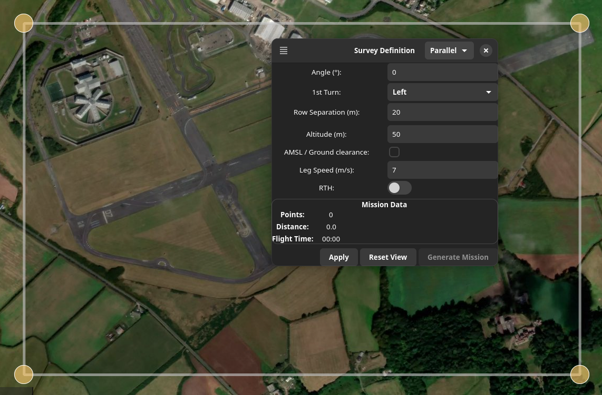
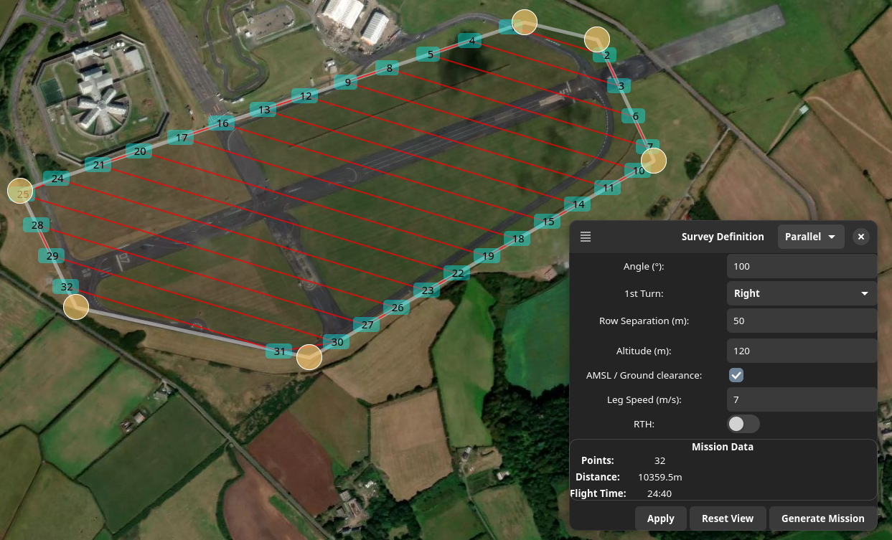
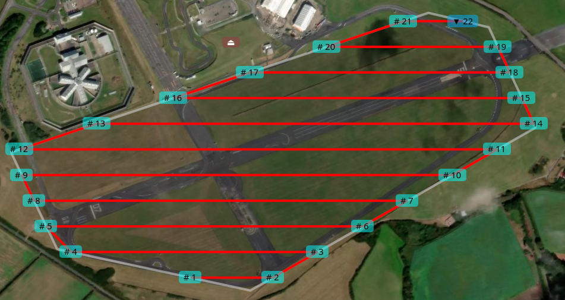
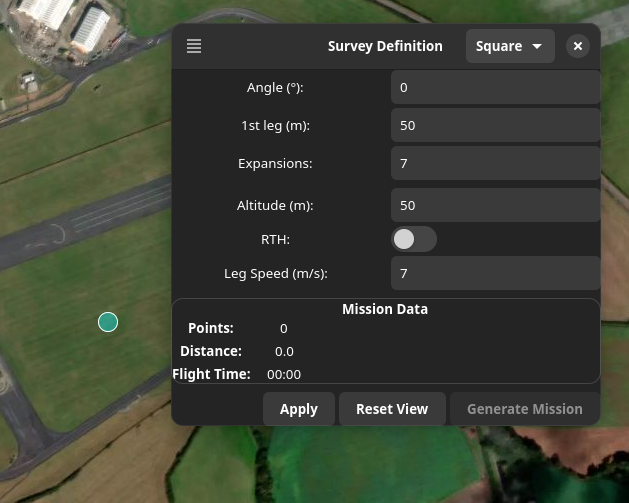
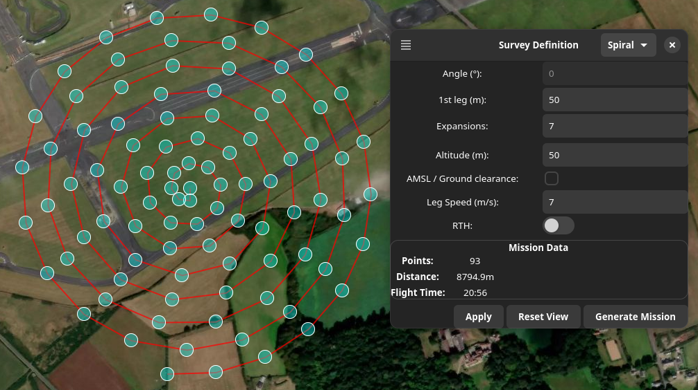
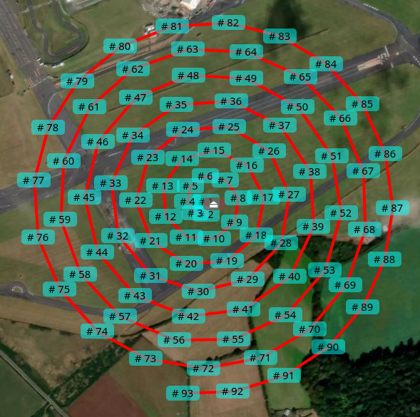

# Mwp Survey Planner

{{ mwp}} survey / area planner is a tool to plan "survey" or "search" missions. It generates MWXML mission files compatible with mwp and the INAV Configurator. A simple "parallel lines across a polygon" survey pattern is supported, as well as a "creeping square" pattern.

## Usage

The area planner is invoked from the "Edit" menu. It loads a dialogue window and presents a basic search area outline.

The drop-down in the top right offers options of:

* Parallel: Default parallel line pattern
* Square: Expanding Square.
* Spiral: Spiral pattern.

The tool is controlled by the three buttons at the bottom of the window.

* **Apply:** The settings are applied and the pattern is drawn. The button will be disabled if the size of the survey outline and the row separation values would result in an impractically large number of turning points. In order to resolve this it will be necessary to either reduce the size of the survey area or increase the row separation.

* **Reset View:** The survey view is reset. The survey outline is reset to a rectangle covering 80% of the map. This is used to reset the area after panning or zooming out of the initial view.

* **Generate Mission:** Generates a mission from the survey plan. The survey tool is closed. The mission may be edited / save / uploaded to the FC as normal. If the number of points would exceed the maximum number of mission points, this button is disabled.  In order to resolve this it will be necessary to either reduce the size of the survey area or increase the row separation.

### "Parallel Lines" Editing outline points

Points may be inserted / deleted from the survey outline from a right mouse / long press on a survey points. Insert adds a point in a clock-wise direction; delete removes the clicked point.

Points may be moved by dragging.

Any plotted outline mission will be recalculated as points are manipulated.

### Parameters

* **Angle:** Defines the direction of the first mission leg.
* **1st Turn:** Left or Right
* **Row Separation:** Distance between the rows in metres
* **Altitude:** in metres (mission parameter)
* **RTH** (mission parameter). Whether to set RTH on the final generated WP.
* **Leg Speed** (mission parameter).

Once an initial solution has been plotted, changing any of the first three parameters will result in the solution being recalculated. The latter three options are common to all patterns.

After a solution has been calculated, the "Mission Data" summary is updated.

Example of too many points being generated due to over-large area / narrow row separation:

Example of fewer points being generated with adjusted area and row separation:

Note also how the angle and turn parameters affect the staring point.

Example of generated mission with KML backdrop showing original survey area:

### File Menu

The area planner dialog has a drop down menu to load and save area definitions to / from the file system. The files are the same format as for the legacy `mwp-area-planner`.

In addition (not shown), it is also possible to save the survey outline as a KML file for future display / analysis.

### "Square" pattern generator

The "Square" generator provides a single draggable point with options of start angle, first leg distance and the number of iterations.

The default parameters result in the following survey pattern.

The generated mission from these settings looks like:

### "Spiral" pattern generator

The "Spiral" generator provides a single draggable point with options of first leg distance and the number of iterations. In this case, the first leg distance is the range to the 0° radial, which is repeated for each iteration. The number of points per iteration varies with the "radius" in order to provide practical leg lengths within INAV's 120 mission point constraint.

The default parameters result in the following survey pattern.

The generated mission from these settings looks like:

## Obsolete video

There is an old [youtube video](https://youtu.be/AUYETXqdJ1g?list=PLE_mnLfCdjvAH4pLe9HCqaWm682_r8NT3) covering both the legacy `mwp-area-planner` and iforce2d's on line tool.

<iframe width="560" height="315" src="https://www.youtube.com/embed/AUYETXqdJ1g?list=PLE_mnLfCdjvAH4pLe9HCqaWm682_r8NT3" title="mwp area planner intro" frameborder="0" allow="accelerometer; autoplay; clipboard-write; encrypted-media; gyroscope; picture-in-picture" allowfullscreen></iframe>
