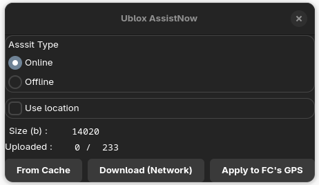
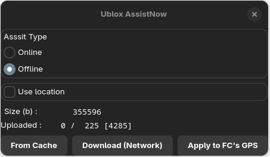

# mwp Assist Now

## Overview

[Assist Now](https://developer.thingstream.io/guides/location-services/assistnow-user-guide) (tm) is a Ublox service that provides data that may to be uploaded to a GPS in order to speed up time to first fix. In order to use this service, it is necessary to register for the service and a fee may be required.

Assist Now provides two data sets:

* "Online": Data that is immediately useful. Downloaded data is useful for about 4 hours.
* "Offline": Longer term satellite orbit information. Downloaded data is useful for 35 days.

mwp provides a UI to:

* Download AssistNow data to your computer. It is also cached, valid for the periods stated above.
* Upload the AssistNow data to your GPS (via the flight controller).

It is possible to download and save the data to a file cache, and then upload to the FC later, within the specified cache validity periods.

## Requirements

* Ublox GPS M8 or later
* INAV 8 or later
* Registered for the AssistNow service.
* A single AssistNow access key for 'online' and 'offline' data.
* The key is stored in mwp's settings:
    ````
	gsetting set org.stronnag.mwp assist-key 'xxxxxxxxxxxxxx'
    ````

## Usage

The UI is available from the File menu:

{: width="50%" }

* The user can select the 'online" and "offline" data sets; for best effect both should be applied.
* The 'Use Location' setting applies only to the "online" set and **its use is recommended**. If the home location (real or fake) is known, it will be used, otherwise the map centre is used. As the minimum precision used by AssistNow is 300km, home should be adequate for our needs.
* Once data has been downloaded [**Download (Network)**], it will be cached (`~/.cache/mwp/online.ubx`,  `~/.cache/mwp/onffine.ubx`). The cached files maybe reloaded [**From Cache**] within the validity periods..
* The [**Apply to FC's GPS**] button is only sensitive when a MSP connection is made and `feature GPS` is asserted. This will upload the AssistNow data to the FC. which in turn uploads it to the GPS.
* The "offline" data is time-stamped (up to 35 days). The data closest to the current time is uploaded. This is indicated by the "Uploaded:" legend showing the filtered item count as well as the total item count.

{: width="50%" }

In this case, there are 4285 records in the offline data set, of which 225 will be uploaded to the FC based on the current date.
