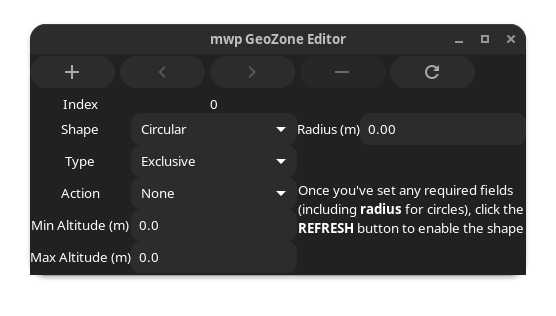
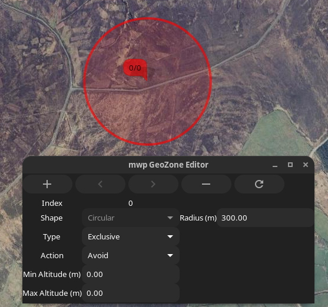
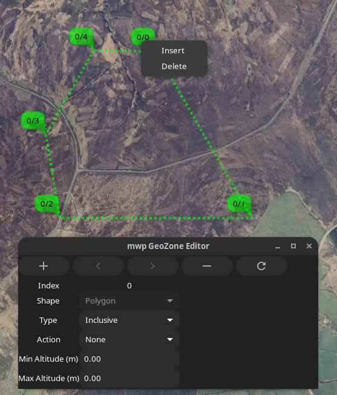

# mwp and Geozones

## Introduction

{{ mwp }} provides a UI for the Geozones function that is planned to appear in INAV 8.0.0. [INAV Documentation](https://github.com/iNavFlight/inav/blob/master/docs/Geozones.md).

The technical details for this feature are published as part of INAV 8.0.

!!! Note "Version Requirements"
	The proposed INAV 8.0 implementation of GeoZones **requires** {{ mwp }} 24.11.14 or later.

Geozones provides a set of geographical shapes that the FC can navigate around, characterised by:

* Shape
    - Circular
    - Polygon

* Type
    - Exclusive
    - Inclusive

* Action
    - None
    - Avoid
    - Poshold
    - RTH

The effect these parameters have on FC behaviour are described in the [INAV Documentation](https://github.com/iNavFlight/inav/blob/master/docs/Geozones.md).

## Geozone Validity and Enforcement

### Zone Geometry

{{ mwp }} checks that Geozones conform to the FC's known rules for validity:

* Zones are numbered consecutively from zero and are contiguous.
* Polygon zones are counter-clockwise.
* Polygon zones are "simple" (not "complex") polygon. That means there are no crossing line segments within a single polygon.

{{ mwp }} provides a "Check Validity" menu option to perform ad-hoc checks. mwp will not permit the upload of an invalid Geozone set to the FC. It is however possible to save a set that mwp claims is invalid in case the user wish to dispute such categorisation with the developer.

### Runtime Considerations

There are a number of runtime recommendations from the Geozone developer:

* If nested inclusive zones are used, ensure that they overlap by at least `2 * loiter radius` (or `geozone_mr_stop_distance` for multirotors) horizontally and 50 metres vertically to allow RTH to calculate a proper heading.
* When connecting polygonal zones, at least 2 vertices of one zone must be within the over-lapping zone.

{{ mwp }} does not currently attempt to enforce the runtime recommendations nor warns of their violation.

## mwp User interface

!!! note "Legacy Images"
    The majority of images this section are from legacy mwp, however the capability is the same.

### Menu options

{{ mwp }} adds a Geozones menu option, with suboptions:

{: width="50%" }

Note that the **Save**, **Export**, **Clear**, **Download** and **Upload** options are not sensitive if no geozone is loaded. Once a geozone is loaded, some or all of these options will be enabled. The MSP options are only enabled if the FC offers `feature GEOZONE` with the INAV 8.0 `feature` value of `(1 << 4)`.

Note that if `feature GEOZONE` is present, {{ mwp }} will attempt to load Geozones from the FC if the setting `autoload-geozones` is true, e.g.:

    gsettings set org.stronnag.mwp autoload-geozones true

## User Interface

* Open, Save: Expects a textual definition in INAV CLI format. This may be read from an INAV dif for offline use.
* Export: Exports a loaded Geozone to KML. Geozone specific parameters are stored in the KML such that the original Geozone in CLI notation could be reproduced from the KML.

### Editor

!!! note "Edit UI Images"
	The image immediately below represents the current Edit UI (it has the AMSL button); other Edit UI images are from an earlier instance without this button. The altitude values have no bearing on mwp's display of the Geozones, other than in the generated KML.

{: width="50%" }

The icons along the top are:

* "+": Create a new zone
* "<" : Move to previous zone
* ">" : Move to next zone
* "-" : Delete current zone
* "🗘" : Refresh : Refresh display / Start editing **new** zone

If there is no Geozone loaded, the editor is as shown at the "new zone" state: the "Shape" item is enabled and a note explains how to proceed. Note that to create a circular zone, the radius must be non-zero. If the "Shape" item is set to "Polygon", then no radius is required to proceed.

{: width="50%" }

Once the required details have been entered, pressing refresh draws the template shape. circle has a dragable centre and editable radius.

{: width="50%" }

A polygon has 3 points (the mimimum), each of which can be dragged.

{: width="50%" }

Additional points can be added immediately in front of an existing point from the right mouse menu.

{: width="50%" }

With multiple zones loaded (or created), the user can switch between zones using the `<` and `>` icons.

{: width="50%" }

### Example validation

In the following image, from left to right

| Zone Id | Colour | Characteristics | Validity |
| ------- | ------ | --------------- | -------- |
| 0       | Red    | Counter-clockwise | Valid |
| 1       | Green  | Clockwise | Invalid |
| 2       | Red, fill    | Counter-clockwise, "complex" | Invalid |
| 3       | Green, fill  | Counter-clockwise, concave | Valid |

Invalid zones are reported with the "Check Valdity" or "Upload to FC" options.

## Zone Colours

{{ mwp }} sets line and fill characteristics for GeoZones according to the zone's `type` and `action`.

The default values are set as:

| Type      |  Action  | Line      | Fill     |
| ----------| ---------| ----------| -------- |
| Exclusive |  None    | red 4 4   |          |
| Exclusive |  Avoid   | red 4     | red      |
| Exclusive |  PosHold | red 10    | red      |
| Exclusive |  RTH     | red 10    | red      |
| Inclusive |  None    | green 4 4 |          |
| Inclusive |  Avoid   | green 4   |          |
| Inclusive |  PosHold | green 10  |          |
| Inclusive |  RTH     | green 10  | green    |

The values after the line colour are line width and optional dash width.

The default colours are those suggested by the user who requested that {{ mwp }} support GeoZones.

The default "red" and "green" colours have some opacity set:

| Type | Value |
| ---- | ----- |
| Line red | `rgba(255,0,0,0.625)` |
| Fill red | `rgba(255,0,0,0.125)` |
| Line green | `rgba(0,255,0,0.625)` |
| Fill green | `rgba(0,255,0,0.125)` |

Where line width is greater than 10, the opacity is further reduced by 20% to satisfy the author's aesthetic opinion.

### User definition

The user may specify their own colours by creating a _pipe separated_ file, `$HOME/.config/mwp/zone_colours`. This is a text file of the format:

    type|action|line_colour|line_width|line_dash|fill_colour

### User definition fields:

**Type:** The zone type as an integer (0-1 : Exclusive / Inclusive)

**Action**: The zone action as an integer (0-3 :  None / Avoid / Poshold / RTH).

**Line Colour**: see below for colour formats

**Line Width**: In pixels, as an integer

**Line Dash**: In pixels, as an integer; the line will alternate on/off using this value.

**Fill Colour**: see below for colour formats

### Colour defintion

Colours may be defined as:

* A "standard" name (taken from the [X11 "rgb.txt"](https://en.wikipedia.org/wiki/X11_color_names) file) ; or
* A hexadecimal value in the form `#rrggbb` or `#rrggbbaa` ; or
* A RGB colour in the form `rgb(r,g,b)`); or `rgba(r,g,b,a)`

Where `r`, `g`, `b` and `a` are respectively the red, green, blue and alpha colour values. In the "`rgb()`" format, `r`, `g`, and `b` are either integers in the range 0 to 255 or percentage values in the range 0% to 100%, and `a` is a floating point value in the range 0 to 1.

If the alpha component is not specified then it is set to be fully opaque.

For "standard X11 names", an opacity may be defined by appending a floating point value in the range 0 to 1.0 to the name, separated by a semi-colon, for example `steelblue;0.8`

### Example: default settings as `zone_colours` file

The default settings can be represented in a `zone_colours` file as:

    0|0|rgba(255,0,0,0.625)|4|4|
    0|1|rgba(255,0,0,0.625)|4|0|rgba(255,0,0,0.125)
	0|2|rgba(255,0,0,0.625)|10|0|rgba(255,0,0,0.125)
	0|3|rgba(255,0,0,0.625)|10|0|rgba(255,0,0,0.125)
	1|0|rgba(0,255,0,0.625)|4|4|
	1|1|rgba(0,255,0,0.625)|4|0|
	1|2|rgba(0,255,0,0.625)|10|0|
	1|3|rgba(0,255,0,0.625)|10|0|rgba(0,255,0,0.125)

Where fill is not required, it is left blank.

If a line cannot be parsed, an error will the logged, giving the offending line number(s).
Blank lines and comment lines (starting with `#` or `;`) are ignored.

Please also note that floating point values must be specified with a _point_ (`.`), even when the locale customary format would use _comma_ (`,`).

Alternate colour expressions for the first line above are therefore:

    0|0|red;0.625|4|4|
    0|0|#ff0000a0|4|4|
