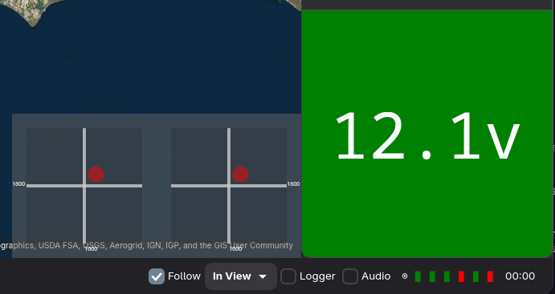

# mwp HID Device Support

## Overview

From 25.05.07, {{ mwp }} supports using a HID (Human Input Device) to provide RC (stick / switch inputs) to the FC.  An example of this might be running mwp on a game console such as SteamDeck and using the SteamDeck HID (sticks, buttons) to provide TX functions.

While mwp provides functionality for doing this, it is not condoned as an acceptable way of controlling a UAS. Using `NSP_SET_RAW_RC` (aka `MSPRC`) over a MSP telemetry link cannot provide the update rate / performance / reliability / safety of a standard RC TX/RX.

## Prerequisites

* Telemetry radio capable sustaining of at least 12 MSP messages / second.
* No other device is using `MSP_SET_RAW_RC` (this precludes MLRS).
* Either the FC is configured with `USE_MSP_RC_OVERRIDE` and appropriate `msp_override_channels` or the FC is configured for `set receiver_type = MSP`
* It is recommended that you have a validated failsafe solution.

## RC Mapping File

It is necessary to generate a mapping file that maps the HID device (e.g. game controller, joystick) inputs to RC functions (sticks / buttons).

mwp's uses the well known [SDL](https://www.libsdl.org/) (Simple DirectMedia Layer) library. This library handles numerous input devices (Joysticks, Game Controllers) in well defined manner across multiple platforms.

mwp provides a tool `mwp-hid-test` to allow the user to identify the inputs on their HID devices and allocate / map inputs to RC Channels. SDL provides for the following HID inputs:

* Axes : "Sticks" and some switches (3 or more positions).
* Buttons : Some switches (2 position, momentary).
* Hats : ?
* Balls : ?

Note that "Hats" and "Balls" are effectively undefined in mwp's reference implementation solely because the author has no example of such devices.

## mwp-hid-test tool

The user plugs in the required HID controller and starts the application (from a shell / terminal). She can then exercises all the required (stick / switch / button) inputs. `mwp-hid-test` will record the input, best shown by example:

```
$ mwp-hid-test
There are 1 joysticks connected.
Entry 0, OpenTX Radiomaster Boxer Joystick guid=0300c19b09120000544f000011010000 game controller=true
Name: OpenTX Radiomaster Boxer Joystick
No. axes 8
No. balls 0
No. buttons 24
No. hats 0
Joystick 0 connected
 ....
Axis 2 value -32608.
 ....
Button 1 released.
 ....
Joystick 0 removed.
```

In the above example, `mwp-hid-test`  application is started, the device (Boxer radio in HID mode) is detected. If multiple devices are detected, the user will be asked which entry they wish to use.

In the example above:

* The user moved the throttle stick, this is identified as "Axis 2"
* The user moved switch "SF", this is identified as "Button 1".

After exercising all required inputs, the user should prepare a mapping file; this is a simple plain text file mapping "Axis" and "Button" inputs to RC Channels (RC channels numbered from 1). For example:

```
$ less boxer.txt
# Sticks
Axis 0 = Channel 1 ; Aileron
Axis 1 = Channel 2 ; Elevator
Axis 2 = Channel 3 ; Throttle
Axis 3 = Channel 4 ; Rudder
# Switches
Axis 4 = Channel 5 ; SE (Arming)
Axis 5 = Channel 6 ; SA
Axis 6 = Channel 7 ; SB
Axis 7 = Channel 8 ; SC
Button 0 = Channel 9 ; SD
Button 1 = Channel 10 ; SF
$
```
Notes:

* Blank lines, lines starting with # or ; are ignored
* Trailing items after ; or # are ignored (comments / notes).

Definition lines are of the form Axis N = Channel X or Button M = Channel Y.

* The Axis N or Button M data is that shown by `mwp-hid-test`. The Channel is the RC channel for that input.
* mwp maps the value from SDL (-32608 to 32607) to RC range 1000-2000. Buttons are mapped from off = 1000 to on = 2000.
* It is possible to set an input as inverted or define a deadband.

Currently the mapping is fixed; if necessary this could be expanded to allow the user to further define the mapping (change ranges, etc.), if that is found necessary.
For Game Controllers, it is (probably) possible to provide a SDL Mapping file as a parameter to mwp-hid-test (for example, see https://github.com/mdqinc/SDL_GameControllerDB), that will (possibly) help the SDL library to manage the device.

```
$ mwp-hid-test gamecontrollerdb.txt
```
An example file for the SteamDeck might look like:

```
# Sticks
Axis 2 = Channel 1 ; Aileron
Axis 3 = Channel 2 invert ; Elevator
Axis 1 = Channel 3 invert ; Throttle
Axis 0 = Channel 4 ; Rudder

# Switches
Button 9 = Channel 5 ; SE (Arming) (L1)
Axis 4 = Channel 6 ; SA (L2)
Button 10 = Channel 7 ; SB (R1)
Axis 5 = Channel 8 ; SC (R2)

# More switches
Button 12 = Channel 9 ; SD (R3)
Button 13 = Channel 10 ; SF (L3)
Button 14 = Channel 11 ; SG (R4)
Button 15 = Channel 12 ; SH (L4)

# Buttons
Button 0 = Channel 13 ; SI (A)
Button 1 = Channel 14 ; SJ (B)
Button 2 = Channel 15 ; SK (X)
Button 3 = Channel 16 ; SL (Y)

# Unused:
# Touchpads, D-Pad, Menu, Stick Press
# Maybe use for local configurations and triggers
```

Note the use of `invert`. Mapping file courtesy of GH user @alrealmess.


### mwp-hid-test usage

```
$ mwp-hid-test --help
Usage:
  mwp-hid-test [OPTION?]

Help Options:
  -h, --help         Show help options

Application Options:
  -d, --deadband     Deadband (in SDL frame of reference)
```

Note that deadband is applied in terms of the SDL resolution, so 1 microsecond of RC PWM is equivalent to c. 65 SDL units.

### Mapping file with deadband


The mapping file supports deadband and invert, for example:

```
$ less boxer.txt
# Sticks
Axis 0 = Channel 1 ; Aileron
Axis 1 = Channel 2 ; Elevator
Axis 2 = Channel 3 ; Throttle
Axis 3 = Channel 4  invert ; Rudder
# Switches
Axis 4 = Channel 5 ; SE (Arming)
Axis 5 = Channel 6 ; SA
Axis 6 = Channel 7 invert ; SB
Axis 7 = Channel 8 ; SC
Button 0 = Channel 9  invert ; SD
Button 1 = Channel 10 ; SF

deadband = 200
```

* `deadband` is a global option and is specified with the `deadband` key and a value in the range 1-1024 (SDL resolution).
* `invert` is a per-channel keyword. Add `invert` after the channel number and before any trailing comment.

In the above example, channels 4, 7 and 9 will be inverted.

## mwp-hid-server

mwp does not communicate directly with the HID device, this is done by an intermediate program, `mwp-hid-server` using a simple line orientated, text based UDP protocol. Normally, this is transparent to the user, as mwp handles the invocation of and communications with `mwp-hid-server`.  It is, however, possible to run `mwp-hid-server` manually to test your rc mapping file. In addition, having a simple, defined protocol allows other mapping implementations (e.g. other than SDL) to be implemented.

#### mwp-hid-server usage

```
$ mwp-hid-server  --help
Usage:
  mwp-hid-server [OPTION?] rc-mapping-file

Help Options:
  -h, --help           Show help options

Application Options:
  -v, --verbose        Verbose mode
  -f, --fake           Fake values (for testing without HID hardware)
  -p, --port=31025     Udp port
```

* `rc-mapping-file` is the simple text file that maps the capabilities of the HID device to RC Channels. This was discussed above.
* `verbose` will display channel values every 10 seconds.

#### mwp-hid-server command language

The `mwp-hid-server` server listens on a defined UDP port (default 31025) for the following commands:

* `raw` : Returns 16 int16 values, little endian, representing 16 RC channels.
* `info` : Returns information (free form text) on the connected HID device.
* `quit` : Terminates the server
* `text` : Returns a text string of 16 space separated channel values.
* `set` : sets RC data for the first four channels (a testing aid). Data is provided as a set of space separated values, for example `set 1600 1700 1010 1889`.

`mwp` uses only the `info` and `raw` commands.

#### `mwp-hid-cli`

`mwp-hid-cli` is a simple command line tool to investigate the hid server. This allows the user to send the server commands listed above to a running `mwp-hid-server`.

```
$ mwp-hid-cli
udp conn 127.0.0.1:38668 127.0.0.1:31025
> info
OpenTX Radiomaster Boxer Joystick Axes: 8 Buttons: 24
> text
 1500 1500 1000 1500 1000 1001 1002 1003 1004 1005 1006 1007 1009 1010 1011 1012
> quit
```

You should ensure that any test `mwp-hid-server` is closed before using the HID function with mwp. It is not advisable to issue the `raw` command in the test environment, as your terminal may not handle the raw data with any elegance.

## mwp UI

HID support is selectable at run time via `Edit > MSP RC Setting` menu option. Note, this option is only sensitive when the main serial port is closed, so you cannot change an open MSP session.

{: width="30%" }

If enabled, `mwp-hid-server` is invoked with the provided mapping file. If you need to pass another option (for example `-f` for testing), this may be done using the environment variable `MWP_HIDOPT`, for example `MWP_HIDOPT="-f"`.

By default (if no mapping file has been previously set), the settings UI looks for the mapping file in the mwp configuration directory (`$XDG_CONFIG_HOME/mwp` i.e. `~/.config/mwp` on POSIX OS). The user may choose any other suitable location.

With mwp's HID / `MSP_SET_RAW_RC` enabled, when the **main telemetry channel is started**, the "stick display" icon will show in the bottom right of the map:


This may be expanded (click on the icon) to show the sticks.



### mwp settings

The MSP RC settings are persisted via the following settings:

* `msprc-cycletime` (default 150ms)
* `msprc-enabled` (default false)
* `msprc-settings rc` mapping file (default not set)

The  `msprc-cycletime` option defines how often mwp sends `MSP_SET_RAW_RC` messages. INAV requires at least 5Hz (200ms) to avoid fail-safe. Time slots used for `MSP_SET_RAW_RC` reduces the time available for MSP telemetry data displayed by mwp, so the user needs to choose a compromise setting that balances RC responsiveness with telemetry data refresh within the constraint of the available bandwidth.

## Miscellaneous notes

* The hard part of this is arbitrating serial usage between the need to maintain INAV's requirement for `MSP_SET_RAW_RC` (minimum of 5Hz refesh) and mwp's telemetry requirement (minimum say (also) 5 MSP/sec, though it this is not a hard limit, rather a usability desire).
* You may consider using `USE_MSP_RC_OVERRIDE` / `MSP RC Override` and a backup TX.
* Note that mwp tries to send `MSP_SET_RAW_RC` messages every 150 milliseconds (c. 7Hz) by default. This interval is configurable. The default was chosen to minimise the chances of fail-safe while maintaining a decent telemetry rate.

### Serial Usage Metrics

mwp can monitor MSP message rates and automatically log the information. If you are testing this `MSP_SET_RAW_RC` functionality in mwp, consider adding the following to `~/.config/mwp/cmdopts` / `%LOCALAPPDATA%\mwp\cmdopts`:

```
MWP_STATS_LOG=60
```

This will log MSP throughput every minute into `mwp_stderr_YYYY_MM_DD.txt`.

#### Throughput example

Telemetry device: Ebyte E220 LoRa, 115200 ground speed, 38400 air speed, USB connection to GCS.

`mwp_stderr_YYYY-MM-DD.txt` file with lines like:

```
13:13:30.168812 900.267s, rx 341851b, tx 139948b, (380b/s, 155b/s) to 0 wait 0, avg poll loop 62 ms messages 15046 msg/s 16.7
...
13:14:15.113726 945.195s, rx 358998b, tx 146799b, (380b/s, 155b/s) to 0 wait 0, avg poll loop 62 ms messages 15797 msg/s 16.7
```

Telemetry device: Ebyte E220 LoRa, 115200 ground speed, 62500 air speed, USB connection to GCS. Slightly higher throughput at the expense of some message timeouts (and maybe also range).

```
11:36:04.735320 2100.442s, rx 659187b, tx 712573b, (314b/s, 339b/s) to 2 wait 0, avg poll loop 88 ms messages 36053 msg/s 17.2
```

This device appears usable.
