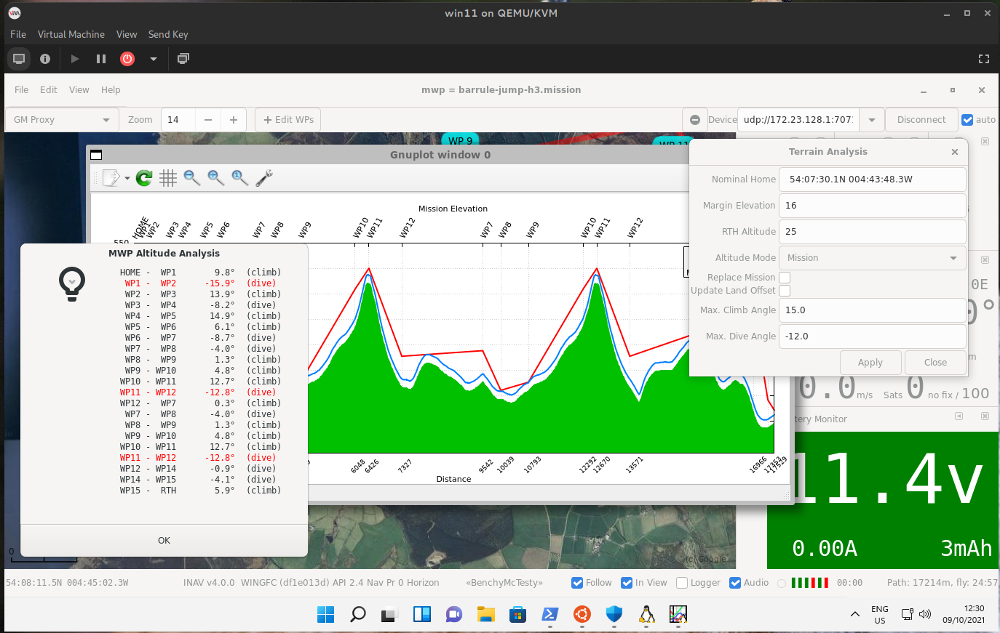
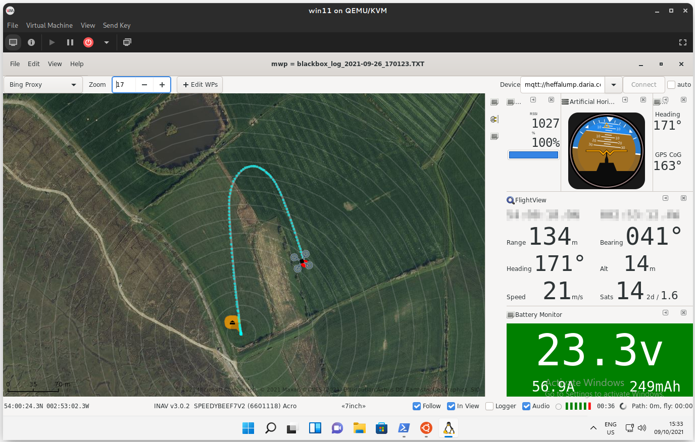

# Windows 11 / WSL-G

## Intro

As a result of user interest in running {{ mwp }} on Windows 11 / WSL-G, here's an experiment to see if it's possible. By a Windows neophyte, so if I can install mwp on WSL, anyone can.

There is also an excellent [you-tube video tutorial](https://www.youtube.com/watch?v=VvnBzQR7aE8) from Marc Hoffmann (in English and German).

<iframe width="560" height="315" src="https://www.youtube.com/embed/VvnBzQR7aE8" title="YouTube video player" frameborder="0" allow="accelerometer; autoplay; clipboard-write; encrypted-media; gyroscope; picture-in-picture" allowfullscreen></iframe>

It is also possible to run  {{ mwp }} on Windows 10 (and 7) using WSL-1 (win10) and / or Cygwin (win7 - win10).  This is documented in the [mwp wiki](https://github.com/stronnag/mwptools/wiki).

## Environment

Tested with Windows 11 VM hosted on Arch Linux by the developer.

## WSL Installation

* Installed default Ubuntu
* Note that serial ports remain *difficult* (workarounds described below)

### Windows / WSL Pre-requisites

None other than the serial port issue, Wayland (GUI) and sound just work.
The serial port problem can be mitigated by a "serial to IP" solution; mwptools provides [`ser2udp`](#serial-devices) for this purpose or using `usbipd / usbip`

## mwp Installation

Use one of the following:
### (a) Install the [current release from GitHub](https://github.com/stronnag/mwptools/releases/latest).

* Down load the `.deb` file
* `cd ` to where ever you saved the `.deb` file
* In the WSL terminal
  `sudo apt install ./mwptools_x.y.z_amd64.deb`

Example: using `curl` to download ...

    $ curl -LO https://github.com/stronnag/mwptools/releases/download/x.y.z/mwptools_x.y.z_amd64.deb
    $ sudo apt install ./mwptools_x.y.z_amd64.deb

Where `x.y.z` represents the build tag.

#### (b) Unified first-time build script (build and install from source)

For the initial installation, there is a unified / simplified install / build / install script: [Instructions](https://github.com/stronnag/mwptools/wiki/Building-with-meson-and-ninja/#easy-first-time-install-on-debian-and-ubuntu)

This installs mwptools and blackbox-tools-inav to `$HOME/.local/bin`.

#### (c) Traditional build process (build and install from source)

If you want more control over build options.

If `git` is not pre-installed in WSL, then it will be necessary to install it.

    sudo apt update && sudo apt upgrade
    sudo apt install git

Note: `/etc/sudoers` (via `visudo`) was edited to allows the WSL user to run commands as root without asking for a password.

Then it was just a case of cloning the mwp repository and following mwp's instructions (`mwptools/docs/debian-ubuntu-dependencies.txt`), to install the dependencies, this is available as an executable script thusly:

    sudo mwptools/docs/debinstall.sh -y # "-y" bypasses interactive query / responses

Then build and install mwp and optionally the blackbox tools (as `mwptools/docs/debian-ubuntu-dependencies.txt`). [Build documentation](https://github.com/stronnag/mwptools/wiki/Building-with-meson-and-ninja).

For blackbox replay, install the [flightlog2x](https://github.com/stronnag/bbl2kml) tools; build from source in Linux/WSL or install the release binaries.

Note that the normative build reference is the `INSTALL` file in the source tree.

## Running mwp

Compared to Win10/WSL or Cygwin, there is no longer any need to mess around the `DISPLAY` or `udev` settings. No 3rd party X-server, Windows 11 / WSL-G  handles all the GUI.

### One off changes

* WSL installs a very cut down icon theme that does not provide the all the system / standard icons used by mwp. Fix this by:

    	sudo apt install adwaita-icon-theme-full

* If you wish to replay blackbox / OTX / BulletGCSS logs, it may be necessary to have an IPv6 definition of `localhost`; WSL's `/etc/hosts` does not provide this:

    	# updated in /etc/hosts for ipv6
    	::1   localhost ip6-localhost ip6-loopback

  Note: This was caused by an unnecessary assumption in [flightlog2x](https://github.com/stronnag/bbl2kml)'s `fl2ltm` which is corrected in [flightlog2x](https://github.com/stronnag/bbl2kml) release (> 0.11.0), so you might not need it anymore.

* Then tell WSL to please not break your `hosts` file again

    	### Add the following entry to /etc/wsl.conf:
    	[network]
    	generateHosts = false

* Due font differences, it may be necessary to reduce the font scaling in the mwp 'Flight View' docklet.

    	gsettings set org.mwptools.planner font-fv 10
    	# if you still have resizing problems, try 9 ....

* `ser2udp.exe`. <a name="autos2n">mwp</a> can start and stop the Windows `ser2udp.exe` on demand. This is quite a neat trick by Microsoft's enabling extra-VM process management. In the example below, we have installed `ser2udp.exe` as `c:\Users\win11\ser2udp.exe` :

		# Start command
		gsettings set org.mwptools.planner atstart '/mnt/c/Users/win11/ser2udp.exe'
		# Shutdown command
		gsettings set org.mwptools.planner atexit 'pkill ser2udp.exe'

Then you are ready to run mwp.

    mwp

### Serial devices

In order to use a serial device, it is necessary to run a "serial to IP" bridge on the Windows side. There are two solutions to this, both involve some effort on both the Windows and Linux sides.

* `usbip`, a long-standing Linux feature that has recently been introduced to Windows
* Standalone "serial-to-IP" bridge, such as mwp's `ser2udp` tool. This application will need to be white-listed in the Windows firewall.

### udpip

See this [Microsoft developer blog article](https://devblogs.microsoft.com/commandline/connecting-usb-devices-to-wsl/) for installation / usage information.

### Standalone Bridge

There are a number of existing solutions that may work; **mwp** provides a simple, dedicated `ser2udp` tool that works well, and once set up is transparent in usage.

### Installing mwp's `ser2udp`

Build on the  **Linux/WSL side**:

* `cd mwptools/src/samples/s2n`
* `make ser2udp.exe`
* copy `ser2udp.exe` to the d̶a̶r̶k̶  Windows side

See [above](#autos2n) for automating starting and stopping `ser2udp.exe`.

On the Windows side:

* Use the Windows firewall settings to allow `ser2udp.exe` to accept UDP traffic.
* Either [automate](#autos2n) in mwp (recommended) or run `ser2udp.exe` ; it will autodetect your serial port. By default this listens on UDP port 17071, you can change this by supplying a second parameter, e.g., to use port 34567. In this case, either define the serial port or use `auto` (auto-detect).

    	> ser2udp.exe auto :34567
    	## or just let ser2udp autodetect
    	> ser2udp.exe
    	External address: fe80::1439:d6de:efcb:97e1%7
    	External address: 172.29.32.1

  The colon is required to define an alternative port.

* `ser2udp` will survive removal of USB devices and attempt to re-connect (e.g. if the FC is rebooted).
* `ser2udp` will _only_ attempt to automatically acquire STM32 USB devices (`0483:5740` vid:pid)
* You need to terminate `ser2udp` when you're done with it (e.g. to use the INAV configurator in Windows).

#### Using `ser2udp` in mwp

* On the Linux side, we need to know the IP address (or have a hostname for) the Windows WSL endpoint. Fortunately this happens to be Linux's default gateway, so we can handle it fairly transparently.

It is easily automated by using the magic `__MWP_SERIAL_HOST` name in the serial device.

    mwp -d udp://__MWP_SERIAL_HOST:17071
    # recognised by other tools as well ...
    cliterm udp://__MWP_SERIAL_HOST:17071

`__MWP_SERIAL_HOST` is resolved as:

* If an environment variable `$MWP_SERIAL_HOST` exists, it is used; else
* The default gateway (which on WSL is the Windows host IP) is used; else
* It will fail, as the literal name is unlikely to exist as a resolvable host name (not even a RFC legal host name).

Thus:

* For WSL and `ser2udp`, in mwp [preferences](misc-ui-elements.md#general-preferences), set the serial device to `udp://__MWP_SERIAL_HOST:17071`
* Or in the shell, for some other scenario, `export MWP_SERIAL_HOST=foobox.org` in the event that you have a valid use case

### Launch ser2udp and MWP in one go

* [Automate](#autos2n) `ser2udp.exe` in mwp's settings

* Create a new `txt` file in the same folder where `ser2udp.exe` is located and copy the following lines into that file:

    	@echo off
    	echo Launching MWP Mission Planner
    	start wslg.exe -d Ubuntu mwp
    	exit

* rename the file with any name and change the extension to `.cmd`
* Create a shortcut anywhere on your PC or in `C:\Users\<username>\AppData\Roaming\Microsoft\Windows\Start Menu\Programs` to pin it to your Start Menu
* Replace the shortcut symbol with the MWP icon [from here](https://github.com/stronnag/mwptools/wiki/images/mwp_icon.ico)

## Other packages for additional functionality.

* To replay blackbox logs, you need
    * [INAV blackbox tools](https://github.com/iNavFlight/blackbox-tools), mandatory
    * [flightlog2x / bbl2kml](https://github.com/stronnag/bbl2kml). Provides a much better blackbox replayer than the default shipped with mwp (and you can generate really pretty Google Earth files from blackbox / opentx / bulletgcss logs).
* Terrain Analysis
    * Gnuplot. Check the installer script that it's enabled.

## Summary

* Much, much better than the prior WSL instances, pity about the difficulty in using serial ports (still). Overall, the seamless WSL-g experience is impressive.

### Connection via `ser2udp` bridge

{: width="80%" }
Dark theme, [correct system icons installed](#one-off-changes), connected to FC via `ser2udp`.

### Terrain / elevation analysis

{: width="80%" }

### Blackbox replay

{: width="80%" }

!!! Note "Good enough!"
    The user's compass seems good enough for navigation functions (top right widget comparing GPS CoG v. compass heading).
