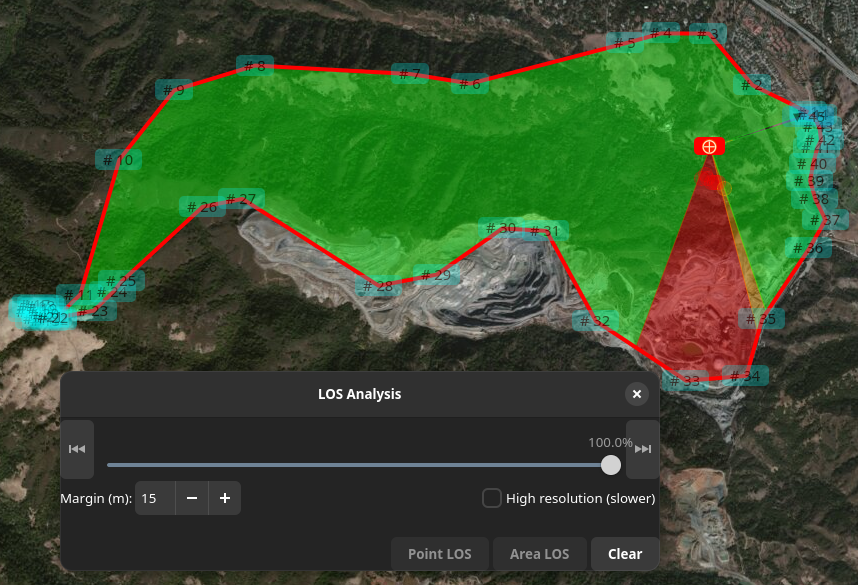

# Line of Sight (LOS) Tool

## Overview

{{ mwp }} provides a LOS tool that establishes whether there is LOS between the observer location (the mwp home icon) and arbitrary points on an {{ inav }} mission. This is may be useful to establish:

* Can the pilot or observer see the aircraft?
* Is there LOS for RC control or video?

## Caveats

There are a number of issues to take into consideration.

* Online DEMs (Digital Elevation Model) vary [significantly](Mission-Elevation-Plot-and-Terrain-Analysis.md/#datum), with implications for accuracy.

{{ mwp }} uses  [Mapzen DEM](https://registry.opendata.aws/terrain-tiles/) data, which improves accuracy (more users  get one arc-second data ) with better accuracy, as well as a significant performance boost and offline usage after the initial data download.

Please be aware of these accuracy / fidelity issues when evaluating the results of any elevation analysis.

## Invocation

 is invoked from any waypoint using the right mouse button.

{: width="30%" }

## Examples

When the LOS slider is displayed, the only UI actions available are:

* Scroll the map
* Zoom the map
* Change the map product

This restriction means that the mission cannot be changed while a LOS Analysis is being performed. This is currently a feature (to reduce implementation complexity).

### Manual LOS Analysis

The LOS dialog presents:

* A slider to position the 'puck` (to which LOS is calculated) along the mission path.
* Start and End buttons to move the puck to start / end.
* A Margin selection (the clearance required at the puck location).
* A High resolution button (for Area LOS puck increments)
* A "Point LOS" button.
* An "Area LOS" button.
* A "Clear" button.

In the image above the user has selected "Line of Sight ..." from the right mouse menu at WP6. The slider is positioned appropriate to WP6. Note that if the mission contains JUMP WPs, these are executed once only (regardless of the mission setting). This is why the slider might appear less advanced compared to the mission length if the JUMP is ignored. The user can reposition the WP using the slider (or the start / end buttons).

When "Point LOS" is clicked, the LOS is calculated between planned home (brown icon, lower left) and the red "⨁" "Point of Interest" (POI) icon. This is displayed as a terrain plot with the LOS line superimposed over the terrain elevation. The line is red as there is no LOS (and it would be green where there is LOS). A red "dot-dash" is also displayed on the map. If a margin is specified, then LOS lines with clearance between the terrain and the margin value are shown in orange.

The user may repeat the "move slider" / "Point LOS" action as required. The prior terrain plot is removed each time "Point LOS" is selected; the lines on the map are removed when the slider dialog is closed. "Area LOS" may be used to run a continuous analysis from the currently selected location. "Area LOS" may be started / stopped at any point (and Point Analysis invoked at any time when stopped).

When an analysis results in an orange or red LOS fill, the first point where the LOS break is detected is also shown as a coloured blob. This is apparent in the Area image below.

### Area LOS

This analysis is iterated along the mission path automatically, providing Area coverage for the mission.

The image shows the state after a complete "Area" analysis. While the analysis is running, the slider and "Point LOS" are not sensitive; once the run has completed, these controls are available if the user wishes to investigate further. The user can stop (and restart) Area  using the "Area LOS" / "Stop" button.

Note the areas indicated in the SE part of the mission.

If the user now runs a "High Resolution" Area LOS, note how the more fidelity is revealed in the SE part of the mission.

The user can use the  "Point LOS" to examine a point.

It is important to note that Area LOS is performed at 1% increments of the [naive mission length](#miscellaneous-notes), it is not contiguous.

Caveat user!

There is also a You Tube video (uses a slightly earlier UI iteration).

<iframe width="768" height="634" src="https://www.youtube.com/embed/EIm8vksK1Pg" title="mwp LOS (Line of Sight) Tool" frameborder="0" allow="accelerometer; autoplay; clipboard-write; encrypted-media; gyroscope; picture-in-picture; web-share" allowfullscreen></iframe>

## Local DEMs

mwp uses [Mapzen DEM](https://registry.opendata.aws/terrain-tiles/) SRTM (Shuttle Radar Telemetry Mission) HGT files for all mwp elevation requirements. These are downloaded on demand. No user access key is required.

## Miscellaneous notes

* The Area LOS data is interval sampled. An obstruction could always be in the gap.
* The elevation data does not include obstructions above the terrain (trees, buildings, power lines etc.).
* The mission interpretation is naive.
    - There is no loiter radius
    - The vehicle can turn sharply at way points
    -  There is linear ascent / descent between way points, including from home to WP1 and from RTH to home.
    - JUMPs are executed once.
