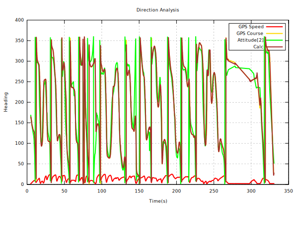
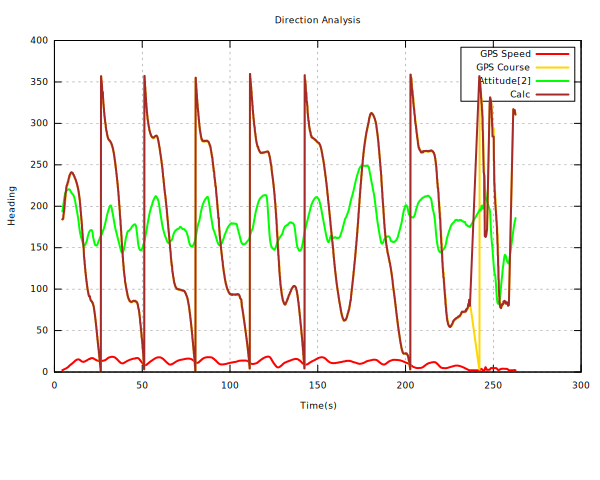

# mwp miscellaneous tools

## Overview

The {{ mwp }} suite contains numerous command line tools developed since 2015 in order to aid development of INAV, development of {{ mwp }} and diagnosing numerous (often 3rd party) problems, more so in the early days.

This chapter describes a few of the command line tools that are provided by mwptools. Note that not all these tools are built or installed by default; it may be necessary to enter a source directory and invoke `make` in situ, or copy a script to a directory on the `$PATH`.

## fc-get, fc-set

`fc-get` and `fc-set` are tools to manage CLI settings:

* `fc-get` : Dump cli `diff` settings to a file that can be replayed by `fc-set`
* `fc-set` : Replay a file of cli settings to the FC. Once the settings have been saved, a backup is made of the original file; the settings are then read from the FC and the original file updated.

		$ fc-set --help
		Usage:
		  fc-set [OPTION?]  - fc diff manager

		Help Options:
		  -h, --help        Show help options

		Application Options:
		  -b, --baud        baud rate
		  -d, --device      device
		  -n, --no-back     no backup

NOTE: `fc-get` and `fc-set` are essentially the same program, the function is defined by the name.

The tools auto-detect the plugging of an FC.

    $ fc-get /tmp/dodo-test.txt
    12:16:04 No device given ... watching
    12:16:04 Opening /dev/ttyUSB0
    12:16:04 Establishing CLI
    12:16:05 Starting "diff all"
    12:16:06 Exiting
    12:16:06 Rebooting

Then, maybe after flashing the FC to a new version:

    $ fc-set /tmp/dodo-test.txt
    12:16:56 No device given ... watching
    12:16:56 Opening /dev/ttyUSB0
    12:16:56 Starting restore
    12:16:56 Establishing CLI
    12:16:58 [████████████████████████████████] 100%
    12:16:58 Rebooting
    12:17:01 Establishing CLI
    12:17:03 Starting "diff all"
    12:17:03 Exiting
    12:17:03 Rebooting

And now we have a settings backup ...

    $ ls -l /tmp/dodo*
    -rw-r----- 1 jrh jrh 2115 Mar 28 12:17 /tmp/dodo-test.txt
    -rw-r----- 1 jrh jrh 2115 Mar 28 12:16 /tmp/dodo-test.txt.2018-03-28T12.17.01

## flash.sh, fcflash

`fcflash` is a script to flash INAV images to a flight controller using the command line.
It requires that `stm32flash` and `dfu-util` are installed on your computer. Optionally, it requires GCC `objcopy` to convert hex files to binary for DFU operation.

* DFU mode requires `dfu-util`
* USB serial mode requires `stm32flash`

`fcflash` decides which tool to use depending on the detected device node (which can be overridden)

* `/dev/ttyACMx` => DFU
* `/dev/ttyUSBx` => USB serial

Note: `fcflash` is the installed file, in the repository it's `src/samples/flash.sh`.

### Operation

`fcflash` performs the following tasks

* Auto-detects the serial port (unless `rescue` is specified, and the FC is set to DFU via hardare (switch, pads))
* Sets the serial port to a sane mode
* Sets the FC to bootloader mode (unless 'rescue' is specified).
* If necessary, converts the `hex` image to a `bin` image (for DFU)
* Flashes the firmware.

### Options

`fcflash` parses a set of options given on the command line. Normally, only the path to the hex file is required and everything else will be detected (device, flashing mode).

* `rescue` : Assumed the FC is already in bootloader mode, requires a device name
* `/dev/*` : The name of the serial device, required for `rescue`, typically `/dev/ttyACM0`
* `erase`  : Performs full chip erase
* `[123456789]*` : Digits, representing a baud rate. `115200` is assumed by default.

A file name (an INAV hex file) is also required.

## Examples

### Flash image, DFU, auto-detect

    fcflash inav_5.0.0_MATEKF405.hex

### Flash image, USB serial (/dev/ttyUSB0), auto-detect

For my broken FC (USB connector unreliable).

    # as above, /dev/ttyUSB0 is autodetected
    fcflash inav_5.0.0_MATEKF405.hex

    # force device (and USB serial mode)
    fcflash /dev/ttyUSB0 inav_5.0.0_MATEKF405.hex

### Flash image, rescue mode (hardware boot button), full flash erase

    fcflash rescue erase /dev/ttyACM0 inav_5.0.0_MATEKF405.hex

The no specific ordering of the command line options is required.

In summary, the command:

    fcflash inav_5.0.0_WINGFC.hex

results in

* The hex is converted to a temporary Intel binary format file, as required by `dfu-util`.
* The FC is put into bootloader mode
* `dfu-util` is invoked as:

    	 dfu-util -d 0483:df11 --alt 0 -s 0x08000000:force:leave -D inav_5.0.0_WINGFC.bin

* The firmware is flashed and the FC reboots
* The temporary bin file is removed

see also [msp-tool](https://github.com/fiam/msp-tool) for another tool to simplify command line FC flashing.

## flashgo

`flashgo` is a tool to download blackbox logs from on-board flash. If you're doing this on a VCP board, it will download much faster then the apparent baud rate indicates. If you're using a non-VCP board (i.e. F3 or earlier), then consider using `flash_dump.rb` which can  temporarily alter the baudrate to achieve faster rates using CLI (vice MSP) commands.

`flashgo` is a replacement for the earlier `flashdl` tool.

    $ flashgo --help
    Usage of flashgo [options] [device]
    -dir string
    	output directory ($(cwd) if not specified)
    -erase
    	erase after download
     -file string
    	output file, auto-generated (bbl_YYYY-MM-DD_hhmmss.TXT) if not specified
     -info
    	show flash info and exit
     -only-erase
    	erase only and exit
     -test
    	download whole flash regardess of used state

    device is the FC serial device, which may be auto-dectected

### Usage Examples

#### Check flash usage

    $ flashgo -info
    Using /dev/ttyACM0
    Firmware: INAV
    Version: 5.0.0
    Data flash 0 / 2097152 (0%)

#### Test mode (download whole flash)

    $ flashgo -test
    Using /dev/ttyACM0
    Firmware: INAV
    Version: 5.0.0
    Entering test mode for 2097152b
    Data flash 2097152 / 2097152 (100%)
    Downloading to bbl_2022-05-22_113211.TXT
    [▇▇▇▇▇▇▇▇▇▇▇▇▇▇▇▇▇▇▇▇▇▇▇▇▇▇▇▇▇▇▇▇▇▇▇▇▇▇▇▇▇▇▇▇▇▇▇▇▇▇] 2.0MB/2.0MB 100% 0s
    2097152 bytes in 40.2s, 52218.4 bytes/s

#### Check flash info

    $ flashgo -info
    Using /dev/ttyACM0
    Unexpected MSP 108 (0x6c)
    Firmware: INAV
    Version: 5.0.0
    Data flash 27674 / 2097152 (1%)

#### Download to auto-generated file name

    $ flashgo
    Using /dev/ttyACM0
    Firmware: INAV
    Version: 5.0.0
    Data flash 27674 / 2097152 (1%)
    Downloading to bbl_2022-05-22_114044.TXT
    [▇▇▇▇▇▇▇▇▇▇▇▇▇▇▇▇▇▇▇▇▇▇▇▇▇▇▇▇▇▇▇▇▇▇▇▇▇▇▇▇▇▇▇▇▇▇▇▇▇▇] 27.0KB/27.0KB 100% 0s
    27674 bytes in 0.5s, 50838.4 bytes/s

#### Erase the flash (only, no download)

    $ flashgo -only-erase
    Using /dev/ttyACM0
    Firmware: INAV
    Version: 5.0.0
    Erase in progress ...
    Completed

#### Check flash info

    $ flashgo -info
    Using /dev/ttyACM0
    Firmware: INAV
    Version: 5.0.0
    Data flash 46893 / 2097152 (2%)

#### Download to nominated file name

    $ flashgo -file bbl_TEST.txt
    Using /dev/ttyACM0
    Firmware: INAV
    Version: 5.0.0
    Data flash 46893 / 2097152 (2%)
    Downloading to bbl_TEST.txt
    [▇▇▇▇▇▇▇▇▇▇▇▇▇▇▇▇▇▇▇▇▇▇▇▇▇▇▇▇▇▇▇▇▇▇▇▇▇▇▇▇▇▇▇▇▇▇▇▇▇▇] 45.8KB/45.8KB 100% 0s
    46893 bytes in 0.9s, 52290.6 bytes/s

#### Download to nominated file and directory

    $ flashgo -file bbl_TEST.txt -dir /tmp/
    Using /dev/ttyACM0
    Firmware: INAV
    Version: 5.0.0
    Data flash 46893 / 2097152 (2%)
    Downloading to /tmp/bbl_TEST.txt
    [▇▇▇▇▇▇▇▇▇▇▇▇▇▇▇▇▇▇▇▇▇▇▇▇▇▇▇▇▇▇▇▇▇▇▇▇▇▇▇▇▇▇▇▇▇▇▇▇▇▇] 45.8KB/45.8KB 100% 0s
    46893 bytes in 0.9s, 52298.0 bytes/s

#### Download to auto-generated file name and nominated directory, then erase flash

    $ flashgo  -dir /tmp/ -erase
    Using /dev/ttyACM0
    Firmware: INAV
    Version: 5.0.0
    Data flash 46893 / 2097152 (2%)
    Downloading to /tmp/bbl_2022-05-22_114515.TXT
    [▇▇▇▇▇▇▇▇▇▇▇▇▇▇▇▇▇▇▇▇▇▇▇▇▇▇▇▇▇▇▇▇▇▇▇▇▇▇▇▇▇▇▇▇▇▇▇▇▇▇] 45.8KB/45.8KB 100% 0s
    46893 bytes in 0.9s, 52291.9 bytes/s
    Erase in progress ...
    Completed

Note that in every case, the FC device node is auto-detected.

Note also that the download speed is approximately **5** times greater than one would expect from the nominal baud rate (115200 ~= 10800 bytes/sec).

## flash_dump.rb

`flash_dump.rb` is another tool for downloading blackbox logs from on-board flash. Whereas `flashgo` uses MSP, flash_dump.rb uses CLI commands and is thus rather more fragile and requires that the FC firmware is compiled with `#define USE_FLASH_TOOLS` (**which is not the default**).

* It allows the temporary use of higher baud rates on USB (e.g. 921600).
* If it fails, you may  have to reset the baud rate via the CLI, if the configurator is unable to connect > 115200 baud.

		$ flash_dump.rb --help

		flash_dump.rb [options] file
		Download bb from flash
		    -s, --serial-device=DEV
		    -e, --erase
		    -E, --erase-only
		    -o, --output=FILE
		    -b, --baud=RATE
		    -B, --super-baud=RATE
		    -?, --help                       Show this message

Unlike `flashdl` which auto-detects serial ports, `flash_dump.rb` tries `/dev/ttyUSB0` and `/dev/ttyACM0`, or the device given with `-d`. The "super baud" rate must be specified to use a faster rate than the FC default:

    $ flash_dump.rb -B 921600
    /dev/ttyUSB0
    Changing baud rate to 921600
    Found "serial 0 1 115200 38400 115200 115200"
    setting serial 0 1 921600 38400 115200 115200
    Reopened at 921600
    Size = 1638400
    read 1638400 / 1638400 100%    0s
    Got 1638400 bytes in 18.8s 87268.8 b/s
    Exiting

After the download has completed, the serial port is reset to the previously configured baud rate (typically 115200). Note the very high speed of the  download, 87268 bytes /sec; this is almost 9 times faster than the standard baud (and 9x the speed of using the configurator with a USB board).

Should the download fail and the board serial speed is not reset automatically, it will be necessary to manually reset UART1, possibly using `cliterm`.

So, had the above failed, it could be rescued by pasting in the "Found" line above:

    $ cliterm -b 921600
    open /dev/ttyUSB0

    Entering CLI Mode, type 'exit' to return, or 'help'

    # serial 0 1 115200 38400 115200 115200

    # save
    Saving
    Rebooting

## cliterm

`cliterm` is a terminal program for interacting with the INAV CLI. Unlike alternative tools (`picocom`, `minicom` etc.), it will auto-detect the FC serial device, uses 115200 as the baud rate and, by default, automatically enters the CLI.

		$ cliterm --help
		Usage:
		  cliterm [OPTION?]  - cli tool

		Help Options:
		  -h, --help                            Show help options

		Application Options:
		  -b, --baud=115200                 baud rate
		  -d, --device                      device
		  -n, --noinit=false                noinit
		  -m, --msc=false                   msc mode
		  -g, --gpspass=false               gpspassthrough
		  -p, --gpspass=false               gpspassthrough
		  -f, --file                        file
		  --eolmode=[cr,lf,crlf,crcrlf]     eol mode

* With `-g`, `-p`, the FC is put into GPS passthrough mode, in order to use tools like `ublox-cli` or `u-center` (sic).
* `-m`, `--msc` causes the FC to reboot in MSC (USB Mass Storage) mode.

The options `-n` (don't enter CLI automatically) and `-m` may be useful when accessing other devices (for example a 3DR radio, HC-12 radio or ESP8266) in command mode.

`cliterm` understands Ctrl-D as "quit CLI without saving". You should quit `cliterm` with Ctrl-C, having first exited the CLI in the FC (`save`, `exit`, Ctrl-D). Or after `save`, `exit`, `cliterm` will exit when the FC is rebooted, by seeing the tear-down of the USB device node.

## Blackbox analysis and diagnostics

mwptools has always included tools to simplify blackbox analysis. it seems to the author that it's often much easier to pre-process the output of {{ inav }} `blackbox_decode` into a smaller dataset that addresses the specific problem rather than try and make sense of the mass of data in a blackbox log.

There are a few basic prerequisites for doing this analysis using the {{ mwp }} scripts:

* You have a recent version of INAV's `blackbox_decode`
* You have a `ruby` interpreter installed
* You don't mind "getting your hands dirty" on the command line
* If you want pretty graphs, have `gnuplot` installed; it's also possible to generate graphs ("charts") from spreadsheet applications (LibreOffice Calc, MS Excel).

### Worked example

A user reported serious toilet-bowling / fly away on a large cine-octa with expensive VTX RF gear and camera gimbal. Two blackbox logs were provided, one with the RF and gimbal disabled, the other with them enabled (when the problem appears).

The logs were processed with the `mwptools/src/bbox-replay/inav-parse_bb_compass.rb`. This script:

* Decodes the log, down-sampling to 0.1s intervals (or user provided interval)
* Extracts the GPS heading and the compass heading (via INAV's position estimator), the relevant blackbox fields being `GPS_ground_course` and `attitude[2]/10`.
* Generates a calculated heading from adjacent GPS locations.
* Generates a simplified CSV containing the down-sampled lines and required data only (including throttle and navigation state)
* Generates a SVG graph.

#### Script usage

You need to run this from a shell (Linux / MacOS /FreeBSD terminal, Windows powershell or cmd).
`blackbox_decode` and (optionally) `gnuplot` need to be on the `PATH`.

    $ ./inav-parse_bb_compass.rb --help
    inav-parse_bb_compass.rb [options] [file]
          --list-states
          --plot                       Generate SVG graph (requires 'gnuplot')
          --thr                        Include throttle value in output
      -o, --output=FILE                CSV Output (default stdout
      -i, --index=IDX                  BBL index (default 1)
      -t, --min-throttle=THROTTLE      Min Throttle for comparison (1000)
      -s, --states=a,b,c               Nav states to consider [all]
      -d, --delta=SECS                 Down sample interval (default 0.1s)
      -?, --help                       Show this message

### Results from the analysis

First, the good log (no VTX-RF or gimbal enabled):

    ./inav-parse_bb_compass.rb --plot /tmp/LOG00001.TXT
	INAV 4.1.0, states from 2.7.0
    Log 1 of 1, start 00:49.654, end 06:33.615, duration 05:43.961

    Statistics
    Looptime            506 avg           14.9 std dev (2.9%)
    I frames   21061  128.0 bytes avg  2696240 bytes total
    P frames  315692   81.6 bytes avg 25753176 bytes total
    H frames     164   10.0 bytes avg     1640 bytes total
    G frames    1865   21.6 bytes avg    40300 bytes total
    E frames       1    6.0 bytes avg        6 bytes total
    S frames    4066   40.0 bytes avg   162637 bytes total
    Frames    336753   84.5 bytes avg 28449416 bytes total
    Data rate  979Hz  83359 bytes/s     833600 baud

    29 frames failed to decode, rendering 181 loop iterations unreadable. 2897 iterations are missing in total (1466ms, 0.43%)
    339649 loop iterations weren't logged because of your blackbox_rate settings (171980ms, 50.00%)

    Graph in /tmp/LOG00001.TXT.csv.svg

We see some information, mainly the summary from `blackbox_decode` and notification of the resulting graph file.

Looks OK, there's a few deviations between the GPS and position estimator, possibly a result of hard Acro mode manoeuvres.

Let's now look at the log with the VTX-RF and gimbal enabled:

    ./inav-parse_bb_compass.rb --plot /tmp/LOG00008.TXT
	...
	 Graph in /tmp/LOG00001.TXT.csv.svg

Note the difference

Something in generating enough interference to cause the heading / position estimator `attitude[2]` to essentially flat-line.

So now we have concrete evidence of the problem, the next steps would be for the pilot to repeat the exercise enabling just one of the suspect devices to identify the actual cause of the problem and then rectify it:

* Somehow isolate the device
* Replace the device with a better shielded substitute
* Move the GPS / compass further away (might not be so easy)

### Similar tools

PH unstable altitude is often caused by excessive vibrations or inadequately protected (open cell foam) barometer. `mwptools/src/bbox-replay/inav_gps_alt.rb` will generate a similar graph of baro v. GPS v. position estimator elevations.

* GPS and baro correlate, position estimator is off, most likely vibrations
* GPS and baro don't correlate. Probably lack of baro protection (or GPS interference from VTX).

## mwp-area-planner

{{ mwp}} area planner is a tool to plan "survey" missions. It generates MWXML mission files compatible with mwp and the INAV Configurator. A simple "parallel lines across a polygon" survey pattern is supported.

There is an old [youtube video](https://youtu.be/AUYETXqdJ1g?list=PLE_mnLfCdjvAH4pLe9HCqaWm682_r8NT3) covering both the `mwp-area-planner` and iforce2d's on line tool.

<iframe width="560" height="315" src="https://www.youtube.com/embed/AUYETXqdJ1g?list=PLE_mnLfCdjvAH4pLe9HCqaWm682_r8NT3" title="mwp area planner intro" frameborder="0" allow="accelerometer; autoplay; clipboard-write; encrypted-media; gyroscope; picture-in-picture" allowfullscreen></iframe>
