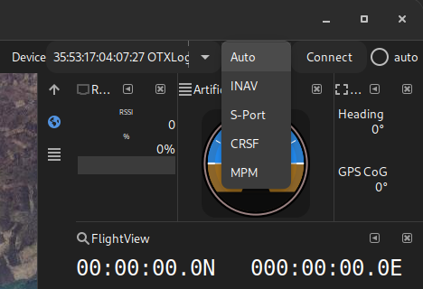

# "Serial" device support

mwp supports a number of different data transports for "serial" protocols:

* Wired serial devices (USB TTL (VCP) etc.)
* Bluetooth
* IP (UDP and TCP)
* "Special" (e.g. BulletGCSS via the MQTT protocol).

Each of these requires a specific device name and _may_ require a protocol selection.

## Serial devices

Serial devices are defined by the operating system device node name and optionally include an embedded baud rate (`@baudrate`), for example:

    # Linux, USB seral
    /dev/ttyACM0
    # Linux, USB serial with baud rate
    /dev/ttyUSB0@57600
    # Linux, RFCOM Bluetooth
    /dev/rfcomm1

    # FreeBSD
    /dev/cuaU0

	# Windows
	COM7
	COM17@38400

## Bluetooth

Bluetooth may be specified by either an `rfcomm` device node (`/dev/rfcommX` on Linux, `/dev/ttypX` pseudo-terminal abstraction on FreeBSD) or by the device address (`BD_ADDR`, Linux and FreeBSD only):

    # BT RFCOMM device node (Linux)
    /dev/rfcomm1
    /dev/rfcomm1@57600
    # RFCOMM / SPP (FreeBSD)
    /dev/ttyp6
    # BT device address (note here baud rate is immaterial)
    35:53:17:04:07:27

* On Linux, both legacy Bluetooth (RFCOMM/SPP) and Bluetooth Low Energy (BLE) are supported. BLE devices do not implement RFCOMM and must be accessed by address.
* On FreeBSD, only legacy (RFCOMM/SPP) Bluetooth is supported.

### Further Bluetooth considerations

* For legacy devices, it is recommended that these are paired before use; this will greatly speed up the device recognition process.

* For BLE, in general it is not possible to pair devices; it is recommended that you use operating system tools (e.g. `bluetoothctl` to discover the device and find all the BLE/Gatt characteristics (e.g. by `connect` in `bluetoothctl`). Otherwise you may end up in a "Morton's fork" situation where in order recognise the device as BLE, mwp needs to connect to it and in order to use the BLE connect functions, mwp needs to know it's a BLE device.

A sequence of `bluetoothctl` commands (where `aa:bb:cc:dd:ee:ff` represents a new device address); such as the following will help :

    $ bluetoothctl
	power on
    default-agent
    scan on
	## ... devices are discovered
    info aa:bb:cc:dd:ee:ff
	## note this will probably only show up a little data and 0 or 1 UUIDs (we need more)
	connect aa:bb:cc:dd:ee:ff
    ## for a BLE device, this will spew out a load of "characteristics" and multiple UUIDS
	trust aa:bb:cc:dd:ee:ff
	disconnect aa:bb:cc:dd:ee:ff
	quit

Now the device should be discovered in mwp and should connect.

The following BLE chip-sets are supported:

* CC2541
* Nordic Semi NRF
* SpeedyBee Type 1
* SpeedyBee Type 2

The first and last items having been tested by the author.

### Discovery and filtering

By default, mwp relies on the bonded information about bluetooth devices known to the operating system. This has (at least) two consequences:

* Unknown devices are not detected
* All known (serial) devices are listed, including offline / un-powered devices.

#### Experimental Discover and Filter action

There is a somewhat experimental option that includes scanning and RSSI filtering such that:

* A Bluetooth discovery scan is initiated (and terminated on quit).
* Only on-line devices with non-zero RSSI are listed.

The downside being that is RSSI if never discovered / advertised by the OS, then the device is not listed.

This mode is enabled by a setting:

    $ gsettings set org.stronnag.mwp  bluez-disco true

This is persistent, in order to revert to the default, non-scanning no RSSI filter:

    $ gsettings set org.stronnag.mwp  bluez-disco false


### mwp-ble-bridge

In order to use BLE serial devices with tools (i.e. other than mwp)  that do not implement the BLE protocol, mwp provides a `mwp-ble-bridge` tool that uses a pseudo-terminal, TCP server or UDP server to facilitate BLE connectivity for other tools that expect a device node. See the `README.md` in `src/mwp-ble-bridge`.

Using a bridge with TCP allows connectivity with the INAV Configurator versions that appear not to understand BLE on Linux. Note that INAV Configurator 8.0 will "sort of" support BLE on Linux.

### BLE Caveats

BLE not particularly useful for anything other than low power. The transfer rates are extremely slow and whether the device can be used at all depends on its MTU (maximum transmission unit). For some devices this is unacceptable low for use with mwp / INAV.

* The SpeedyBee version 2 BLE device has an MTU of 517 bytes; it works perfectly.
* CC2541 based devices have an MTU of 23 bytes; this is less useful for our requirement.

mwp will never send more than 20 bytes in a single write to a BLE device; chunking up messages as required. The FC cannot do this, so large messages will result in massive data overrun (for example MSP_BOX_NAMES will typically return more than 400 bytes).

mwp will log the detected MTU when it connects a BLE device.

    13:05:07.547489 BLE chipset CC2541, mtu 23 (unlikely to end well)
	...
	13:07:36.946329 BLE chipset SpeedyBee Type 2, mtu 517

### Serial permissions

It is necessary for the user to have read / write permission on serial devices. The installation guide provides [instructions](Building-with-meson-and-ninja.md#accessing-the-serial-port).

## IP protocols (UDP and TCP)

mwp uses a pseudo-URL format for TCP and UDP connections `udp://host:port` and `tcp://host:port` (where `host` is either a hostname or an IP address as required).

Typically on one side of the connection you'll provide a hostname /IP and on the other you won't (as it can get the peer address from the first data packet).

Assuming the required UDP port is 43210

if mwp is the "listener" (doesn't need, *a priori*, to know the address of peer), set the "Device" to:

    udp://:43210

i.e. the host part is empty.

If the remote device / application is the listener, and we know its IP address; in the following example "192.168.42.17", set the "Device" to:

    udp://192.168.42.17:43210

Note that for TCP, mwp only supports the latter form (it expects to be the TCP client).

## Special Cases

### UDP devices required defined local and remote port numbers

Some UDP devices (typically ESP8266 transparent serial) require that the port number is specified for both local and remote addresses; often the same port number at both ends. `udp://local_host:local_port/remote_host:remote_port` or `udp://remotehost:remote_port/?bind=port`. The following have the same effect.

    udp://:14014/esp-air:14014
    # both sides use port 14014, remote (FC) is esp-air, blank local name is understood as INADDR_AN
    udp://esp-air:14014/?bind=14014

### MQTT / BulletGCSS

See the [mwp's MQTT support](mqtt---bulletgcss-telemetry.md) article for a detailed description of the URI format:

    mqtt://[user[:pass]@]broker[:port]/topic[?cafile=file]

## Multi Protocol selection

### Overview

There is a protocol drop-down that allows the user to select the in-use serial protocol.
{: width="60%" }

Offering:

{: width="40%" }

### Usage

| Item | Usage |
| ---- | ----- |
| Auto | Auto-detects the protocol from the serial data stream. Note that MPM cannot (yet) be auto-detected reliably, and must be explicitly selected).|
| INAV | INAV protocols, MSP, LTM and MAVLink. Legacy behaviours |
| S-Port | Smartport telemetry, previously required `--smartport` options. Expects a non-inverted stream |
| CRSF | Crossfire Telemetry. |
| MPM | Multi-Protocol-Module telemetry. The output from an EdgeTX / OpenTX radio with a multi-protocol module, FrSky Smartport or Flysky 'AA' via the EdgeTX / OpenTX "Telem Mirror" function. Prior to EdgeTX 2.7, this cannot be reliably auto-detected, and should be explicitly selected; with EdgeTX 2.7 and later, auto-detection is possible and reliable. |

#### Notes

* For [radar functions](mwp-Radar-View.md) (INAV-radar, ADSB), it is necessary to set the `--radar-device=` [option](running.md#command-line-options). Leave the protocol selector at 'Auto'.
* For telemetry forwarding, it is necessary to set the `--forward-to=` [option](running.md#command-line-options). Leave the protocol selector at 'Auto'.
* For FlySky MPM telemetry, the INAV CLI setting `set ibus_telemetry_type = 0` is required; any other `ibus_telemetry_type` value will not work.

#### Auto-detection

* INAV (MSP, LTM, MAVLink) auto-detection should be reliable (legacy function).
* S-Port and CRSF may be less reliably detected.
* MPM is hard to auto-detected. From EdgeTX 2.7, MPM auto-detection works reliably.
* It is recommended that for S-Port, CRSF and MPM, the desired protocol is set explicitly (not left at "Auto").

## Telemetry Forwarding

{{ mwp }} can forward received telemetry protocol payloads according to a filter defined by two parameters:

* The CLI parameter ``--forward-to=<device>` where `<device>` represents the device node / name used for forwarding. `<device>` describes any supported mwp transport (serial, BT, UDP, TCP).
* The setting `forward`:
  ```
  $ gsettings describe  org.stronnag.mwp forward
  Types of message to forward (none, LTM, minLTM, minMAV, all, MSP1, MSP2, MAV1, MAV2)
  ```

These settings have two distinct behaviours:

* `none`: No forwarding (default)

### Forwarding "same type" messages

The following settings, apply to received telemetry of  the specified type. No message translation is done, and all data received will be regenerated and sent on to the `forward-device`.

*  `all`: Any `MSP`, All received MSP responses will be forwarded.
* `minLTM`: Minimal set of received `LTM` (typically for antenna trackers; `G`, `A` and `S` frames) will be forwarded.
 * `minMAV`: Minimal set of `MAVLink` (typically for antenna trackers; `ID_HEARTBEAT`, `ID_SYS_STATUS`, `GPS_RAW_INT`, `VFR_HUD`, `ATTITUDE`) will be forwarded.

### Translated "capability" messages

The following settings are "capability" based and may involve translation of a forwarded protocol into a different protocol. For example, a MSP `MSP_RAW_GPS` might be forwarded to a `LTM` consumer as LTM `G_FRAME` or to a MAVLink consumer as `MAVLINK_MSG_GPS_RAW_INT`. Messages are grouped into the following "capailities":

* GPS Position / velocity / status
* Attitude
* Status
* Origin

When a telemetry message via MSP, LTM or MAVlink is received that matches one of these categorisations, it is forwarded as best reprenting that capability is the consumer's message protocol:

* `LTM` : Data is transposed to one or more LTM messages
* `MSP1` : Data is transposed to one or more MSPv1 messages
* `MSP2` : Data is transposed to one or more MSPv2 messages
* `MAV1` : Data is transposed to one or more MAVLink v1 messages
* `MAV2` : Data is transposed to one or more MAVLink v2 messages

Caveat:

* The association between an incoming message, its "capability" and the appropriate outgoing message(s) is necessarily "fuzzy"; not all data in one message protocol can be represented in a different message protocol
* Simple cases e.g. receiving MSPv2 and forwarding to an antenna or head tracker that uses a different protocol (MSP1, MAV1, MAV2, LTM) should be satisfactory, as a tracker doesn't require much information.
* Forwarding translated data to another GCS will most likely result in a degraded view on the consumer GCS.

Other Notes:

* Prior to forwarding the message payload, mwp will have validated the message and processed it for its own purpose.
* For MAVLink, by default, mwp uses a `sysid` of `106` (UTF8 `j`).
* The MAVLink `sysid` may be changed with the setting `mavlink-sysid`, in the range 2-255 (see [MAVlink documentation](https://ardupilot.org/dev/docs/mavlink-basics.html#message-format) and particularly the GCS guidance, 2nd paragraph _ibid_)

e.g.

```
# setting
gsettings set org.stronnag.mwp forward minLTM
```
```
# in ~/.config/mwp/cmdopts
# forward over UDP
--forward-to=udp://udp-ant:30001
```
