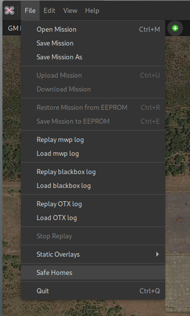
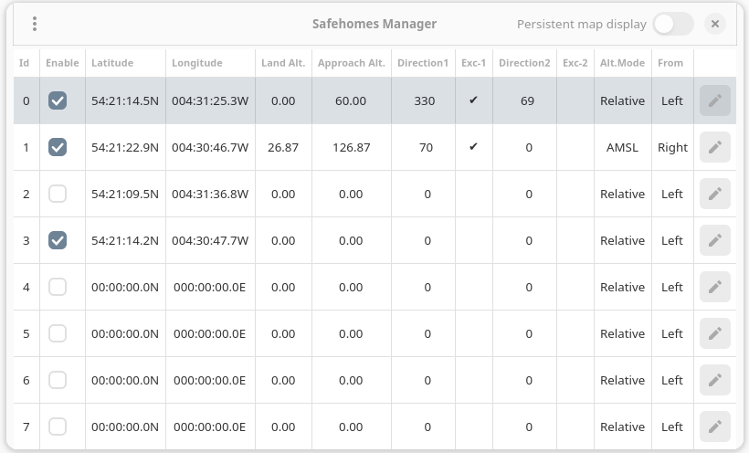
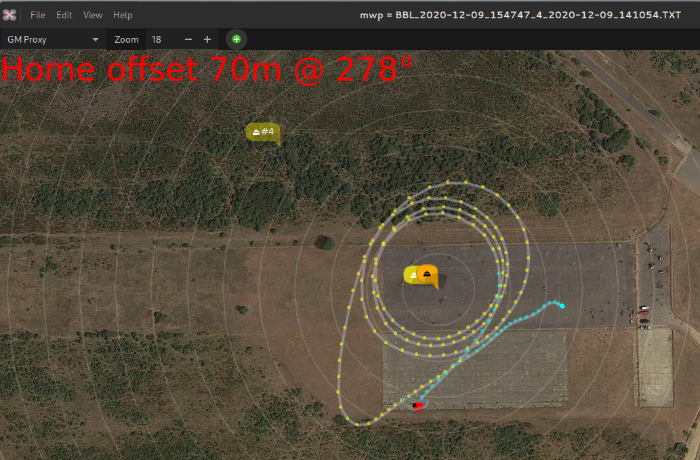

# Ssafehome and Auto-land

One of the great features of {{ inav }} 2.6 was the `safehome` capability. The user can define of set of up to eight locations, and if any of these is within 200m (configurable up to 650m in {{ inav }} 2.7), then that is used as the home location for RTH (and RTH failsafe).

## INAV setting

`safehome` is set in {{ inav }} using the CLI, (note more recent Configurators also have a UI);  here's an example:

    # safehome
    safehome 0 1 508047750 -14948970
    safehome 1 1 509102384 -15344850
    safehome 2 1 509390336 -14613540
    safehome 3 1 509149619 -15337365
    safehome 4 0 508054891 -14961431
    safehome 5 0 543545392 -45219430
    safehome 6 0 540954148 -47328458
    safehome 7 0 0 0

As you see, it's not too user friendly; the parameters are

* Index (0 - 7)
* Status (0 = don't use, 1 = can use)
* Latitude as degrees * 10,000,000 (i.e. 7 decimal places)
* Longitude as degrees * 10,000,000 (i.e. 7 decimal places)

It can be error prone to get locations into the correct format, particularly when a common source (Google Maps) only provides 6 decimal places of precision.

## mwp solution

### Graphical User Interface

Note: Since mwp 7.32.?, mwp provides additional fields for the Autoland function that first appeared in INAV 7.1.0.

{{ mwp }} now offers a `Safe Homes` menu option:

{: width="25%" }

This will launch the `Safe Home` window:

{: width="50%" }

From here it is possible to:

* Load safehomes from a file in CLI format. A CLI diff or dump can be  used.
* Save safehomes to a file in CLI format. If a CLI diff or dump is selected, then only the `safehome` and `fwapproach` stanzas are changed; other information in the diff / dump is preserved.
* Display safehomes on the map. Active safehomes are displayed with greater opacity than inactive locations.
* Change the status (active, inactive). If a previously unused item is enabled, an icon is placed on the centre of the map for positioning.
* Clear (unset) one or all safehomes.
* Upload and Download `safehome` and `fwapproach` data to/from the flight controller.
* Manage INAV 7.1.0+ Autoland data

Note that editing functions are only available when the `Safe Homes` window is active; if the windows is dismissed with icons displayed, then the icons remain on the map, but are not editable.

### Display safehomes at startup

It also is possible to set a `gsettings` key to define a file of safehomes to load at startup, and optionally display (readonly) icons.

    gsettings set org.mwptools.planner load-safehome ~/.config/mwp/safehome.txt,Y

This sets the default safehomes file to `~/.config/mwp/safehome.txt` and the appended `,Y` means display the icons on the map.

If the file also contains `fwapproach` data, that will be applied as well.

If the name part is set to `-FC-`, then the safehomes will be loaded from the flight controller, for example:

    gsettings get org.mwptools.planner load-safehome
	'-FC-,Y'

### Example

The image below shows a blackbox replay. Note that the flight home location (brown icon) is coincident with the pale orange safehome icon.

{: width="50%" }
