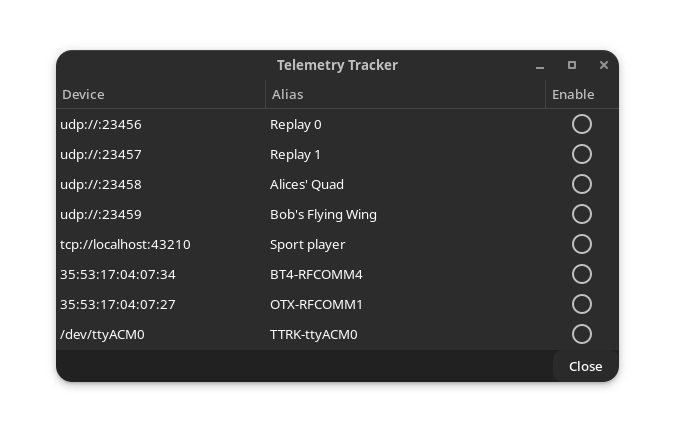

# Telemetry Tracking

## Overview

The {{mwp}} "Telemetry Tracking" function allows additional vehicles to be tracked by a single {{mwp}} instance.

A use case is:

* The "primary" user is connected using either RX Telemetry or a legacy telemetry radio (3DR, HC-12, LoRA) and uses {{mwp}} as a ground station, displaying the vehicle icon, track, information widgets in the "dock" and maybe audio prompts.
* One or more "secondary" users also wish to have their vehicle's tracking symbol displayed on the {{mwp}} map. These secondary users connect to {{mwp}} from their RX using Bluetooth, USB (or perhaps WiFi). This is somewhat analogous to INAV-Radar.
* For RX Telemetry, it is necessary to set a RX UART to "Telemetry Mirror"; this is supported by both EdgeTX and OpenTX.

This capability builds on extant {{mwp}} features.

* {{mwp}} already knows about all USB serial devices and bound Bluetooth serial devices
* These devices are categorised as :
    - Primary device. This will be drive the "dock" widgets, be tracked with a flight path and generate audio reports (if enabled). A device becomes the `Primary` device by user action (as now, from the "Connect" button).
	- "Radar" devices. Predefined devices for either INAV-Radar or ADS-B reports.
	- Secondary devices - Unassigned deviced, available for telemetry tracking. Managed by the "Telemetry Tracking" dialog.
* Uses extant {{mwp}} telemetry protocol decoding:
    - LTM
	- MAVlink
	- CRSF
	- SmartPort (direct via inverter or non-inverted via MultiProtocolModule (MPM)
	- Flysky 'AA'/INAV type 1 via MPM
* The telemetry protocol is auto-detected.

## Telemetry Tracking (Secondary devices)

The devices will be read for any push telemetry supported by [mwp](https://github.com/stronnag/mwptools) and {{inav}} (e.g. LTM, MAVLink, CRSF, Smartport, MPM). The protocol will be auto-detected. When valid (geo-referenced) telemetry data is received, a symbol and name will be displayed on the map (as for the [mwp radar display](mwp-Radar-View.md)). The name associated with the symbol may be:

* Defined by the user when the device is selected in the [user interface](#user-interface) ; or
* Assigned by {{mwp}} :
    - For Bluetooth, the device alias if defined; or
	- Derived from the device name (e.g. `TTRK-ttyUSB1`)

## User Interface

In order to use Telemetry Tracking, it will be necessary for the user to assign the required devices. The primary device (once connected) and any devices predefined for "Radar" will not be considered. Once a device has been assigned as a "Secondary / Telemetry Tracking" device, it may not the used as the "Primary" device. Likewise, an established primary device will not be offered as a secondary device.

The "Telemery Tracking" device(s) may be assigned from the "View" / "Telemetry Tracker" menu option (Control-Shift T).



* The IP entries devices are for testing; they cannot be auto-detected so must be defined by the environment variable `MWP_SECDEVS`. This environment variable describes one or more devices, each with optional "Alias" text. The "device" part comprises a mandatory device name, and a optional alias, separated by a space; multiple devices are separated by a pipe symbol (`|`). For example:
        ```
		MWP_SECDEVS=udp://:23456 Replay 0|udp://:23457 Replay 1|udp://:23458 Replay 2|udp://:23459 Replay 3|tcp://localhost:43210 Sport player
		```
* The IP devices are defined from `MWP_SECDEVS`; each of these has a user-defined alias. Two of the UDP aliases have been edited by the user.
* The USB device node is auto-detected and automatically aliased `TTRK-ttyACM0`. The user can edit / override this alias if she so wishes.
* The two bluetooth devices (`35:53:*`) have aliases defined at the operating system level.
* If `/dev/ttyACM0` is subsequently connected as the primary device, it will not appear in the list.
* The `Hints` column lets the user define the specific protocol to used (vice let it be auto-detected).

Tracking devices are enabled / disabled using the "Enable" check-button. Once a device is enabled, {{mwp}} will attempt to read data from it. The device is closed by toggling the "Enable" button. Once disabled, its resources are freed. If a USB device is physically removed when enabled, its resources will also be freed.

## Visualisation

"Telemetry Tracked" objects are displayed on the map can be inspected using the existing [mwp radar display](mwp-Radar-View.md) functionality. "Telemetry Tracking" may be used at the same time as the extant "INAV-Radar and "ADS-B" tracking.

And example of visualisation is:


The "Primary" vehicle (a flying wing) has the standard mwp visualisation attributes. The other icons, `Replay 0` and `Replay 1` are "secondary" tracks from other pilot's CRSF telemetry (but it could be any of LTM, Mavlink, CRSF, SPort or Flysky 'AA' (INAV type 1)).  Note also that `Replay 0` has not reported for  over 5 minutes ("stale"); maybe it's crashed? At least the pilot knows where to start looking.

### Icon

All "Telemetry Tracked" vehicles use a common icon (`inav-telem.svg`).
The default may be overridden by the user if so desired.

## Constraints

Linux preferred, due to the `udev` dependency for device enumeration. On other platforms it will be necessary to define devices _a priori_ using the `MWP_SECDEV` environment variable (which may be set in `~/.config/mwp/cmdopts`.
