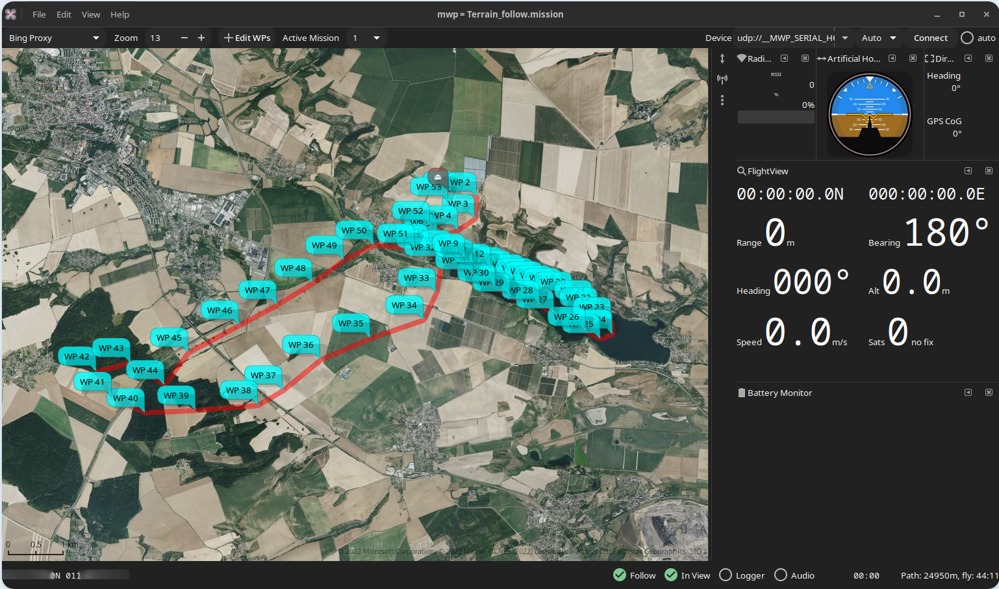
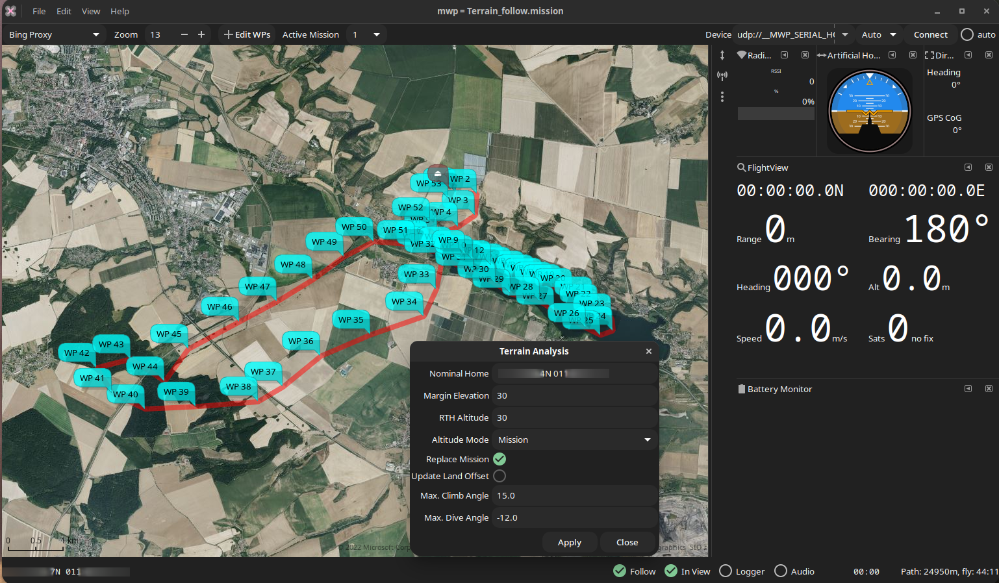
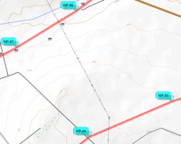
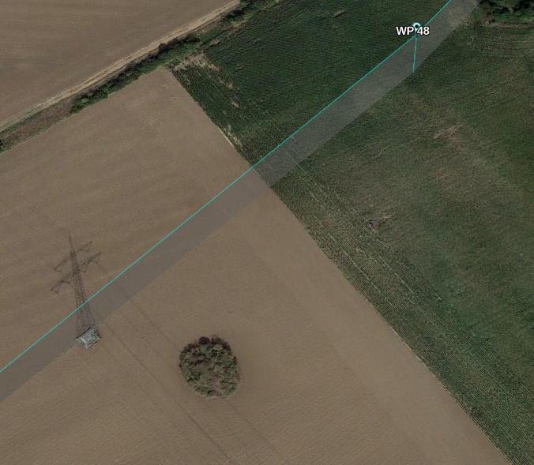

# Terrain Avoidance Quick Guide

There's already quite a long article on  [mwp's terrain analysis tool](Mission-Elevation-Plot-and-Terrain-Analysis.md); this is a quick summary of how to use it in three easy steps.

## 1. Load your mission

First load (or create) the mission in mwp. Here, the pilot chooses to take a cruise around the lake and adjacent country side. The brown / grey icon at the top of the mission is the planned home location.  At first glance, the terrain looks quite benign.

{: width="50%" }

## 2. Set your avoidance parameters

By right clicking on any waypoint, we can select **Terrain Analysis**. As this will use Bing Maps, we need to have an internet connection. We set the analysis parameters:

* Home is taken from the planned home location
* The pilot elects for 30m clearance above terrain
* Uses the same altitude definition (Relative / Absolute) as is set in the extant mission
* Replace the mission altitudes with the altitudes generated from the analysis
* Highlight any extreme climb / dive angles

{: width="50%" }

On clicking **Apply**, the analysis will run.

## 3. Review the output

The output is displayed as a chart of the terrain (green), the original mission (red), the avoidance margin (blue, 30m in this example), and the adjusted mission (orange). There is also a Climb / Dive analysis.

{: width="50%" }

There are a few places that could benefit from further manual adjustment, but in general it looks pretty good.

* We could eliminate the unnecessary small dips at WP37, WP41 and WP43
* It is unlikely we'll try the extreme climb from HOME to WP1; the mission will probably be invoked some distance from home.

So it looks good. Or does it?

## Terrain may not be the only hazard

The terrain analysis is only as good as the terrain data. If we zoom in closely, or look at a difference map source (e.g. OpenTopo), or examine the route in 3D (Google Earth) via [flightlog2kml / mission2kml](https://github.com/stronnag/bbl2kml), maybe from [fl2xui](https://github.com/stronnag/fl2xui) we can see another hazard. Between WP36-WP37 and WP47-WP48 there are high voltage overhead transmission lines. Hitting these, or at WP48, the tower would be sub-optimal.

{: width="30%" }
{: width="30%" }

A replan seems like a good idea, at least adding significant altitude on these legs of the mission.
