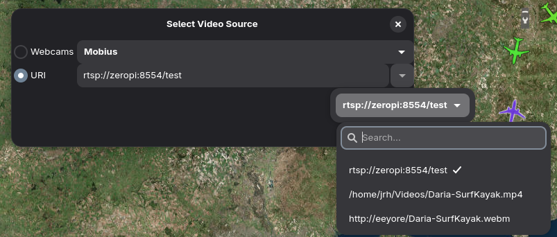

# Playing Video in mwp

{{ mwp }} provides support for live and replay video.

* In ground station mode, in order to repeat the FPV feed to the mwp screen, presumably for the enjoyment of spectators;
* During Blackbox replay, to show the FPV recorded video during the replay.

## Video Player Options

mwp offers two alternate video player implementations:

* The default uses the standard GTK4 `Gtk.Video` widget. This is available on all platforms.
* The "hand-crafted" player from legacy mwp is also available with a run time dependency on the `gstgtk4` Gstreamer plugin. This is available only on modern operating systems and its package name is OS dependent, for example:

    * Arch:  `gst-plugin-gtk4`
    * Debian (Sid / Trixie): `gstreamer1.0-gtk4`
    * FreeBSD: `gstreamer1-plugins-rust`
    * Void: `gst-plugins-rs1`

The `gstgtk4` player may have better (accelerated) performance and may play more media formats.
It is also more tolerant of errors.

In order force use of the `gstgtk4` player it is necessary:

* To use an operating system that supports the GStreamer `gstgtk4`  plugin.
* Set the environment variable `MWP_USE_GSTGTK4` (to anytihng).

The `gstgtk4` player contains `(gstgtk4)` in the title bar.

Either player can play streaming camera formats such as `rtsp` and `hls` if the appropriate GStreamer plugins are installed.

!!! note "Legacy Images"
    The images this section are from legacy mwp, however the capability is the same.

## Live stream mode (GCS)

There is now a **Video Stream** option under the view menu.

{: width="30%" }

Selecting this option opens the source selection dialogue. Camera devices offering a "video4linux" interface (i.e most webcams) will be auto-detected. There is also the option to enter a URI, which could be a `http`/`https`, `rtsp` or other standard streaming protocol, or even a file.

{: width="20%" }

The selected source will then play in a separate window. This window will remain above the mwp application and can be resized, minimised and moved.

In stream mode, there are minimal video controls; a play/pause button and volume control. Note the volume is that of the video, the overall volume is controlled by the system volume control.

Up to 10 recent URIs are persisted. In order to access this list it is necessary to click the "expander" icon at the end of URI text entry box. The recent files list is stored in a text file `~/.config/mwp/recent-video.txt`. This file may be maintained with a text editor if required.

## Blackbox replay mode (BBL replay)

The Blackbox log replay chooser also offers a video replay option.

{: width="75%" }

Here the user can select a media file and start options, i.e. whether and when to start the video replay with respect to the start of the BB log replay.

* In order for mwp to start the replay, the **Start** check-button must be selected. If it is:
* The user can enter an optional time (minutes : seconds) that defines when the video starts relative to the start of the BB log:
    * No time is entered, or the time is 0:00 : The video starts at the start of the BBL replay.
    * The time is positive (e.g. 2:34.5 (two minutes, 34.5 seconds), as the example: Here the video would start when BB log starts, at an offset 2:34.5 into the video (i.e. the pilot started FPV recording 2m 34.5s before arming the aircraft).
    * If the time is negative (including "-0" minutes), then the start of the video is delayed by that amount; so -0:57 would delay the start of the video by 57 seconds relative to the start of BB log replay.
    * Pausing the replay will pause the video, and vice-versa.

When playing a file (vice a stream), the player gains a progress bar (which can be used to position the stream and "beginning" and "end" buttons.

## Other OS

* FreeBSD. FreeBSD offers a video4linux emulation that works with {{ mwp }}. Cameras are not auto-detected but will be recognised if plugged in before mwp is invoked. In any case, the URI `v4l2:///dev/video0` (for example) can be used in streaming mode if required.
