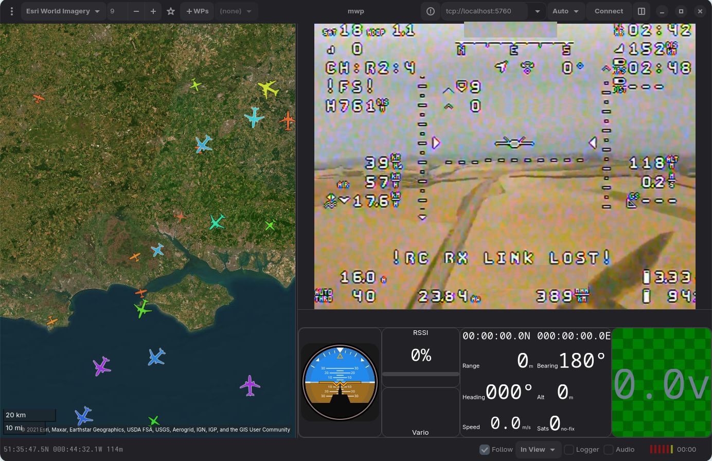
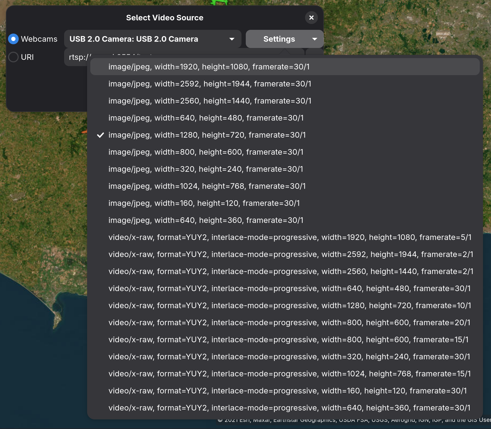

# Playing Video in mwp

{{ mwp }} provides support for live and recorded video. Use cases might include:

* In ground station mode, for long range monitoring;
* In ground station mode, in order to repeat the FPV feed to the mwp screen, presumably for the enjoyment of spectators;
* During Blackbox replay, to show the FPV recorded video during the replay.

Video may be played in either a separate window, or in an embedded pane (FPV Mode).

{: width="30%" }

## Video Player Requirements

mwp uses the open source GStreamer API to provide video playing. As well as any decoders / formats etc. to support the input stream, there is runtime dependency on the `gstgtk4` Gstreamer plugin. This is available on modern operating systems and its package name is OS dependent, for example:

* Arch and MSys2 :  `gst-plugin-gtk4`
* Debian (Sid / Trixie): `gstreamer1.0-gtk4`
* FreeBSD: `gstreamer1-plugins-rust`
* Void: `gst-plugins-rs1`

There is also a fallback video player for older OS (e.g. Ubuntu 24.04). This can also be used on Windows where the graphics driver fails (error message `failed to share contexts through wglShareLists 0xaa`) (any may crash mwp) using the `gstgtk4` Gstreamer / OpenGL plugin.

The "fallback" video widget is based on `Gtk.Video':

* Automatically detects missing `gtk4paintablesink` on Ubuntu 24.04 et al and uses the fallback player.
* On Windows with "bad" graphics drivers (or to force the fallback widget anyway), fallback video requires that the new setting `use-fallback-video` is set to `true`.

Consequences of using the fallback video player:

* On Windows, no direct USB camera access
* Higher latency (e.g. 2000ms on RTSP feeds)
* Fewer  video codecs available.

!!! note "Legacy Images"
    The images this section are from legacy mwp, however the capability is the same.

## Live stream mode (GCS)

There is a **Video Stream** option under the view menu.

{: width="30%" }

Selecting this option opens the source selection dialogue. Camera devices (i.e most webcams) will be auto-detected. There is also the option to enter a URI, which could be a `http`/`https`, `rtsp` or other standard streaming protocol, or even a file.

{: width="20%" }

The selected source will then play in a separate window. This window will remain above the mwp application and can be resized, minimised and moved.

In stream mode, there are minimal video controls; a play/pause button and volume control. Note the volume is that of the video, the overall volume is controlled by the system volume control.

Up to 10 recent URIs are persisted. In order to access this list it is necessary to click the "expander" icon at the end of URI text entry box. The recent files list is stored in a text file `~/.config/mwp/recent-video.txt`. This file may be maintained with a text editor if required.

In "FPV Mode", no controls are shown.

## Camera Capabilities

mwp requests camera capabilities from Gstreamer and presents them to the user when the "Settings" button clicked.



If a capability is selected, it is passed on to GStreamer verbatim and stored for future use.

## OS Specific

* Linux. "Video4Linux" (`v4l2src`).
* FreeBSD. FreeBSD offers a video4linux (`v4l2src`) emulation that works with {{ mwp }}.
* Windows. Uses `ksvideosrc` or  `mfvideosrc` if detected.
* MacOS. Uses `afvideosrc` for Camera input. Not tested.

## FPV Mode

FPV mode provides a paned view of a camera feed. The user can switch between "Standard" and "FPV Mode" views from the "View / FPV Mode" menu option or by assigning a [shortcut key](mwp-Configuration.md#keyboard-accelerators), for example in `~/.config/mwp/accels`, the "action" name is "modeswitch", which is here mapped to `F12`.

```
modeswitch F12
```

The [panel](dock.md) will swich as necesary.

FPV uses the following order to determine what to show (if anything).

* If the windowed player was active, that stream is transferred to the video pane.
* Else, if available, the last panel stream is shown.

### Using RTSP for camera parameter definitions

{{ mwp }} cameras are used in their default configuration. If the user wants more control over the camera properties, is using a remote camera, if the camera is not detected or if using Windows with mwp' "fallback" player , then a RTSP server can be used.

[go2rtc](https://github.com/AlexxIT/go2rtc) is a useful RTSP server that supports numerous video options.

#### Linux, FreeBSD

The following configuration file `go2rtc.yaml` illustrates some of the possibilities:

```
streams:
  usbcam1: v4l2:device?video=/dev/video0&input_format=mjpeg&video_size=1280x720&framerate=30
  usbcam2: ffmpeg:/dev/video0#video=h264#audio=aac#scale=1280:720
  usbcam3: v4l2:device?video=/dev/video0&input_format=mjpeg&video_size=640x480&framerate=30

  file0: exec:ffmpeg -hide_banner -re -stream_loop -1 -i /home/jrh/Videos/Daria-SurfKayak.mp4 -vcodec h264 -rtsp_transport tcp -f rtsp {output}
  file1: ffmpeg:/home/jrh/Videos/18_ft_Skiff_in_heavy_wind.mp4
  test: exec:ffmpeg -hide_banner -re -f lavfi -i testsrc -vcodec h264 -rtsp_transport tcp -f rtsp {output}
```

The camera is a 10 year old "Mobius"; remember them?

* `usbcam1` : "Normal" camera configuration (MJPEG feed).
* `usbcam2` : Camera feed is transcoded using `ffmpeg` to H264 prior to transmission. This appers to be smoother in mwp's video player.
* `usbcam3` : Sets the camera resolution.

And some test streams:

* `file0` : Streams a `webm` video in a loop
* `file1` : Streams a `mp4` video
* `test` : Streams the `ffmpeg` "test card"

It is possible to start and stop `go2rtc` when mwp is started / quit using the `atstart` and `atexit` settings:

Adjust configuration  file path for your environment:

* atstart: `go2rtc -c /home/jrh/.config/go2rtc/go2rtc.yaml`
* atexit: `pkill -f go2rtc.exe`

### Windows

Configuration file for USB webcam:

```
streams:
  webcam0: ffmpeg:device?video=0#width=640#height=480#video=mjpeg
  webcam1: ffmpeg:device?video=Mobius#width=640#height=480#video=mjpeg
  webcam2: ffmpeg:device?video=0#width=640#height=480#video=h264
```

Each of the above lines refers to the same device (name/index reference), natural or trans-coded video). At least in the author's VM, it is necessary to downsize the video-stream to avoid `ffmpeg` overruns.

* atstart: `go2rtc.exe -c c:/Users/win10/go2rtc.yaml'`
* atexit: `taskkill.exe -f -im "go2rtc.exe"`

It is recommended to use POSIX style forward slashes rather than Windows backslash in order to avoid any "backslash escape" issues.

Note that go2rtc and dependencies (`ffmpeg` etc.) must be on a `PATH` available to `mwp.exe`.
