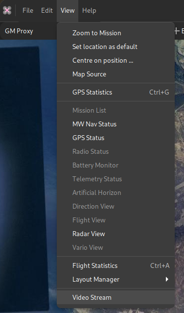
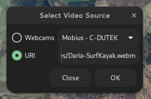
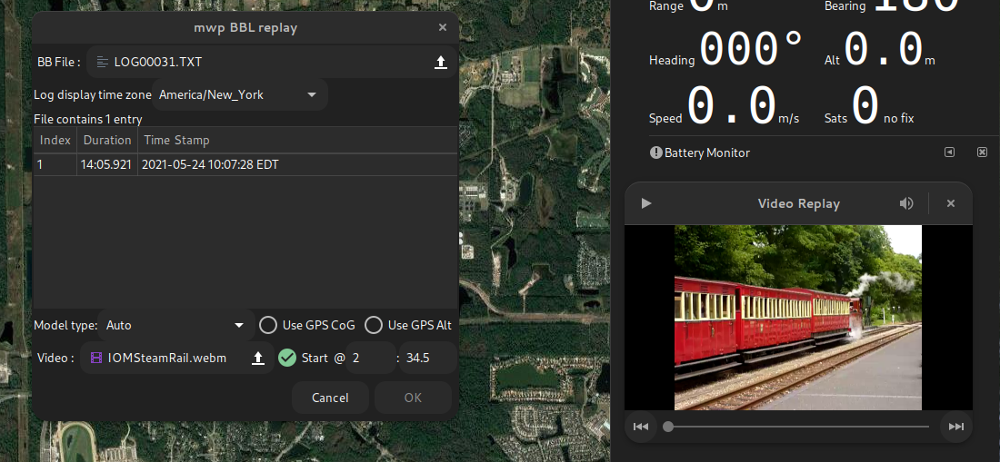

# Playing Video in mwp

{{ mwp }} provides support for live and replay video.

* In ground station mode, in order to repeat the FPV feed to the mwp screen, presumably for the enjoyment of spectators;
* During Blackbox replay, to show the FPV recorded video during the replay.

## Dependencies and platform requirements

The video replay capability requires:

* Arch Linux `sudo pacman -S gst-plugins-base-libs`
* Debian / Ubuntu `sudo apt install libgstreamer-plugins-base1.0-dev`
* Fedora `sudo dnf install gstreamer1-plugins-base gstreamer1-plugins-base-devel`
* Other distro -- consult the package manager

And, if not installed:

* Arch Linux `gst-plugins-good`
* Debian / Ubuntu `gstreamer1.0-plugins-good`
* Fedora `gstreamer1-plugins-good`
* Other distro -- consult the package manager

!!! info "One off actions"
    These are documented for new installs (and provided by the ['easy' script](Building-with-meson-and-ninja#easy-first-time-install-on-debian-and-ubuntu)).

!!! info "FreeBSD"
    Strictly, {{ mwp }} requires `gstreamer1.0-plugins-gtk` which _should_ be included in `gstreamer1.0-plugins-good`; on FreeBSD it is necessary to install `gstreamer1-plugins-gtk` explicitly.

## Live stream mode (GCS)

There is now a **Video Stream** option under the view menu.

{: width="30%" }

Selecting this option opens the source selection dialogue. Camera devices offering a "video4linux" interface (i.e most webcams) will be auto-detected. There is also the option to enter a URI, which could be a `http`/`https`, `rtsp` or other standard streaming protocol, or even a file.

{: width="20%" }

The selected source will then play in a separate window. This window will remain above the mwp application and can be resized, minimised and moved.

In stream mode, there are minimal video controls; a play/pause button and volume control. Note the volume is that of the video, the overall volume is controlled by the system volume control.

## Blackbox replay mode (BBL replay)

The Blackbox log replay chooser also offers a video replay option.

{: width="75%" }

Here the user can select a media file and start options, i.e. whether and when to start the video replay with respect to the start of the BB log replay.

* In order for mwp to start the replay, the **Start** check-button must be selected. If it is:
* The user can enter an optional time (minutes : seconds) that defines when the video starts relative to the start of the BB log:
  * No time is entered, or the time is 0:00 : The video starts at the start of the BBL replay.
  * The time is positive (e.g. 2:34.5 (two minutes, 34.5 seconds), as the example: Here the video would start when BB log starts, at an offset 2:34.5 into the video (i.e. the pilot started FPV recording 2m 34.5s before arming the aircraft).
  * If the time is negative (including "-0" minutes), then the start of the video is delayed by that amount; so -0:57 would delay the start of the video by 57 seconds relative to the start of BB log replay.
  * Pausing the replay will pause the video, and vice-versa.

When playing a file (vice a stream), the player gains a progress bar (which can be used to position the stream and "beginning" and "end" buttons.

## Issues / Workarounds

If your camera does not work the `gstreamer` utilities, it is unlikely to work with {{ mwp }}, as it uses `gstreamer` APIs for camera access.

You can easily test this using `gst-launch-1.0` which will closely emulate the way {{ mwp }} works:

```
gst-launch-1.0 playbin uri=v4l2:///dev/video0
```
Where `/dev/video0` is the camera device node.

### Fail example and resolution

A camera (an old Mobius) works on some computers and not others, including, annoyingly, the main {{ mwp }} development box. The issue was an old  USB2.0 (extension) hub that didn't provide enough bandwidth; so there was just a black screen shown.

Fixed by setting uvcvideo quirk 640:
`UVC_QUIRK_FIX_BANDWIDTH` (0x80, 128)
`UVC_QUIRK_RESTRICT_FRAME_RATE` (0x200, 512)

#### Test fix
```
sudo rmmod uvcvideo
sudo modprobe uvcvideo quirks=640
```
Now there is a proper picture, rather than a black screen.

#### Permanent solution

Add a file e.g. `/etc/modprobe.d/v4l2.conf` containing the line:
```
options uvcvideo quirks=640
```
or to any other `.conf` file under `/etc/modprobe.d/`

### Helper tools

There are a couple of tools under `mwptools/src/samples/gst-video/`. These are not built / installed by default but may be built if required to enable diagnostics.

```
cd mwptools/src/samples/gst-video
make
# optionally, install to ~/.local/bin
make install
```

* `gst-devmon` provides the same video device monitoring as employed by mwp. It should report the insertion and removal of camera devices, together with their attributes.
* `gst-video-player` provides the same video replay capability as {{ mwp }}
  * Camera stream : `gst-video-player v4l2:///dev/video0` . Assuming the camera, as reported by `gst-devmon` is `/dev/video0`.
  * File: `gst-video-player somefile.mp4`
  * Web stream `gst-video-player https://www.freedesktop.org/software/gstreamer-sdk/data/media/sintel_trailer-480p.webm`

## Other OS

* FreeBSD. FreeBSD offers a video4linux emulation that works with {{ mwp }}. Cameras are not auto-detected but will be recognised if plugged in before mwp is invoked. In any case, the URI `v4l2:///dev/video0` (for example) can be used in streaming mode if required.

* Windows 11/ WSLG: No support for cameras, probably works with files / URLs.
