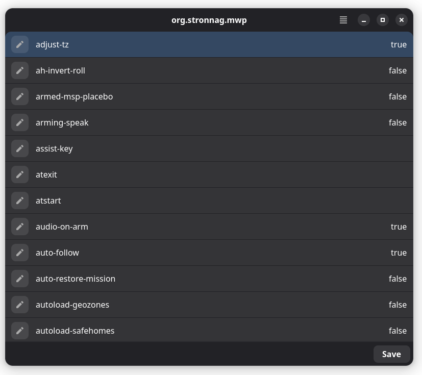
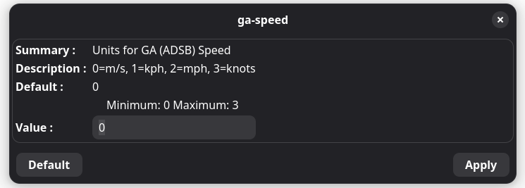
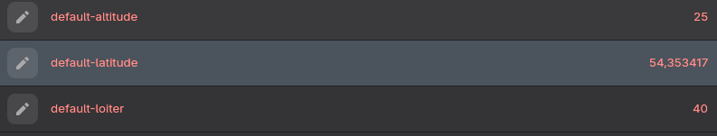

## mwpset

### Overview

`mwpset` is an application to manage mwp settings.

* Graphical settings editor
* Save updated settings to back-end settings database
* Backup and restore settings

It provides a unified GUI tool across all operating systems but does not preclude the use of standard OS tools like `gsettings`, `dconf` or `dconf-editor`.

### Usage

``` bash
$ mwpset [schema]
```

The default scehma is `org.stronnag.mwp`; however any `gsettings` / `dconf` schema can be specified.

On MacOS, the {{ mmwp }} `ini` settings file `~/.config/mwp/mwp.ini` is used.


### UI

The UI presents an alphabetical list of setting keys and their current value. Clicking on the "Edit Icon" (or double clicking) on a row will open the setting editor.

{: width="30%" }

The edit dialog shows settings name, summary, description default value and a type specific widget to change the value.

#### Setting Edit Dialog

* For enumerations and "choices" (including boolean) a drop down menu is presented.
* For other entries, there is a text entry box.
* Where a range (min, max) is enforced, the range values are also shown.

{: width="60%" }

{: width="60%" }

{: width="60%" }

* Clicking the "Default" button will apply the default.
* Clicking "Apply" will update the value.
* Where a new value is out of range, the prior value will be restored.
* If the new value is accepted, the edit window is closed.

After a value has been changed, it is shown in a highlight colour in the settings list.

{: width="60%" }

Changed settings may be saved back to the settings database using the "Save" button. Once the new settings are saved, they are immediately available in a running `mwp` application.

In a few cases, mwp caches settings on startup. Changes to these settings will not take effect until mwp is restarted.

## Settings Window Menu

The settings window menu provides options :

* **Backup** : Backup settings to a file
* **Restore** : Restore settings from a file (in the format written by **Backup**).
* **Quit**

When settings are restored, any changed settings  compared to the current values are shown in a highlight colour. It is necessary to **Save** any changed settings for them to take effect.

## Localisation

Any floating point numbers will be displayed using either point or comma as the radix point according to the user's locale. Floating point numbers should be edited using the locale specific radix.

The backup file is a `dconf` compatible `.ini` file. This is always written with a "point" radix and should not changed.
