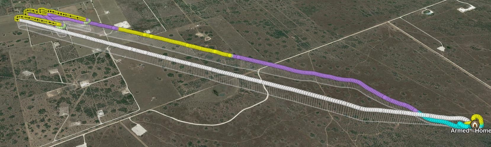
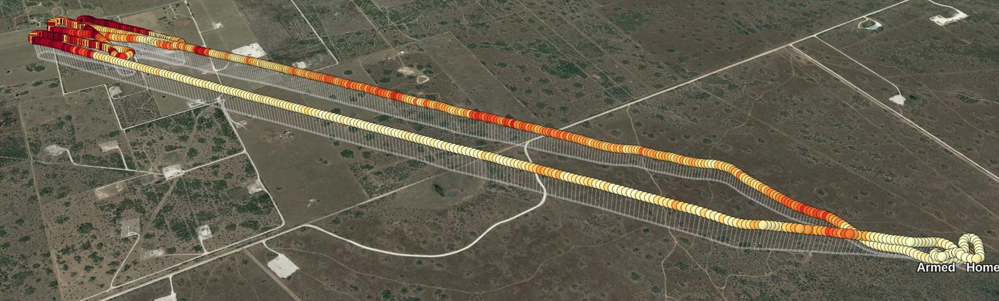
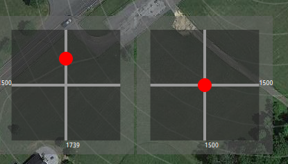

# Replay Tools

In order to replay log files, {{ mwp }} has a number of external dependencies, in particular the **flightlog2x** `fl2ltm` tool provided by the [bbl2kml](https://github.com/stronnag/bbl2kml) repository. As well as providing replay tools for {{ mwp }}, the  [bbl2kml](https://github.com/stronnag/bbl2kml) tools offer the facility to generate  attractive animated KML / KMZ files for visualisation in **google-earth**.

<figure markdown>
{: width="80%" }
<figcaption>Flight mode view</figcaption>
</figure>
<figure markdown>
{: width="80%" }
<figcaption>RSSI view</figcaption>
</figure>
<figure markdown>
{: width="80%" }
<figcaption>Efficiency view</figcaption>
</figure>
!!! Note "Analysis"
    The RSSI view shows why the aircraft is playing "failsafe ping-pong" at the right extreme of flight

[bbl2kml](https://github.com/stronnag/bbl2kml) binary packages are provided for many popular platforms.

## Log replay

{{ mwp }} can replay a number of "flight log" formats. Other artefacts such as mission files / safehomes / (geozones) can be displayed while the replay is in progress.

### Location rebase

You may wish to obfuscate the location of log replay, particularly if you are publishing screen shots or vidoes. The `--rebase` option allows this. `--rebase` requires a latitude and longitude of the relocated position; the latitude and longitude may be separated by comma, semi-colon or space (the latter two quoted or shell escape) and may be decimal degrees or DD:MM:SS.ss format. The following would relocate a replay to Narita Airport in Japan (plausible denial, protect the innocent etc.):

    mwp --rebase 35.761000,140.378945 -b reloc-test.TXT -m reloc-test.mission
    mwp --rebase 35.761000\;140.378945 -b reloc-test.TXT -m reloc-test.mission
	mwp --rebase 35.761000\ 140.378945 -b reloc-test.TXT -m reloc-test.mission
	mwp --rebase "35:45:39.6N 140:22:44.2E" -b reloc-test.TXT -m reloc-test.mission

Currently (March 2024) only flight logs and mission files are rebased. Safehomes (and Geozones) may also be relocated in future.

## Blackbox replay

In order to replay blackbox logs, you additionally need [inav blackbox tools](https://github.com/iNavFlight/blackbox-tools), specifically `blackbox_decode`). Binary packages are provided for many popular platforms. The minimum required version in 0.4.4, the latest release is recommended.

## OpenTX / EdgeTX logs (CRSF and Smartport)

OpenTX enables the storage of CRSF and Smartport telemetry logs on a transmitter's SD-Card. These logs contain telemetry information transmitted from the flight controller.

{{ mwp }} can replay these logs, in a similar manner to the replay of Blackbox or mwp logs, albeit with less detail and typically at lower data rates.

* Enable RX telemetry on the FC
* Enable telemetry logging on the TX
* Post flight, transfer the log from the LOGS directory of the SD card to your computer
* Replay the log using the Replay OTX Log (or Load OTX Log for a "fast-forward" rendering)
* Limited support is available of TX logs from Ardupilot.

No addition software requirements.

## BulletGCSS Logs

Requires that {{ mwp }} is built with [MQTT support](mqtt---bulletgcss-telemetry.md).

No addition software requirements.

## Ardupilot logs

Requires Ardupilot's [mavlogdump.py](https://github.com/ArduPilot/pymavlink).

## mwp JSON logs

No addition requirements.

## mwp "raw" logs

mwp "raw" logs are either recorded directly in mwp (`--raw-log`) for indirectly using the external [`mwp-serial-cap` tool](https://github.com/stronnag/mwptools/blob/master/src/samples/mwp-serial-cap/README.md).  The logs generated by `mwp` and `mwp-serial-cap` contain meta-data describing the size and time of each item recorded; `mwp` can also play 3rd party logs that are 'plain' rw data (i.e. without any timing meta-data).

Recent versions of `mwp` contain a "Replay mwp RAW log" menu item that automates the manual process described below. This provides a dialogue to select the raw log file and an optional delay which is applied every 16 bytes read.

Otherwise it is necessary to build and install [`mwp-log-replay`](https://github.com/stronnag/mwptools/blob/master/src/samples/mwp-log-replay/README.md) and run it outside of mwp,

    # Start mwp as a UDP listener, port is arbitrary, here 40001 is chosen
    ## -a connect immediately without user intervention
    ## -d serial-device. No host part means it listens for remote connections
    ## listen on UDP port 40001

    mwp  -a -d udp://:40001

    # In another  terminal  (even other machine if you replace localhost with the machine running mwp)

    mwp-log-replay -d udp://localhost:40001 /path/to/my/logfile.raw

Raw logs containing MSP, LTM, MAVLink, CRSF and MPM Smartport and IBUS messages can be replayed.

## Display of RC Stick positions

Where such data is available, {{ mwp }} can display the position of the 'sticks'. This is displayed in a separate window which by default has no Window Manager (WM) decoration.

{: width="30%" }

The sticks window may be moved according the WM's rules (mwp has no part in this), for example:

* {==With the mouse over the sticks window==}, press and hold the ++alt++ key and drag the window with the mouse, holding down the left mouse button.
* {==With the mouse over the sticks window==}, press ++alt+f7++. The cursor changes to a 'drag mode' cursor, and the window can be moved with the mouse (no pressing any mouse button).

Both of these techniques work in native and KVM virtualised GNOME Shell. Using other WMs or virtualisation may require other keys or may not work at all, in which case there is a [settings](mwp-Configuration.md#dconf-gsettings) key `show-sticks` to modify the behaviour:

```
$ gsettings describe  org.mwptools.planner show-sticks
If "yes", stick position is shown during log replay,
if "no" , never shown.
If "decorated", then shown in a decorated window (for window managers
that can't cope with un-decorated windows), e.g. WSL, Cygwin
```

Windows 10, Cygwin with `gsettings set org.mwptools.planner show-sticks decorated`. Note that Cygwin and the Windows WM does not support transparency.

{: width="30%" }

Linux, decorated:

{: width="30%" }
