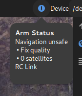
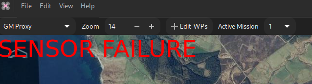

# User interface

## Main Window

{: width="100%" }

The {{ mwp }} main window and the main user interface elements are:

1. [Menu Icon](#menu-bar-1). Invokes the main menu. The menu options are described later.
2. [Map and Mission](#map-and-mission-settings-2) settings
3. [Communications and telemetry settings](#communications-and-telemetry-settings-3)
4. [Side Bar Visibility](#side-bar-visibility-4)
5. [Map window](#map-area-5)
6. [Side Bar Elements](#side-bar-elements-6)
7. [Mouse location](#location-7) (user preference units, cursor or map centre location)
8. [Flight controller](#fc-information-8) information
9. [Vehicle Visualisation](#vehicle-visualisation-9) settings
10. [Sensor status and flight timer](#sensors-and-flight-status-10)

In the sections that follow, there will be a brief summary of each part; more detail will then provided in subsequent sections.

## Menu Bar (1)

The following tables summarise the available menu options. Where usage is not obvious, operation will be described later on.

### File Menu

| Item                                         | Usage                                                                                                                                                         |
| ----                                         | -----                                                                                                                                                         |
| Open Mission                                 | Offers a dialog to [open a mission file](inav-4.0-multi-missions.md#open-mission-file)                                                                           |
| Append Mission file                          | [Appends a mission](inav-4.0-multi-missions.md#append-mission-file) to the current mission set (creates a multi-mission element)                                                                                    |
| Save Mission                                 | Saves the mission to the current mission file, overwriting any extant content                                                                                 |
| Save Mission As                              | Saves the mission to a user selected file. For a [multi-mission](inav-4.0-multi-missions.md#save-as-mission-file) the user can choose not to save specified mission segments.                                                                                                                     |
| Download Mission from FC                     | [Downs a (multi-) mission](inav-4.0-multi-missions.md#upload-download-menu-options) from the flight controller                                                                                                           |
| Upload Mission to FC > Upload Active Mission | [Uploads the current mission segment](inav-4.0-multi-missions.md#upload-download-menu-options) to the flight controller                                                                                                  |
| Upload Mission to FC > Upload All Missions   | [Uploads all mission segments](inav-4.0-multi-missions.md#upload-download-menu-options) to the flight controller                                                                                                         |
| Restore Mission from EEPROM                  | Restores the EEPROM stored mission from the flight controller                                                                                                 |
| Save Mission to EEPROM                       | Saves the current mission segment(s) to the flight controller. The current active mission segment (in a multi-mission) is set as the active mission in the FC |
| Replay mwp log                               | Replay a mwp (JSON) log file                                                                                                                                  |
| Replay blackbox log                          | Replays a Blackbox log file                                                                                                                                   |
| Replay OTX log                               | Replays an OpenTX / EdgeTX CSV log file. (Also BulletGCSS and Ardupilot logs where available)                                                                                                                       |
| Replay mwp RAW log                           | Replay a mwp raw (binary) log file
| Stop Replay                                  | Stops a running replay                                                                                                                                        |
| Static Overlay > Load                        | Loads a static KML format overlay file                                                                                                                        |
| Static Overlay > Remove                      | Removes a loaded KML file from the display                                                                                                                    |
| Geozones                                   | Invokes the {{inav }} [Geozones editor](mwp-geozones.md)                                                                                                |
| Safe Homes                                   | Invokes the {{inav }} [safe-home editor](mwp-safehomes-editor.md)                                                                                                |
| Quit                                         | Cleanly quits the application, saving the display layout                                                                                                      |

### Edit Menu

| Item | Usage |
| ---- | ----- |
| Set FollowMe Point | Displays the [Follow Me](mwp-follow-me.md) dialogue |
| Preferences | Displays the [preferences](misc-ui-elements.md#preferences) dialogue |
| Area Planner | Invokes the [area-planner](mwp-area-planner.md) to generate search or survey plans as a mission.
| Mission Manager | Display the multi-mission dialogue to remove segments from a multi-mission |
| CLI serial terminal | Displays the {{ inav }} CLI using the current connection |
| Get FC Mission Info | Display the mission status from a connected FC |
| Seed current map | Shows a dialogue to seed the map cache for offline (field) use |
| Reboot FC | Reboots a connected flight controller |
| Audio Test | Reads out the {{ mwp }} version number as an audio test |

### View Menu

| Item | Usage |
| ---- | ----- |
| Zoom to Mission | Zooms the map to the currently loaded mission |
| Set location as default | Sets the current location as the default (startup) location |
| Centre on position ... | Shows the ["Centre on Position" selector and "favourite places" editor"](misc-ui-elements.md#favourite-places) |
| GPS Statistics | Displays FC GPS status (rate, packets, errors, timeouts, HDOP/EPV/EPH) |
| Radar View | Displays the [Radar (inav radar / ADS-B) view](mwp-Radar-View.md) |
| Telemetry Tracker | Displays the [Telemetry Tracker UI](mwp-telemetry-tracker.md) |
| Flight Statistics | Display the flight statistic dialogue (also automatic on disarm) |
| Video Stream | Opens the (live) video stream window |
| GCS Location | Displays the indicative [GCS location icon](gcs-features.md#gcs-location-icon) |

### Help Menu

| Item | Usage |
| ---- | ----- |
| Online Manual | Opens this document in the default browser |
| Shortcut keys list | Displays the short cut keys list |
| About |  Displays version, author and copyright information |

## Map and Mission Settings (2)

A number of different map provides are available. {{ mwp }} offers the mapping library (`libshumate`) defaults, MapBox, Bing Map, and [user defined options](mwp-Configuration.md#sourcesjson), for example [anonymous maps](Black-Ops.md).

Note that Bing Maps is deprecated, and MapBox will only be offered if the user has supplied a MapBox API key.

The zoom level may be selected from the control here, or by zooming the map with the mouse wheel.

The **+Add WPs** (Edit WPs)  button enables mission edit mode (click on the map to create a WP, drag to move, right mouse button for properties). Graphical WP editing may be augmented by the table orientated [mission table view](mission-editor.md), which allows additional control (altitude, speed, special functions, for example [fly-by-home](Fly-By-Home-waypoints-(inav-4-new-feature).md) waypoints).

The "Active Mission" drop down supports {{ inav }} 4.0+ [multi-mission](inav-4.0-multi-missions.md). There is also a **mission manager** item under the **Edit** menu.

## Communications and telemetry settings (3)

There is a (blue "!" in the example) 'navigation safe' status icon. If this icon is shown (i.e. navigation is _unsafe_, then clicking on the item will provide more information:

{: width="20%" }

The **Device** drop-down offers detected and pre-set (**Preferences**) devices for the FC / telemetry port. The device syntax is described the [Device and Protocol definition](mwp-multi-procotol.md) chapter.

The **Protocol Selection** drop-down (showing **Auto** in the reference image) allows the user to provide a hint as to communication protocols available on **Device**. These are further described in the [Device and Protocol definition](mwp-multi-procotol.md) article.

The **Connect / Disconnect** button connects / disconnects the displayed device.

The **auto** button causes {{ mwp }} to automatically attempt to connect to the nominated device.

## Side Bar Visibility (4)

Toggling this button will hide or show the side bar (6).

## Map Area (5)

The map area displays the currently selected map at the desired zoom level. The map may be managed using familiar controls (drag, scroll wheel etc).

## Side Bar elements (6)

The side bar displays a set if user defined UI elements ("dockets") that display flight / sensor information.

See [Side Bar Management](dock.md). In the **main window screen shot** (left to right, top to bottom) we have:

* Artificial horizon
* Vario Indicator
* RSSI / LQ Indocator
* Direction Status (Heading (Position Estimator/Compass v. GPS). Useful to diagnose mag EMF interference on multi-rotors).
* Flight View. General geo-spatial information.
* Battery status. Current usage is also shown when available.

## Location (7)

The location of the mouse pointer on the map. Position in the user's preferred format and ground elevation are shown.

## FC Information (8)

Displays the firmware, version and build with API information, profile and flight mode.

## Vehicle Visualisation (9)

* **Follow** : [user setting](mwp-Configuration.md#dconf-gsettings) `auto-follow`. whether the map always displays the aircraft icon and tracks (requires GPS).
* **In View / Centre On / Moviong Map** : Defined how to scroll the map to keep the aircraft in view.
    * **In View** : The map is only panned when the vehicle would otherwise be off-screen.
	* **Centre On**  : The vehicle is always centre of the screen and the map pans as required.
	* **Moving Map**  : The vehicle is always centre of the screen, vertically aligned, the map pans and rotates as required.

## Sensors and flight status (10)

* **Logger** : Generate mwp logs (JSON format).
* **Audio** : [user setting](mwp-Configuration.md#dconf-gsettings) `audio-on-arm`. Whether to "speak" status information.

The green / red bars show gyro / acc / baro / mag / gps / sonar sensor status. If a required sensor fails, a map annotation will be displayed, together with an audible alarm (image from legacy version).

{: width="40% "}
