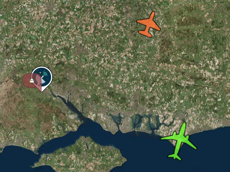

# Tools to assist in customising SVG Icons

## `./resize-icons.sh`

A shell script to resize (by a numeric scale factor), a set of SVG icons

```
$ ./resize-icons.sh -h
resize-icons.sh -f factor files...
```

Note that this will unfortunately remove any `mwp` metadata; however this can be reinstalled with `fixup-svg`

## `fixup-svg`

Adds / resores mwp altitude colour gradient indicators (for ADSB icons) or `xalign` / `yalign` indicators for general icons (e.g. the GCS icon).


```
$ ./fixup-svg --help
Usage:
  fixup-svg [OPTION?]  - fixup-svg [options] files

Help Options:
  -h, --help          Show help options

Application Options:
  -x, --xalign=       xalign
  -y, --yalign=       yalign
  -g, --gradients=false   gradients
```

Note that gradients are applied as:

* Any `path` with `fill="rbg(100%, 100%, 100%)"` or `fill="rgb(255,255,255)"` will be marked as a background path for altitude fill based colouring.
* Any `path` with `fill="rbg(0%, %, 0%)"` will be marked as a foreground path for altitude based stroke colouring.

## Work flow for ADSB icons:

```
# Tools area
$ cd src/samples/adsb-extra/
#
$ Build the `fixup-svg` tool:
$ make fixup-svg
#
# create a work space
$ mkdir /tmp/icons
#
# copy and resize the ADSB icons
$ cp ../../../data/pixmaps/adsb/*.svg  /tmp/icons/
# Now resize ....
$ ./resize-icons.sh -f 2.0 /tmp/icons/*.svg
rsvg-convert -w 44.0 -h 44.0 -a -f svg -o /tmp/icons/A0.svg /tmp/icons/_A0.svg
...
rsvg-convert -w 30.0 -h 30.0 -a -f svg -o /tmp/icons/C3.svg /tmp/icons/_C3.svg
For ADSB symbols, you may have to (re)apply  'id="mwpfg"' and 'id="mwpbg"' attributes to the resized icons : see gradient/README.md
For other symbols, you may have to (re)apply 'mwp:xalign' or 'mwp:yalign' attributes to the resized icons
#
# Add the gradient 'id's back ...
$ ./fixup-svg --gradients /tmp/icons/*.svg
#
# copy the files over ....
$ cp /tmp/icons/*.svg ~/.config/mwp/pixmaps/adsb/
```

## Work flow for GCS or other icon

```
$ ./fixup-svg --yalign 1  /tmp/valk1.svg
/home/jrh/.config/mwp/pixmaps/valk1.svg does not have the 'width' and/or 'height' attribute
```
... need to make the svg "screen" friendly ...

```
$ rsvg-convert -f svg -a -w 44 -o /tmp/valk1.svg /tmp/valk1.svg
# Now set the aligmnet to the bottom, centred
$ ./fixup-svg --yalign 1  /tmp/valk1.svg
$ cp /tmp/valk1.svg ~/.config/mwp/pixmaps
$ cd ~/.config/mwp/pixmaps
$ ln -sf valk1.svg gcs.svg
```

With pointy labels ... because everyone likes pointy labels.


